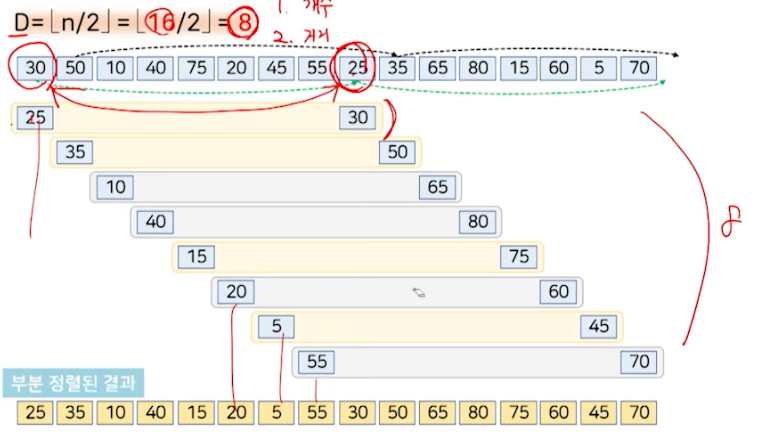
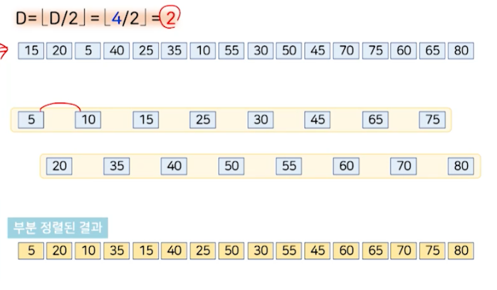

# 정렬 (1)

## 기본 개념

### 정렬 구분

- 주어진 데이터를 값의 크기 순서에 따라 재배치하는 것
  - 오름차순, 내림차순
- 정렬 구분
  - 정렬 수행 시점에 데이터가 어디에 저장되어 있는가 를 기준으로 구분
    - 내부 정렬: 정렬할 데이터를 모두 메모리에 올려놓고 정렬하는 방식
      - 비교 기반 알고리즘
        - 두 데이터의 값 전체를 직접적으로 비교하여 어떤 값이 큰지 또는 작은지를 결정하여 정렬하는 방식
      - 데이터 분포 기반 알고리즘
        - 데이터의 분포를 이용하여 정렬하는 방식
    - 외부 정렬: 정렬할 데이터가 많아서 일부만 메모리에 올려놓고 정렬하는 방식


### 안정성 (stability)

- 동일한 값에 대해 순서가 바뀌지 않는 정렬 알고리즘


### 제자리 정렬 (in-place sort)

- 입력 배열 이외에 별도로 필요한 저장 공간이 상수 개를 넘지 않는 정렬
  - 입력 크기 n이 증가함에도 불구하고 추가적인 저장 공간은 증가하지 않음

## 선택 정렬 (Selection Sort)

- 입력 배열에서 가장 작은 값부터 순서대로 '선택'헤서 나열하는 방식
- 입력 데이터의 상태와 상관없이 항상 동일한 성능 O(n^2)을 가짐
- 제자리 정렬 알고리즘
  - 입력 배열 이외에 상수 개의 저장 공간(i, j, minIndex)만 필요
- 불안정성 정렬


### 알고리즘 순서도


### 구현

```javascript
function selectionSort(arr) {
    // n - 1 번 반복
  for (let i = 0; i < arr.length - 1; i++) {
    let minIndex = i;
      
    // i 이후의 값 중 가장 작은 값의 인덱스 찾기
    for (let j = i + 1; j < arr.length; j++) {
      if (arr[j] < arr[minIndex]) {
        minIndex = j;
      }
    }
      
    // i번째 값과 가장 작은 값 교환
    if (minIndex !== i) {
      [arr[i], arr[minIndex]] = [arr[minIndex], arr[i]];
    }
  }
    
  return arr;
}
```


### 시간 복잡도


## 버블 정렬 (Bubble Sort)

- 모든 인전합 두 데이터를 차례대로 비굥해서 왼쪽 데이터가 큰 경우에는 오른쪽 데이터와 자리를 바꾸는 과정을 반복해서 정렬을 수행하는 방식
- 비교를 진행하는 방향이 다를 수 있다.
  - 왼쪽 -> 오른쪽
    - 가장 큰 값부터 찾아서 오른쪽 끝에서부터 위치시킴
  - 오른쪽 -> 왼쪽
    - 가장 작은 값부터 찾아서 왼쪽 끝에서부터 위치시킴
- 안정적
- 제자리 정렬 알고리즘
- 선택 정렬에 비해 데이터 교환이 많이 발생
  - 선택 정렬보다 비효율적


### 구현

- 개선전 버전

```javascript
function bubbleSort(arr) {
    // n - 1 번 반복
  for (let i = 0; i < arr.length - 1; i++) {
    // i 이후의 값 중 가장 큰 값을 맨 뒤로 보내기
    for (let j = 0; j < arr.length - 1; j++) {
      // 왼쪽 값이 오른쪽 값보다 크면 교환
      if (arr[j] > arr[j + 1]) {
        // 교환
        [arr[j], arr[j + 1]] = [arr[j + 1], arr[j]];
      }
    }
  }
    
  return arr;
}
```


- 개선된 버전

```javascript
function bubbleSort(arr) {
    // n - 1 번 반복
  for (let i = 0; i < arr.length - 1; i++) {
    let isSwapped = false;
      
    // i 이후의 값 중 가장 큰 값을 맨 뒤로 보내기
    for (let j = 0; j < arr.length - 1 - i; j++) {
      // 왼쪽 값이 오른쪽 값보다 크면 교환
      if (arr[j] > arr[j + 1]) {
        // 교환
        [arr[j], arr[j + 1]] = [arr[j + 1], arr[j]];
        // 교환했으므로 true로 변경
        isSwapped = true;
      }
    }
      
    // 교환 없이 한 번 순회했으면 정렬 완료
    if (!isSwapped) {
      break;
    }
  }
    
  return arr;
}
```


### 왼쪽 -> 오른쪽


### 오른쪽 -> 왼쪽


## 삽입 정렬 (Insertion Sort)

- 주어진 데이터를 하나씩 뽑은 후 이미 나열된 데이터가 항상 정렬된 상태를 유지하도록 뽑은 데이터를 바른 위치에 삽입해서 나열하는 방식
- 입력 배열을 정렬 부분(A[0..k-1])과 미정렬 부분(a[k..n-1])으로 구분해서 처리
  - A[0] (첫번째 데이터)를 정렬 부분, A[1..n-1] (나머지 데이터)을 미정렬 부분으로 취급하여 시작
- k = 1, ..., n-1까지 반복
  - 미정렬 부분 A[k..n-1]의 첫 번째 데이터 A[k]를 뽑고,
  - 정렬 부분에서 A[0..k-1]에서 `제자리를 찾아` A[k]를 삽입해서 A[0..k]를 정렬 상태를 유지하도록 만든다.
- 안정적
- 제자리 정렬 알고리즘
- 입력 데이터의 원래 순서에 민감
  - 원하는 정렬 순서의 역순으로 주어지는 경우 -> 최악의 경우 O(n^2)
  - 원하는 순서의 정렬된 상태로 주어지는 경우 -> 최선의 경우 O(n)


### 구현

```javascript
function insertionSort(arr) {
    // n - 1 번 반복, i = 1부터 시작 -> 첫 번째 값은 정렬된 상태로 간주
  for (let i = 1; i < arr.length; i++) {
    let val = arr[i]; // 미정렬된 부분의 첫 번째 값 선택
    
    let j = i - 1; // 정렬된 부분의 마지막 인덱스
    // key보다 큰 값은 오른쪽으로 이동
    while (j >= 0 && arr[j] > val) {
      // 오른쪽으로 이동
      arr[j + 1] = arr[j];
      j--; // j index 1씩 감소 (왼쪽으로 이동)
    }
      
    // val 삽입
    val[j + 1] = key;
  }
    
  return arr;
}
```


## 셸 정렬 (Shell Sort)

- 삽입 정렬의 단점을 보완한 정렬 알고리즘
  - 현재 삽입하고자 하는 데이터가 삽입될 제 위치에서 많이 벗어나 있어도 한 번에 한 자리씩만 이동해서 찾아갸아햠
- 하나의 입력 배열을 물리적으로 여러 개의 부분배열로 분할하지 않음
- 각 부분배열을 번갈아 가면서 미정렬 부분의 첫 번째 데이터를 뽑은 후 D 만큼씩 떨어진 정렬 부분에서 제자리를 찾아서 삽입하는 방식

```plaintext
[10, 20, 30, 40, 50, 60, 5]

위의 배열에서 5가 첫 번째 자리인 제자리로 찾아가려면 모든 데이터와 비교해서 자리르 찾아갸아햠
```

### 기본 아이디어

- 멀리 떨어진 데이터와의 비교/교환으로 한 번에 이동할 수 있는 거리를 늘려서 처리 속도 향상
  - 처음에는 멀리 떨어진 두 데이터를 비교해서 필요 시 위치를 교환하고, 점차 가까운 데이터를 비교/교환한 뒤, 맨 마지막에는 인접한 데이터를 비교/교환하는 방식
- 입력 배열을 부분배열로 나누어 삽입 정렬을 수행하는 과정을 부분배열의 크기와 개수를 변화시켜 가면서 반복
- 사용하는 순열에 따라 성능이 달라짐
  - 가장 좋은 간격을 찾는 것은 아직 미해결 과제
- 최선 O(n log n), 최악 O(n^2)
- 불안정 정렬

- 제자리 정렬 알고리즘

### 부분배열의 개수를 정하는 방법


### 구현

```javascript
function shellSort(arr) {
  let n = arr.length;
  
  // D: 부분배열의 개수 & 간격의 크기
  for (let D = Math.floor(n / 2); D >= 1; D = Math.floor(D / 2)) {
    // 부분배열의 개수만큼 반복
    for (let i = D; i < n; i++) {
      // 부분배열의 첫 번째 값 선택
      let val = arr[i];
      // 부분배열의 첫 번째 값의 인덱스
      for (let j = i; j >= D && arr[j - D] > val; j -= D) {
        // 오른쪽으로 이동
        arr[j] = arr[j - D];
      }
      
        // val 삽입
      arr[j + D] = val;
    }
  }
}
```








## 요약

1. 선택 정렬
   - 가장 작은 값을 선택해서 정렬
  - O(n^2)
  - 불안정 정렬
  - 제자리 정렬
2. 버블 정렬
   - 인접한 두 데이터를 비교해서 정렬
   - O(n^2)
   - 안정 정렬
   - 제자리 정렬
   - 개선된 알고리즘(데이터의 입력 상태에 따라 성능이 달라짐)
3. 삽입 정렬
   - O(n^2)
   - 안정 정렬
   - 제자리 정렬
   - 데이터의 입력 상태에 따라 성능이 달라짐
4. 셸 정렬
   - O(n^2)
   - 불안정 정렬
   - 제자리 정렬
   - 데이터의 입력 상태에 따라 성능이 달라짐
   - 삽입 정렬 단점 보완 -> 부분 배열의 크기/개수를 변화시키면서 삽입 정렬 수행