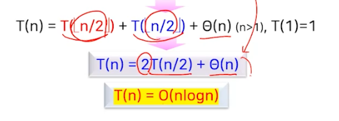

# 정렬 (2)

## 퀵 정렬 (Quick Sort)

- 특정 데이터를 기준으로 주어진 배열을 2개의 부분배열로 분할하고, 각 부분배열에 대해서 퀵 정렬을 순환적으로 적용하는 방식
- 피벗(pivot), 분할 원소
  - 주어진 배열을 두 부분배열로 분할하는 기준이 되는 특정 데이터
    - `보통 주어진 배열의 첫 번째 데이터로 지정`

### 퀵 정렬의 원리

- 피벗이 제자리를 잡도록 하여 정렬하는 방식
- 피벗을 기준으로 왼쪽에는 피벗보다 작은 값, 오른쪽에는 피벗보다 큰 값이 오도록 정렬


`왼쪽 부분배열의 모든 값 < 피벗 < 오른쪽 부분배열의 모든 값`

### 퀵 정렬 처리 과정


### 퀵 정렬 알고리즘


### 코드

```javascript
// with swap
function quickSort(arr, left = 0, right = arr.length - 1) {
    if (left < right) {
        const partitionIndex = partition(arr, left, right);
        quickSort(arr, left, partitionIndex - 1);
        quickSort(arr, partitionIndex + 1, right);
    }
    return arr;
}

function partition(arr, left, right) {
    const pivot = arr[Math.floor((right + left) / 2)];
    let i = left;
    let j = right;
    while (i <= j) {
        while (arr[i] < pivot) {
            i++;
        }
        while (arr[j] > pivot) {
            j--;
        }
        if (i <= j) {
            swap(arr, i, j);
            i++;
            j--;
        }
    }
    return i;
}

function swap(arr, i, j) {
    const temp = arr[i];
    arr[i] = arr[j];
    arr[j] = temp;
}
```

### 분할 과정


### 퀵 정렬의 예


### 성능과 특징

- 피벗과의 비교 횟수?


- z퀵 정렬의 수행 시간은 분할되는 두 부분 배열의 크기에 따라 달라짐


- 최악의 경우 시간 복잡도는 O(n^2)
  - 피벗이 항상 최소값 또는 최대값일 때
  - 피벗이 항상 배열의 첫 번째 원소로 지정되는 경우
  - 이미 정렬된 데이터에 대해 퀵 정렬을 수행할 때


- 최선의 경우
  - 피벗을 중심으로 항상 동일한 크기의 두 부분배열로 분할되는 경우
  - 피벗이 항상 배열의 중간값이 되는 경우




- 퀵 정렬의 평균 수행시간
  - 부분배열의 모든 분할 비율에 따른 수행시간의 평균
  - 피벗은 동일한 확률을 가지고 분할 수 배열의 어느 곳에나 위치 가능
  - 0:n-1, 1:n-2, 2:n-3, ... ,n-2:1 n-1:0


- 퀵정렬은 피벗 선택의 임의성만 보장되면 평균 수행시간을 보장 -> 피벗 선택의 임의로 선정가능하면 최악의 경우를 피할 수 있음
  - 최선/평균 수행시간 -> O(nlogn)
  - 최악 수행시간 -> O(n^2)
    - `피벗의 배열을 첫 번째 원소로 지정하는 경우` && 배열이 정렬된 경우 (배열의 정렬 여부는 우리가 알 수 없으므로 피벗 위치를 조정!)
    - how?
      - 배열에서 임의의 값을 선택한 후, 배열의 첫 번째 원소와 서로 교환한 후 정렬 수행

### 안정적이지 않은 정렬


## 합병 정렬

- 주어진 배열을 동일한 크기의 두 부분배열로 분할하고, 각 부분배열에 순환적으로 합병 정렬을 적용하여 정렬시킨 후, 정렬된 두 부분배열을 합병하여 하나의 정렬된 배열을 만듦


### 코드 예


```javascript
function mergeSort(arr) {
    if (arr.length <= 1) {
        return arr;
    }

    const mid = Math.floor(arr.length / 2);
    const left = arr.slice(0, mid);
    const right = arr.slice(mid);

    return merge(mergeSort(left), mergeSort(right));
}

function merge(left, right) {
    let result = [];
    let leftIndex = 0;
    let rightIndex = 0;

    while (leftIndex < left.length && rightIndex < right.length) {
        if (left[leftIndex] < right[rightIndex]) {
            result.push(left[leftIndex]);
            leftIndex++;
        } else {
            result.push(right[rightIndex]);
            rightIndex++;
        }
    }

    // Concatenate any remaining elements from both halves
    return result.concat(left.slice(leftIndex)).concat(right.slice(rightIndex));
}

// Example usage:
const array = [3, 0, 2, 5, -1, 4, 1];
console.log("Original Array:", array);
console.log("Sorted Array:", mergeSort(array.slice())); // slice() is used to create a copy of the array

```

### 전체적인 수행 과정


### 합병 합수_merge()


### 성능과 특징


### 안정적인 정렬

- 합병 과정에서 동일한 두 데이터에 대해서 항상 왼쪽 데이터를 먼저 선택함

### 제자리 정렬 알고리즘이 아님

- 입력 크기 n만큼의 추가저적인 공간을 요구
- merge() 함수에서 추가적인 배열을 생성하여 정렬된 데이터를 저장

### 비재귀적으로 구현도 가능


