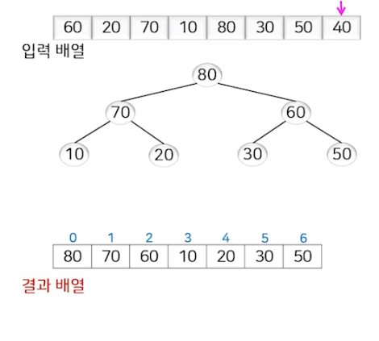
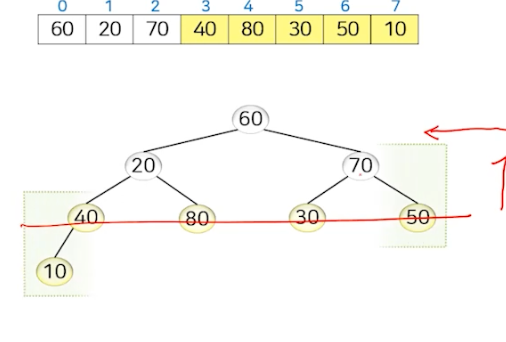

# 정렬 (3)

## 힙 정렬 (Heap Sort)

- '힙' 자료구조를 사용하는 정렬 방법
  - 힙: `임의의 값 삽입`과 `최댓값 삭제`가 쉬움
    - 최대 힙
      - 완전 이진 트리: 마지막 레벨을 제외한 모든 레벨이 완전히 채워져 있고, 마지막 레벨은 왼쪽부터 채워져 있는 상태
      - 각 노드의 값은 자신의 자식 노드의 값보다 크거나 같아야 함
      - 

### 힙의 구현

- 힙은 배열로 구현 가능


- 임의의 값의 삽입


- 최댓값 삭제


### 힙 정렬의 처리 방식


### 힙 정렬의 코드

```javascript
function heapSort(arr, n) {
    // 힙을 구성합니다 (배열을 재배치합니다)
    for (let i = Math.floor(n / 2) - 1; i >= 0; i--) {
        heapify(arr, n, i);
    }

    // 한 번에 한 요소씩 힙에서 추출합니다
    for (let i = n - 1; i > 0; i--) {
        // 현재 루트를 배열의 끝으로 이동합니다
        [arr[0], arr[i]] = [arr[i], arr[0]];

        // 축소된 힙에서 최대 힙을 다시 조정합니다
        heapify(arr, i, 0);
    }

    return arr;
}

// arr[]에서 주어진 노드 i를 루트로 하는 서브트리를 힙으로 만듭니다
function heapify(arr, n, i) {
    let largest = i; // 루트를 초기화합니다
    const left = 2 * i + 1; // 왼쪽 자식 = 2*i + 1
    const right = 2 * i + 2; // 오른쪽 자식 = 2*i + 2

    // 왼쪽 자식이 루트보다 크면
    if (left < n && arr[left] > arr[largest]) {
        largest = left;
    }

    // 오른쪽 자식이 지금까지 가장 큰 값보다 크면
    if (right < n && arr[right] > arr[largest]) {
        largest = right;
    }

    // 가장 큰 값이 루트가 아니면
    if (largest !== i) {
        [arr[i], arr[largest]] = [arr[largest], arr[i]];

        // 영향을 받는 서브트리를 재귀적으로 힙으로 만듭니다
        heapify(arr, n, largest);
    }
}

// 사용 예시:
const array = [3, 0, 2, 5, -1, 4, 1];
const n = array.length;
console.log("Original Array:", array);
console.log("Sorted Array:", heapSort(array.slice(), n)); // slice()는 배열의 복사본을 만들기 위해 사용됩니다
```

###  힙 정렬의 처리 과정


### 1. 초기 힙 구축

- 1차원 입력 배열을 힙으로 변환하는 것
  1. 주어진 입력 배열의 각 원소를 힙에 삽입하는 과정을 반복
  2. 주어진 입력 배열을 우선 완전 이진 트리로 만든 후, 각 노드에 대해 아래에서 위로 그리고 오른쪽에서 왼쪽으로 진행하면서 해당 노드의 아랫부분이 힙의 조건을 만족할 수 있도록 트리를 따라 내려가면서 자신의 자손 노드들과의 위치 교환을 계속해 나가는 방법

#### 힙 구축 방법1

> 입력 배열과 결과 배열을 같다.





#### 힙 구축 방법2





### 2. 힙 정렬 수행

- 최대값을 찾아서 배열의 마지막 원소와 교환
- 이후 다시 heapify를 하는 것을 반복


### 성능과 특징

- 최선, 최악, 평균 수행 시간 -> O(nlogn)
  - 초기 힙 생성, 최댓값 삭제 및 힙 재구성
    - 바깥 루프 -> 입력 크기 n에 비례
    - 안쪽 루프 -> 완전 이진 트리의 높이(logn)에 비례

### 안정적이지 않은 정렬


### 제자리 정렬 알고리즘

## 정렬 알고리즘 중간 정리

- 비교 기반의 정렬 알고리즘
  - 기본 성능 (O(n^2))
    - 버블 정렬
    - 삽입 정렬
    - 선택 정렬
    - 셸 정렬
  - 향상된 평균 성능 (O(nlogn))
    - 합병 정렬
    - 퀵 정렬
    - 힙 정렬
  - 비교 기반 정렬 알고리즘 성능의 하한 (O(nlogn))
    - 아무리 빨라도 O(nlogn)보다 빠르게 정렬할 수 없음
- 이미 얻어진 데이터 분포 정보를 활용하는 정렬 알고리즘
  - 선형 시간 (O(n)) 가능 
    - 계수 정렬
    - 기수 정렬
    - 버킷 정렬

## 계수 정렬 (Counting Sort)

- 주어진 데이터 중에서 자신보다 작거나 같은 값을 갖는 데이터의 개수를 계산하여 정렬할 위치를 찾아 정렬하는 방식
  - 입력값이 어떤 정수 범위 내에 있다는 것을 알고 있는 경우에 적용 가능
  - 자신보다 작거타 같은 값을 갖는 데이터의 개수의 효율적인 계싼 방법
    - 입력값의 범위 a~b에 해당하는 크기의 배열 count[a..b]를 할당하고, 주어진 값들을 한 번씩 반복하면서 입력값의 출현횟수의 누적값 계산이 가능

### 코드 예

```javascript
function countingSort(arr, n) {
    // 배열에서 최댓값을 찾습니다
    let max = arr[0];
    for (let i = 1; i < n; i++) {
        if (arr[i] > max) {
            max = arr[i];
        }
    }

    // count 배열을 초기화합니다
    const count = new Array(max + 1).fill(0);

    // count 배열을 채웁니다
    for (let i = 0; i < n; i++) {
        count[arr[i]]++;
    }

    // count 배열을 누적 합으로 업데이트합니다
    for (let i = 1; i <= max; i++) {
        count[i] += count[i - 1];
    }

    // 정렬된 배열을 저장할 임시 배열을 생성합니다
    const output = new Array(n);

    // 입력 배열을 순회하며 정렬된 위치에 값을 채웁니다
    for (let i = n - 1; i >= 0; i--) {
        output[count[arr[i]] - 1] = arr[i];
        count[arr[i]]--;
    }

    // 정렬된 배열을 반환합니다
    return output;
}

// 사용 예시:
const array = [3, 0, 2, 5, 1, 4, 1];
const n = array.length;
console.log("Original Array:", array);
console.log("Sorted Array:", countingSort(array.slice(), n)); // slice()는 배열의 복사본을 만들기 위해 사용됩니다

```

### 계수 정렬의 예


### 성능과 특징

- 최선, 최악, 평균 수행 시간 -> O(n + k)
  - n: 입력 배열의 크기
  - k: 입력값의 범위


- 입력값의 범위가 데이터의 개수보다 작거나 비례할 때 유용
  - 입력값의 범위를 k라고 할 때 O(n + k)의 성능을 보임
    - k=O(n)일 때 O(n)의 성능을 보임

### 안정적인 정렬 알고리즘

- 입력 배열 A[]의 오른쪽의 것부터 뽑아서 결과 B[]의 오른쪽에서부터 저장

### 제자리 정렬 알고리즘이 아님

- 입력 배열 A[1..n] + COUNT[a..b] + 결과 배열 B[1..n]을 사용

### 보편적이지 못한 정렬 알고리즘

- 입력값의 범위를 미리 알아야 함 + 추가적인 배열 필요

## 기수 정렬

- 입력값을 자릿수별로 구분해서 부분적으로 비교하여 정렬하는 방식
    - 주어진 데이터의 값을 자릿수별로 나누고, 각 자릿수에 대해 계수 정렬과 같은 `안정적인 정렬 알고리즘`을 적용하여 정렬
      - LSD 기수 정렬 -> 가장 낮은 자릿수부터 정렬, "Right-to-Left"
      - MSD 기수 정렬 -> 가장 높은 자릿수부터 정렬, "Left-to-Right"


### 예

#### LSD


#### MSD


### 성능과 특징


- 입력 데이터의 자릿수가 상수일 때 유용
  - 입력 데이터의 자릿수가 n에 비례할 때 O(n)의 성능을 보임

### 안정적인 정렬 알고리즘

- 각 자릿수별로 안정적인 정렬 알고리즘을 적용하므로 기수 정렬도 안정적

### 제자리 정렬 알고리즘이 아님

- 계수 정렬 적용 -> 전체 데이터 개수와 진법 크기만큼의 추가 공간이 필요

## 버킷 정렬

1. 주어진 데이터들의 값의 범위를 균등하게 나누어 여러 개의 버킷에 나누어 담고,
2. 각 데이터를 해당하는 버킷에 넣고,
3. 각 버킷을 삽입 정렬과 같은 안정적인 정렬을 수행한 후,
4. 버킷 순서대로 각 데이터를 나열하는 정렬 방식

> 입력값의 범위 내에서 값이 확률적으로 균당하게 분포될 때 선형 시간에 동작


### 성능과 특징

- 데이터가 균등하게 버킷에 분배되어 있지 않으면 삽입 정렬의 성능에 영향을 받음
- 입력 데이터의 분포가 균등하게 분포되어 있을 때 O(n)의 성능을 보임


