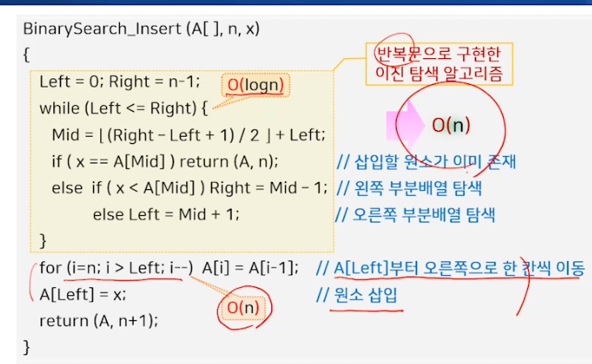

# 탐색 (1)

## 기본 개념

- 여러 개의 원소로 구성된 데이터에서 원하는 값을 가지는 원소를 찾는 것
  - 데이터의 형태 -> 리스트, 트리, 그래프 등
  - 내부 탐색 vs 외부 탐색
    - 내부 탐색: 메모리에 저장된 데이터를 탐색하는 것
    - 외부 탐색: 외부 저장장치에 저장된 데이터를 탐색하는 것
  - 관련 연산 -> 탐색 + (초기화, 삽입, 삭제)

- 탐색 방법
  - 리스트형태 -> 순차 탐색, 이진 탐색
  - 트리형태 -> 이진 탐색 트리, 2-3-4 트리, 레드-블랙 트리, B-트리
  - 해시 테이블 -> 해시 함수, 충돌 해결 방법

## 순차 탐색 (Sequential Search)

- 리스트의 처음부터 끝까지 순서대로 탐색하는 방법

### 탐색 연산

```javascript
function sequentialSearch(arr, target) {
  for (let i = 0; i < arr.length; i++) {
    if (arr[i] === target) {
      return i;
    }
  }
  return -1;
}
```

### 삽입 연산


### 삭제 연산


### 연결 리스트로 구현한 경우


### 성능과 특징

- 탐색
  - 1번 ~ N 번 비교 연산 필요, 항상 n 번 비교
  - O(n)
- 삭제
  - 삭제할 원소의 순차 탐색 (O(n)) 후 마지막 원소의 이동 (O(1))
  - O(n)
- 삽입
  - 삽입할 위치의 순차 탐색 (O(n)) 후 마지막 원소의 이동 (O(1))
  - O(1)
- 정렬되지 않고 크기가 작은 데이터에 적합
  - 모든 리스트 형태의 입력에 적용 가능 -> 비정렬 데이터 탐색에 적합
  - 탐색과 삭제에 O(n) 시간 소요 -> 데이터가 큰 경우에는 부적합

## 이진 탐색 (Binary Search)

- 정렬된 리스트에서 중간 값을 선택하여 탐색하는 방법
- 분할정복 방법이 적용됨
- 배열만 가능하다

### 탐색 연산

- 배열의 가운데 원소 A[mid]와 탐색 target 비교
  - A[mid] = target -> 탐색 성공
  - A[mid] < target -> 오른쪽 부분 배열 탐색
  - A[mid] > target -> 왼쪽 부분 배열 탐색

```javascript
function binarySearch(arr, target) {
  let left = 0;
  let right = arr.length - 1;

  while (left <= right) {
    const mid = Math.floor((left + right) / 2);

    if (arr[mid] === target) {
      return mid;
    } else if (arr[mid] < target) {
      left = mid + 1;
    } else {
      right = mid - 1;
    }
  }

  return -1;
}
```

```javascript
// 재귀로 구현한 이진 탐색
function binarySearch(arr, target, left = 0, right = arr.length - 1) {
  if (left > right) {
    return -1;
  }

  const mid = Math.floor((left + right) / 2);

  if (arr[mid] === target) {
    return mid;
  } else if (arr[mid] < target) {
    return binarySearch(arr, target, mid + 1, right);
  } else {
    return binarySearch(arr, target, left, mid - 1);
  }
}
```


### 초기화 연산

- 주어진 배열이 정렬되어 있지 않으면 정렬 수행 (O(nlogn))

### 삽입 연산




### 삭제 연산


### 연결 리스트로 구현하면?

- 이진 탐색은 배열에만 적용 가능
- 연결 리스트는 이진 탐색이 불가능

### 성능과 특징

- 탐색 -> O(logn)
- 초기화 연산 -> O(nlogn)
- 삽입, 삭제 연산 -> O(n)
- 정렬된 데이터에 대한 탐색에 적합
- 삽입과 삭제가 빈번한 경우에는 부적합
  - 연산 후 리스트의 정렬 상태를 유지하기 위해 O(n)의 데이터 이동이 필요

## 이진 탐색 트리

- 이진 트리
  - 한 노드의 왼쪽 서브트리에 있는 모든 키 값은 그 노드의 키값보다 작다.
  - 한 노드의 오른쪽 서브트리에 있는 모든 키 값은 그 노드의 키값보다 크다.


- 30은 10, 20 보다 크고 40보다는 작다, 50은 30, 10, 40, 20 보다 크고, 60, 70보다 작다


### 탐색 연산

- 루트 노드에서부터 시작해서 값의 크기 관계에 따라 트리의 경로를 따라 내려가면서 탐색 진행


### 삽입 연산

- 삽입할 원소를 탐색한 후, 탐색이 실패하면 해당 위치에 자식 노드로서 새 노드를 추가


### 삭제 연산

- 후속자 successor, 계승자 노드
  - 어떤 노드의 바로 다음 키값을 갖는 노드


- 삭제되는 노드의 자식 노드의 개수에 따라 구분해서 처리
  1. 자식 노드가 없는 경우(리프 노드)
     - 남는 노드가 없어 위치 조절이 불필요, 바로 삭제 
  2. 자식 노드가 하나인 경우
     - 자식 노드를 삭제되는 노드의 위치로 올리면서 서브트리 전체도 따로 올림
  3. 자식 노드가 2개인 경우
     - 삭제되는 노드의 후속자 노드를 삭제되는 노드의 위치로 올리고,
     - 후속자 노드를 삭제되는 노드로 취급하여 자식 노드의 개수에 따라 다시 처리

#### 경우 1 (리프노드) - 20 삭제


#### 경우 2 (자식 노드가 한 개) - 40 삭제


#### 경우 3 (자식 노드가 두 개) - 30 삭제


타깃 삭제


후속자 탐색 후 삭제한 노드의 위치로 이동 (사실상 삭제처리)


이동한 후속자 노드 40의 자식 노드가 1개였으므로 서버 트리를 그대로 올려준다


### 성능과 특징

- 탐색, 삽입, 삭제, 연산의 시간 복잡도
  - 키 값을 비교하는 회수에 비례 -> 이진 트리의 높이가 h라면 O(h)


- 삽입/삭제 연산 시 기존 노드의 이동이 거의 발생하지 않음
  - 삽입 연산 -> 노드의 이동이 없음
  - 삭제 연산 -> 상수 번 이동 (0, 1, 1 또는 2)
- 원소의 삽입/삭제에 따라 경사 트리 형태가 될 수 있음
  - 최악의 수행시간 O(n)을 가짐
    - 경사 트리가 만들어지지 않도록 트리의 균형을 유지해서 O(logn)을 보장하는 트리 구조가 필요
      - 균형 탐색 트리 (탐색 트리의 좌우 서브트리가 같은 높이를 유지하는 자료구조)
        - 2-3-4 트리, 레드-블랙 트리, B-트리

## 2-3-4 트리

- 다음의 성질을 만족하는 균형 탐색 트리
  - 2-노드 -> 1개의 키와 2개의 자식을 갖는 노드
  - 3-노드 -> 2개의 키와 3개의 자식을 갖는 노드
  - 4-노드 -> 3개의 키와 4개의 자식을 갖는 노드
  - 각 노드의 한 키의 왼쪽 서브트리에 있는 모든 키 값은 그 키 값보다 작다. (탐색 트리 기본 성질)
  - 각 노드의 오른쪽 서브트리에 있는 모든 키 값은 그 키 값보다 크다. (탐색 트리 기본 성질)
  - 모든 리프 노드의 레벨은 동일


### 탐색 연산


### 삽입 연산


### 성능과 특징

- 탐색, 삽입, 삭제 연산의 시간 복잡도 -> O(logn)
  - 균형 탐색 트리 -> 트리의 최대 높이 logn
- 삽입 삭제가 일어나도 경사 트리가 되지 않음
- 루트 토드가 분할되는 경우에 한해서 모든 노드의 레벨이 동일하게 1씩 증가
- 2-3-4 트리를 그대로 구현하면 노드 구조가 복잡해서 이진 탐색 트리보다 더 느려질 가능성이 많음 -> 레드-블랙 트리