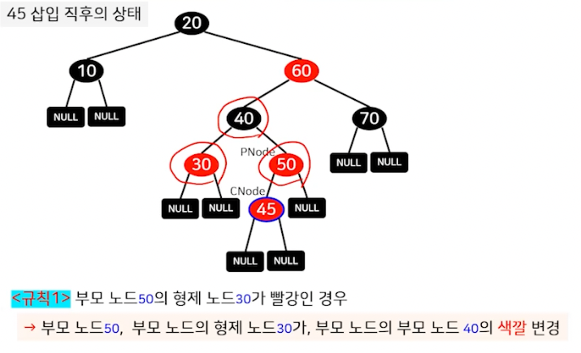
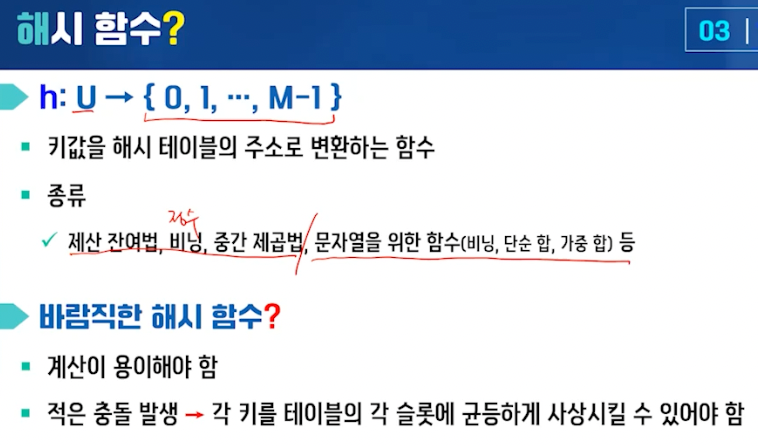
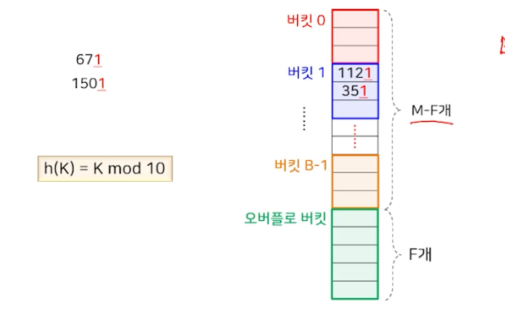

# 탐색 (2)

## 레드-블랙 트리

- 이진 탐색 트리, 균형 탐색 트리

1. 모든 노드는 레드 또는 블랙
2. 루트 노드와 리프 노드는 검정이다
   - 모든 리프 노드는 NULL 노드다.
3. 빨강 노드의 부모 노드는 항상 검정이다.
   - 빨강 노드가 연달아 나타날 수 없음
4. 임의의 노드로부터 리프 노드까지의 경로상에는 동일한 개수의 검정 노드가 존재한다.
5. 한 노드의 왼족 서브트리에 있는 모든 키 값은 그 노드의 키값보다 작다. (이진 탐색 트리의 성질)
6. 한 노드의 오른쪽 서브트리에 있는 모든 키 값은 그 노드의 키값보다 크다. (이진 탐색 트리의 성질)

### 탐색

- 이진 탐색 트리의 탐색 방법과 동일

### 삽입 1

- 탐색을 진행하고 실패한 지점에 노드를 삽입한다.

### 삽입 2

### 삽입 연산을 위한 규칙 

- 빨강 노드가 연달아 나타나는 경우에 적용하는 규칙

1. 부모 노드의 형제 노드가 빨강인 경우
   - 부모 노드, 부모 노드의 형제 노드, 부모 노드의 부모 노드의 색깔을 모두 변경
2. 부모 노드의 형제 노드가 검정이고, 현재 노드의 키값이 부모 노드와 부모 노드의 부모 노드(조부모 노드)의 키값이 사이인 경우
    - 현재 노드와 부모 노드를 회전시킴
3. 부모 노드의 형제노드가 검정이고 현재 노드의 키값보다 부모 노드와 조부모 노드의 키값이 큰 (또는 작은) 경우
   - 부모 노드와 주보무 노드를 회전시키고 색깔을 변경

### 성능과 특징

- 균형 탐색 트리
  - 어떤 두 리프 노드의 레벨 차이가 2배를 넘지 않는 균형 탐색 트리
- 탐색, 삽입, 삭제 연산의 시간 복잡도 -> O(logN)
- 사실상 이진 탐색 트리
  - 탐색 연산은 이진 탐색 트리와 동일
  - 삽입 연산은 회전과 색깔 변경과 같은 추가 연산이 필요

## B-트리

- 균형 탐색 트리, (t는 자연수인 상수)

1. 루트 노드는 1개 이상 2t개 미만의 오름차순으로 정렬된 키를 가짐
2. 루트 노드가 아닌 모든 노드는 (t-1)개 이상 2t개 미만의 오름차순으로 졍려된 키를 가짐
3. 내부 노드는 자신이 가진 키의 개수보다 하나 더 많은 자식 노드를 가짐
4. 각 노드의 한 키의 왼쪽 서브트리에 있는 모든 키 값은 그 키값보다 작음
5. 각 노드의 한 키의 오른쪽 서브트리에 있는 모든 키 값은 그 키값보다 큼
6. 모든 리프 노드의 레빌은 동일함

### 탐색

### 삽입

- 루트 노드에서부터 탐색을 수행하여 리프 노드에도 존재하지 않으면 해당 노드에 추가
- 노드 분할
  - 탐색 과정에서 (2t-1)개의 키를 갖는 노드를 만나면, 이 노드를 (t-1)개의 키를 갖는 2개의 노드와 1개의 키를 갖는 노드로 분할
    - 삽입으로 인해 노드의 키의 개수가 2t개가 되는 것을 방지

### 성능과 특징

- 탐색, 삽입, 삭제 연산의 시간 복잡도 -> O(logN)
  - 트리의 높이 h, 각 노드에서 키의 위치를 찾는 시간 O(t) -> O(th)
    - 각 노드 -> 키의 개수 : (t -1) ~ (2t - 1)개, 자식 노드의 개수: t ~ 2t개
    - 모든 리프 노드의 레벨은 동일

## 해시 테이블

- 키 값을 기반으로 데이터의 저장 위치를 직접 계산함으로써 상수 시간 내에 데이터를 저장, 삭제, 탐색할 수 있는 방법

### 해시 함수 - 제산 잔여법

### 해시 함수 - 비닝

### 해시함수 - 중간 제곱법

### 해시 함수 - 문자열을 위한 비닝

### 해시 함수 - 문자열을 위한 단순합

### 해시 함수 - 문자열을 위한 가중 합

### 충돌 해결 방법

### 개방 해싱

### 폐쇄 해싱 - 버킷 해싱

### 폐쇄 해싱 - 선형 탐사

### 폐쇄 해싱 - 이차 탐사

### 폐쇄 해싱 - 이중 해싱

### 삭제 연산

