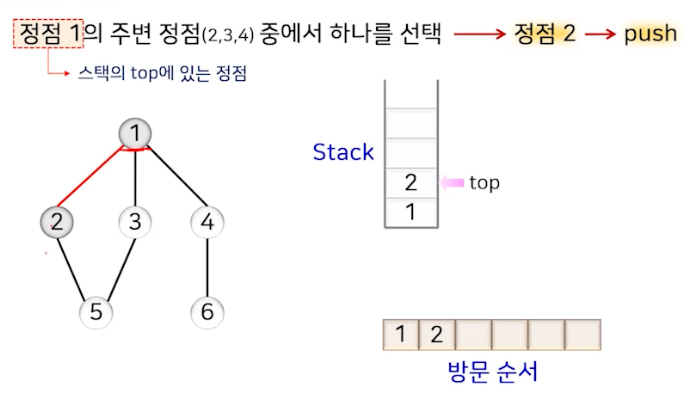
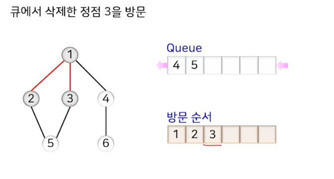

# 그래프 (1)

## 기본 개념

 - G=(V, E)
 - V: 정점(Vertex)의 집합
 - E: 간선(Edge)의 집합

## 그래프 주요 용어

- 인접 정점(Adjacent Vertex): 간선으로 직접 연결된 정점, 두 정점 u, v 사이에 간선이 있으면 u와 v는 인접
- 부수 (incident) : 간선이 정점에 부수되어 있는 것, 해당 간선은 정점 u와 v에 부수되어 있다.
- 경로 (path) : 간선으로 연결된 일련의 정점들의 순서
- 경로의 길이 (length) : 경로를 구성하는 간선의 수
- 차수 (degree) : 해당 정점에 부수된 간선의 수
  - 진입 차수 (in-degree) : 정점으로 들어오는 간선의 수
  - 진출 차수 (out-degree) : 정점에서 나가는 간선의 수
- 단순 경로 (simple path) : 한 경로 상에서 처음과 마지막 정점을 제외한 모든 정점이 서로 다른 경로
- 사이클 (cycle) : 단순 경로의 시작 정점과 종료 정점이 동일한 경우
- 루프 (loop) : 사이클이면서 경로의 길이가 1인 경로
- 연결 (connected) : 무방향 그래프에서 서로 다른 정점의 모든 쌍에 대해 경로가 있으면 연결, 방향 그래프에서는 서로 다른 두 정점의 모든 쌍에 대해서 양방향의 방향경로가 존재하면 그 방향 그래프는 강력 연결되었다고 한다.

## 그래프의 구현 방법

- 인접 행렬 (Adjacency Matrix)
  - 2차원 배열을 사용하여 두 정점을 연결하는 간선의 유무를 표현
- 인접 리스트 (Adjacency List)
  - 연결 리스트를 사용하여 각 정점에 인접한 정점들을 연결하여 표현

## 그래프 순회

- 그래프의 모든 정점을 체계적으로 한 번씩 방문하는 것
  - 그래프 탐색 방법

- 순회 방법
  - DFS (Depth First Search) : 깊이 우선 탐색
  - BFS (Breadth First Search) : 너비 우선 탐색

### 탐색 과정에서의 정점의 구분

- 방문 정점 : 방문이 완료된 정점
- 주변 정점 : 방문 정점에 인접한 정점 중에서 아직 방문하지 않은 정점
- 미도달 정점 : 방문 정점도 주변 정점도 아닌 전혀 접근하지 못한 정점
- 깊이 우선 탐색 -> 최근의 주변 정점을 우선 방문
- 너비 우선 탐색 -> 주변 정점 주에서 오래된 것을 우선 방문

### DFS (Depth First Search)

- 한 정점을 시작으로 매번 인접한 정점 중 한 곳으로 이동하며 탐색하는 방법
  - 최근의 주변 정점을 우선으로 방문하는 탐색 방법

- 스택을 이용하여 구현
  - 현재 정점에 인접한 정점이 없어서 더 이상 탐색을 진행할 수 없으면 거꾸로 되돌아가면서 아직 탐색하지 않은 인접한 정점을 찾아서 탐색을 진행

- 처리 과정
  1. 시작 정점을 스택에 삽입
  2. 스택의 top에 있는 정점에 대한 주변 정점이 존재하면 그중 하나의 정점을 스택에 삽입하고 방문한 정점으로 처리. 주변 정점이 없다면 스택의 top에 있는 정점을 제거
  3. 스택에 더 이상의 정점이 없을 때까지 2의 과정을 반복

### DFS 성능과 특징

- 인접 리스트 -> O(정점의 개수 + 간선의 개수)
- 인접 행렬 -> O(정점의 개수^2)
- 재귀로도 가능

### BFS (Breadth First Search)

- 시작 정점을 기준으로 거리가 가장 가깝게 인접한 정점을 우선으로 모두 방문한 후 시작 정점과의 거리가 멀어지는 순서로 인접 정점들을 탐색하는 방법
  - 거리 : 시작 정점으로부터의 경로의 길이
- 주변 정점 중에서 가장 오래된 것부터 우선 방문하는 방법
- 큐를 사용하여 주변 정점을 정리

### BFS 성능과 특징

- 인접 리스트 -> O(정점의 개수 + 간선의 개수)
- 인접 행렬 -> O(정점의 개수^2)

## 그래프 순회의 응용

### 위상 정렬

- 무사이클 방향 그래프에서 모든 간선이 한 방향으로만 향하도록 정점을 한 줄로 나열하는 것

- 깊이 우선 탐색을 활용하여 구함
  - DFS를 수행하다가 더 이상 주변 정점이 없어서 되돌아갈 때, 스택에서 삭제되는 정점을 역순으로 나열하면 됨

### 그래프의 연결성

- 정점 간의 연결 관계를 다루는 것
  - 연결 성분 (connected component)
    - 무방향 그래프에서 임의의 두 정점 간의 경로가 존재하는 최대 부분 그래프
      - 너비 우선 탐색 또는 깊이 우선 탐색을 활용하여 구함
      - 
  - 강연결 성분 (strongly connected component)
    - 방향 그래프에서 임의의 두 정점 사이에 양방향의 경로가 존재하는 최대 부분 그래프
      - 
      - 
      - 
        - 모든 간선의 방향을 반대로 뒤집은 그래프 (Gr)
      - 
