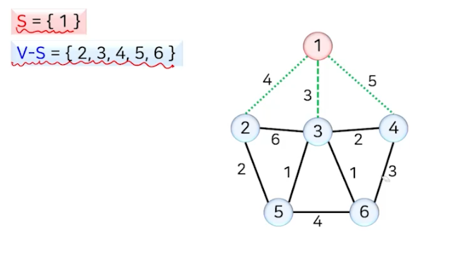
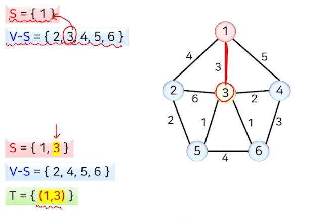
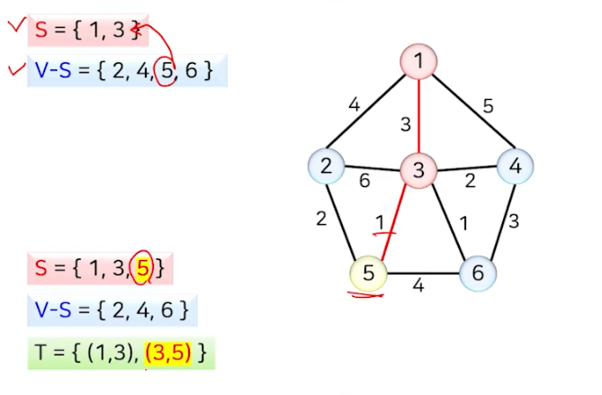
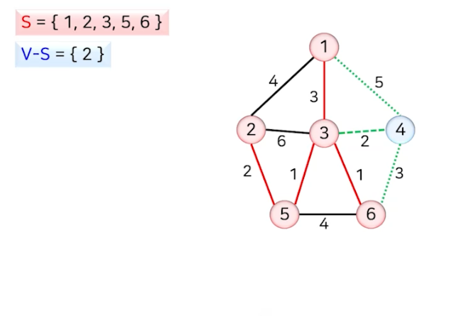
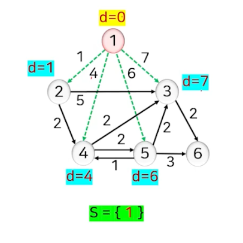
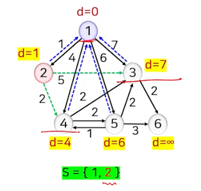
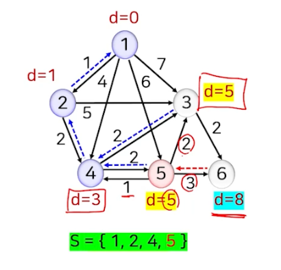

# 그래프 (2)

## 신장 트리 (Spanning Tree)

- 가중 무방향 그래프에서 모든 정점을 포함(모든 정점이 연결, 사이클 X)하는 트리
- 정점의 개수가 n이면, 트리에는 정확히 n-1 개의 간선이 존재한다

## 최소 신장 트리 (Minimum Spanning Tree)

- 신장 트리에서 가중치의 합이 가장 작은 트리
- 간선 (u, v) 마다 가중치 w(u, v)를 가진 연결된 무방향 그래프 G=(V, E)에 대해서 다음을 만족하는 트리 G'=(V, E')

- 모든 간선 중에서 정점을 모두 연결하면서 가중치의 합을 가장 작게 만드는 (n-1)개의 간선을 고르는 과정

## 크루스칼 알고리즘 (최소 신장 트리)

- 간선이 하나도 없는 상태에서 시작해서 가중치가 가장 작은 간선부터 하나씩 골라서 사이클을 형성하지 않으면 해당 간선을 추가하는 방식
- 사이클 형성 여부의 판단
  - 간선(u, v)의 두 정점 u,v가 서로 다른 연결 성분에 속하면 사이클을 형성하지 않음
- |V|=n 개의 정점이 각각의 서로 다른 연결 성분으로 구성된 상태에서 시작해서 간선을 추가할 때마다 연결 성분들이 합쳐지고 최종적으로 하나의 연결 성분을 형성함

### 예제 1

### 성능

## 프림 알고리즘 (최소 신장 트리)

- 임의의 한 정점에서 시작해서 연결된 정점을 하나씩 선택해 나가는 방법
  - 이미 선택된 정점들에 부수된 가중치가 가장 작은 간선을 선택해서 추가
  - 어떤 순간이 이미 선택된 정점의 집합 S와 선택되지 않은 정접의 집합 V-S를 잇는 간선 중에서 가중치가 가장 작은 간선을 선택해서 추가하는 방법
    - 임의의 정점 하나를 S로 지정한 후 시작해서 S=V가 될 때까지 S를 점점 키워나가는 방법
    - 

### 예

### 성능

## 최단 경로?

- 두 정점 u와 v간의 최단 경로
  - 가중 그래프에서 두 정점 u에서 v를 연결하는 경로 중 간선의 가중치의 합이 가장 작은 경로
- 최단 경로 문제의 유형
  - 단일 출발점 최단 경로 (single-source shortest path)
    - 데이크스트라 알고리즘, 벨만-포드 알고리즘
  - 단일 도착점 최단 경로 (single-destination shortest path)
  - 단일 쌍 최단 경로 (single-pair shortest path)
  - 모든 쌍 최단 경로 (all-pairs shortest path)
    - 플로이드 알고리즘
    
## 데이크스트라(다익스크라) 알고리즘 (최단 경로)

- 단일 출발점 최단 경로 알고리즘
  - 하나의 출발 정점에서 다른 모든 정점으로 최단 경로를 찾는 알고리즘
  - 욕심쟁이 방법이 적용된 알고리즘
  - 음의 가중치를 갖는 간선이 없다고 가정
- 거리 d[v]
  - 춟발점에서 현재까지 선택된 정점 집합 S를 경유하여 정점 v에 이르는 최소 경로의 길이
- 출발점에서 시작하여 거리 d[]가 최소인 정점을 차례대로 선택하여 최단 경로를 구하는 방법
  - 초기화 : 출발점 s의 거리 d[s]=0, 나머지 모든 정점 v의 거리 d[v]=무한대, 선택된 정점의 집합 S={}
  - S=V가 될 때까지 반복
    - 미선택 정점 집합 V-S에서 거리 d[]가 가장 작은 정점 u를 선택
    - u의 인접 정점에 대해서 u를 경유하는 거리와 기존 거리르 비교해서 작은 값을 새로운 거리값으로 조정

### 예 (방향 그래프)

### 예 (무방향 그래프)

### 성능과 특징

