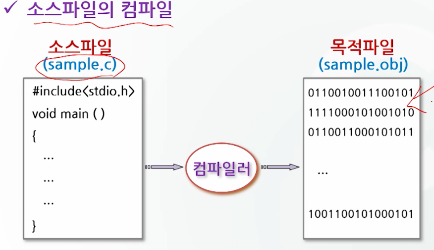
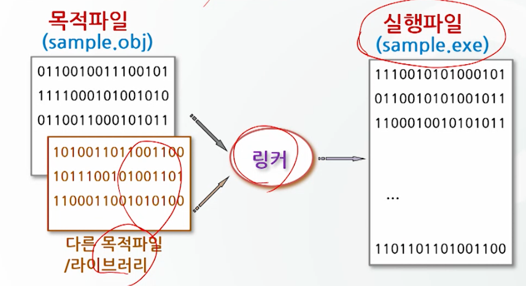

# C 언의의 개요

## C 언어의 정의, 역사 특징

### C 언어의 정의

- 프로그래밍 언어
  - 사람과 컴파일러가 이해할 수 있도록 약속된 형태의 언어
  - 사람(C언어) -> 컴파일러 -> 기계어
- 컴파일러
  - 프로그래밍 언어로 작성된 프로그램을 컴퓨터가 이해할 수 있도록 기계어로 번역해주는 번역기

### C 언어의 역사

- Denis Ritchie (1972년)
- UNIX 운영체제를 만들기 위해 개발
  - 컴퓨터 기종간 호환성을 가진 고급이면서 하드웨어를 제어할 수 있는 새로운 언어가 필요했음
- 어셈블리 언어로 된 UNIX 운영체제가 거의 C 언어로 대체

### C 언어의 특징

- 프로그램 이식성이 높다.
- 간단한 문법표현으로 함축적인 프로그램 작성이 용이.
- low level 특성을 가진 high level 언어.

### C 프로그램의 작성 및 준비

- C 프로그램 완성 과정
  - 코딩 (소스코드 작성)
    - 주어진 문제에 대한 설계를 바탕으로 프로그램을 작성
  - 컴파일
    - 소스파일이 목적파일(obj file)로 변환되는 과정
  - 링크
    - 목적파일이 실행파일로 변환되는 과정
  - 실행




## C 프로그램의 구성

### C 프로그램의 구조

- C 프로그램은 반드시 하나 이상의 함수를 포함해야 한다.
- main 함수는 반드시 존재해야 한다.
- 함수의 사작과 끝을 알리즌 중괄호를 사용해야 한다.
- 중괄호 안에는 변수 선언문, 치환문, 연산문, 함수 등의 명령을 기입힌다.
- 선행처리기(preprocessor)를 제외하고 문장의 끝에는 세미콜론을 붙인다.

```c
// 도입부 -> 프로그램 전체에 적용되는 사항을 기술
#include <stdio.h>
int add(int a, int b);

// main 함수 -> 프로그램의 시작점, 반드시 존재해야함
void main()
{
    int a = 10, b = 20;
    int sum = add(a, b);
    printf("sum = %d\n", sum);
}

// 함수 정의
int add(int a, int b)
{
    return a + b;
}
```

### C 프로그램의 구성 요소

- 예약어: int, char, if, for ...
  - 자료형: char, int, float, short, long, double, unsigned, enum, void, ...
  - 기억 관련: auto, static, register, extern, ...
  - 제어 관련: if ~ else, for, while, do~ while, switch ~ case, break, continue, return, ...
  - 기타: main, sizeof, include
- 명칭: 변수, 함수, 배열 등의 이름
  - 영문자와 숫자의 조합으로 만든다.
  - 명칭의 첫 문자는 영문자나 밑줄(_)로 시작해야 한다.
  - 특수문자를 사용불가
  - 문자 사이에 공백 불가
  - 예약어 사용불가
  - 대소문자 구분
  - 명칭의 길이는 컴파일러에 따라 차이가 있음(일반적으로 32자까지 인식가능)
- 상수: 값이 불변인 자료
- 연산자: =, -, *, /, ++, ...
- 설명문: 프로그램에 대한 주석

### 에러와 경고

- 에러
  - C 언어의 문법상 잘못된 경우 에러 메세지 출력
  - 에러 메세지를 확인하여 반드시 수정해야 한다.
- 경고
  - C 언어의 문법상 문제는 없지만, 프로그램의 실행결과가 의도와 다를 수 있는 경우 경고 메세지 출력
  - 경고 메세지를 확인하여 수정하는 것이 좋다. (무시하여도 실행에는 문제가 없다.)