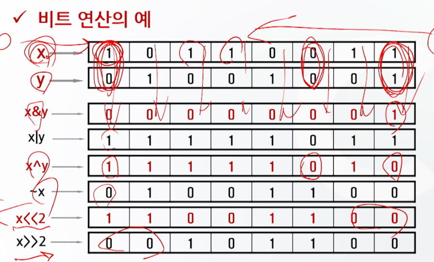
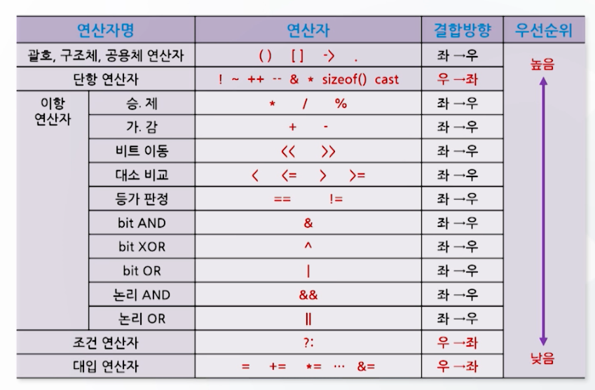

# 입/출력 함수와 연산자 (2)

## 연산자

- 임의의 자료에 대해 각종 연산을 수행하도록 하는 기호

### 산술 연산자

- 피 연산자에 대해 사칙연산을 포함한 각종 산술연산을 수행하는 연산자

### 비트 연산자

| 연산자 |사용예|기능|
|-----|---|---|
| &   |a & b|a와 b의 비트단위 AND 연산|
| \|  |a \| b|a와 b의 비트단위 OR 연산|
| ^   |a ^ b|a와 b의 비트단위 XOR 연산|
| ~   |~a|a의 비트단위 NOT 연산|
| <<  |a << b|a의 비트를 b만큼 왼쪽으로 이동|
| \>> |a >> b|a의 비트를 b만큼 오른쪽으로 이동|



### 기타 연산자

| 연산자       | 기능                                       |
|-----------|------------------------------------------|
| sizeof()  | 지정한 자료형, 수식, 변수가 차지하는 기억공간의 크기(byte)를 구함 |
| cast(형변환) | 지정한 자료형을 다른 자료형으로 강제적으로 바꿈               |
| &         | 변수의 주소를 구함                               |
| *         | 포인터 변수가 가리키는 주소에 저장된 값을 구함               |

- sizeof()
  - ex) `sizeof(int)` : int형 변수가 차지하는 기억공간의 크기를 구함
- cast(형변환)
  - ex) `(int)3.14` : 3.14를 int형으로 강제적으로 형변환

```c
#include <stdio.h>

void main()
{
    int a = 3, b = 4;
    double c;
    
    c = (double)a / b;
    printf("c = %f\n", c); // c = 0.750000
}
```

### 연산자 우선순위

