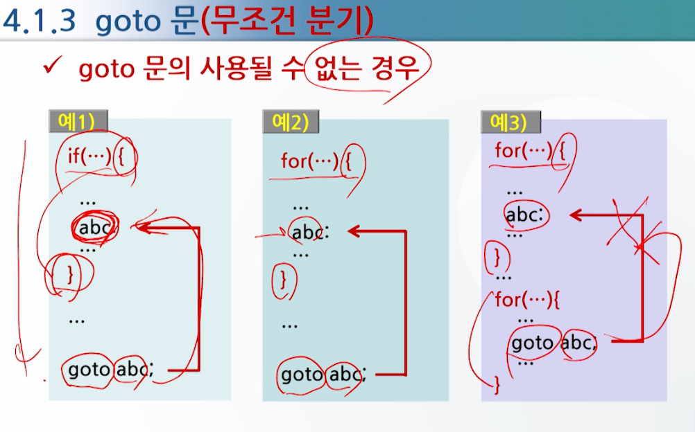

# 선택 제어문과 반복 제어문

## switch문

- 주의사항
    - switch문은 break문을 사용하지 않으면 다음 case문을 실행한다.
    

## goto문

- 형식:

```c
Label:

goto Label;
```

- 기능: 프로그램 수행 도중에 원하는 곳으로 제어를 무조건적으로 옮긴다.

- 예:

```c
#include <stdio.h>

void main()
{
    int i = 0;

    Label:
    printf("i = %d\n", i);
    i++;
    if (i < 5)
        goto Label;
}
```

- goto 문이 사용될 수 없는 경우

