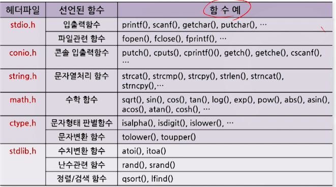
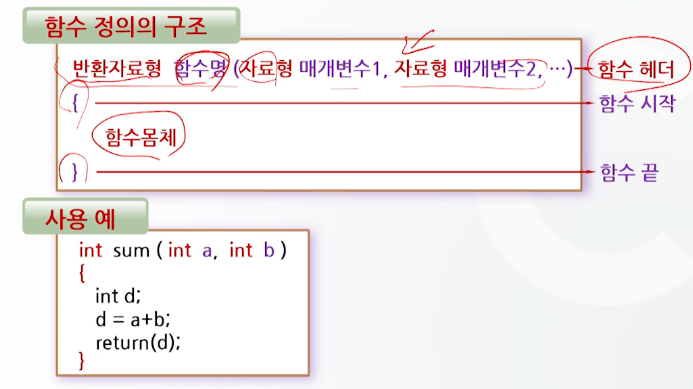
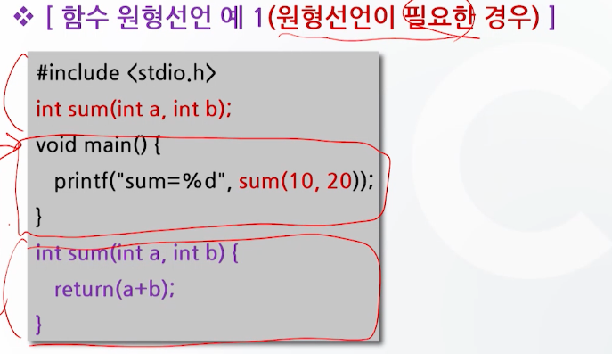
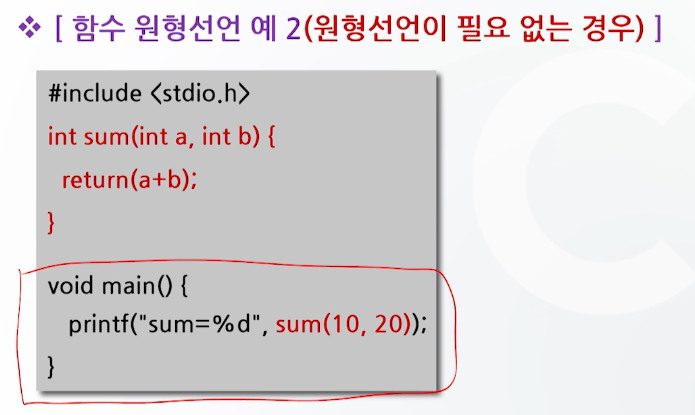
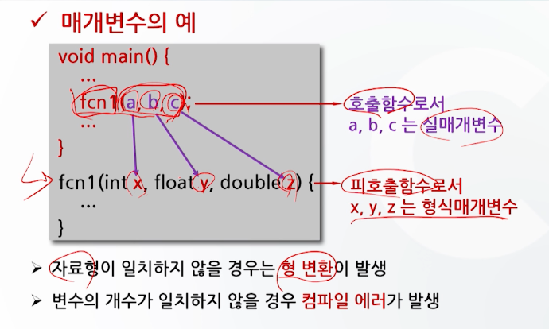

# 함수와 기억 클래스

## 표준함수

- 표준 함수의 원형은 헤더파일에 정의
- 표준함수의 실체는 라이브러리 파일에 수록
- 표준함수를 사용하려면 원형이 선언되어 있는 헤더파일을 #include 시켜 주어야한다.

### 표준함수의 원형 예

- printf(), scanf() 함수의 원형
  - 헤더파일에 정의되어 있음(stdio.h)

```c
inf printf(const char *format, ...);
int scanf(const char *format, ...);
```

### 표준함수 예



## 사용자 정의 함수

- 사용자가 필요에 의해 정의한 함수
- 함수의 원형과 정의를 사용자가 정의



### 사용자 정의 함수 예

```c
#include <stdio.h>
int sum(int a, int b);

void main()
{
    int a = 10, b = 20;
    int result = sum(a, b);
    printf("result = %d\n", result);
}

int sum(int a, int b)
{
    return a + b;
}
```

- 반환 자료형
  - 생략이 가능하며, 생략할 경우 자료형은 int형으로 간주

### 함수의 사용

- 함수를 사용하기 위해서는 함수의 원형 선언, 함수의 호출, 함수의 정의로 구성

### 함수의 원형 선언

- 함수는 변수와 같이 사용되기 전에 미리 선언
- 함수의 원형선언은 일반적으로 main() 함수 이전에 한다.
- 원형선언은 함수정의 부분의 헤더부분에 세미콜론만 추가하면 된다.





### 함수의 호출


