# 함수와 기억 클래스 2

## 매개변수 사이의 자료전달 방법

- 값에 의한 자료 전달(call by value)
  - 기본적인 자료 전달 방법
  - 실 매개변수와 형식 매개변수 사이에 값의 전달
  - 호출한 함수의 실행이 끝난 다음 전달받은 값을 `되돌려 받지는 못한다`.
- 참조에 의한 자료전달
  - 호출함수와 피 호출함수의 배개변수 값을 `서로 교환할 수 있는` 자료전달 방법
  - 값을 전달하는 것이 아니라 실 매개변수의 값이 들어있는 `주소 값이 전달`된다.

### 값에 의한 자료 전달 방법

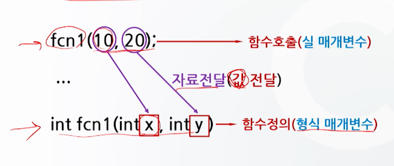

```c
#include <stdio.h>

void swap(int a, int b);

void main()
{
    int a = 10, b = 20;
    printf("a = %d, b = %d\n", a, b); // a = 10, b = 20
    swap(a, b);
    printf("a = %d, b = %d\n", a, b); // a = 10, b = 20
}

void swap(int a, int b)
{
    int temp;
    temp = a;
    a = b;
    b = temp;
    printf("a = %d, b = %d\n", a, b); // a = 20, b = 10
}
```

#### 값에 의한 자료전달 과정

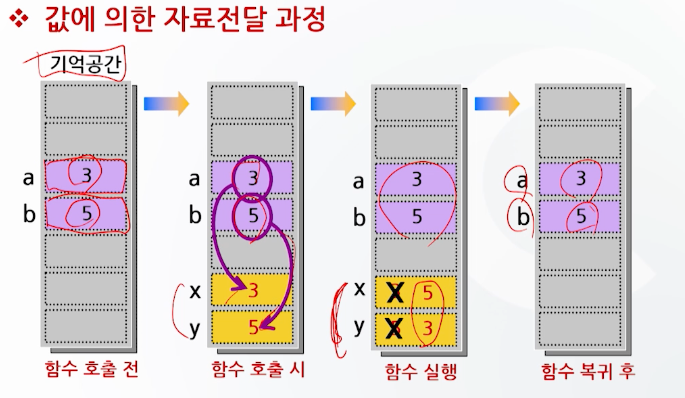

### 참조에 의한 자료전달 방법

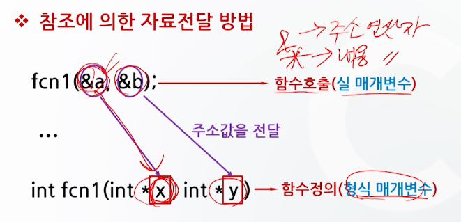

```c
#include <stdio.h>

void swap(int *a, int *b);

void main()
{
    int a = 10, b = 20;
    printf("a = %d, b = %d\n", a, b); // a = 10, b = 20
    swap(&a, &b);
    printf("a = %d, b = %d\n", a, b); // a = 20, b = 10
}

void swap(int *a, int *b)
{
    int temp;
    temp = *a;
    *a = *b;
    *b = temp;
    printf("a = %d, b = %d\n", *a, *b); // a = 20, b = 10
}
```

#### 참조에 의한 자료전달 과정

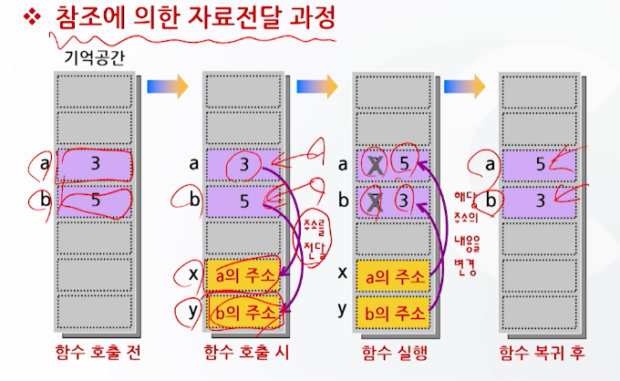

## 기억 클래스 (storage class)

- 변수를 메모리의 특정영역에 할당하는 방법
- 변수의 선언위치에 따라 변수의 생존기간과 접근 범위가 결정된다.
  - 변수의 사용위치에 따라
    - 지역변수
    - 전역변수
  - 변수의 존속기간에 따라
    - 자동변수
    - 정적변수
    - 외부변수
    - 레지스터변수

### 지역변수

- 특정 범위 내에서만 통용되는 변수
- 선언된 블록이나 함수 내에서만 사용가능
- 함수에서 사용되는 매개 변수도 해당

### 전역변수

- 함수 밖이나 외부파일에서 선언되어 프로그램 전체에 걸쳐 사용될 수 있는 변수

#### 지역변수와 전역변수의 유효범위

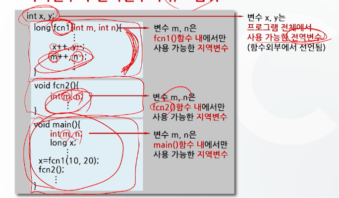

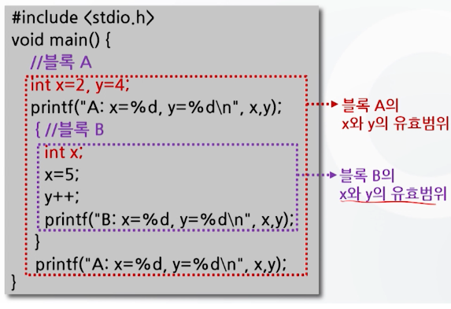

#### 지역변수와 전역변수의 비교

- 동일 범위 내에서는 지역변수가 우선
- 전역변수의 선언은 프로그램 선두에 위치
- 가급적 지역변수를 사용하는 것이 효율적
  - 함수의 독립성 향상
  - 디버깅 효율 항샹
  - 기억 공간 절약

### 기억 클래스의 종류

- 변수의 초기화, 존속기간, 유효범위에 따라 구별
  - 자동변수(auto)
  - 정적변수(static)
  - 외부변수(extern)
  - 레지스터변수(register)
- 기존의 변수 선언무네 기억클래스만 기입
- 선언된 변수에 저장된 자료는 해당 기억영역에 놓이게 됨

```c
auto int a;
static int b;
extern int c;
register int d;
```

#### 자동 변수(auto)

- 함수 실행 시 만들어지고, 실행이 끝나면 기억공간이 제거됨
- 예약어 auto를 사용(생략가능)
- 통용 범위는 변수가 선언된 블록이나 함수 내로 한정
- 지역변수에 해당
- 초기화가 필요

#### 정적 변수(static)

- 메모리에 프로그램 끝날 때까지 유지
- 예약어 static을 사용
- 전역 변수에 해당
- 변수의 값은 프로그램 실행 중 계속 유지
- 초기화가 없으면 0으로 초기화 됨

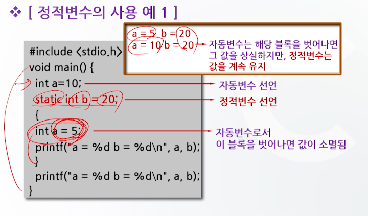

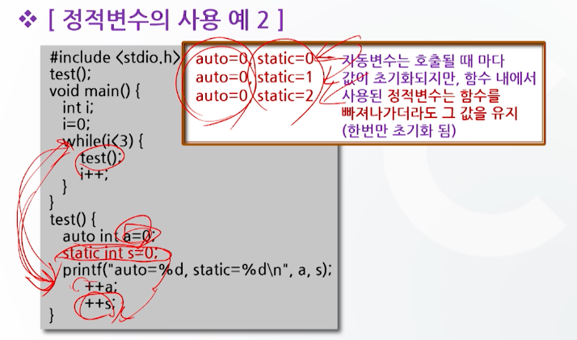

#### 외부 변수(extern)

- 함수의 외부에서 선언
- 예약어 extern 사용
- 전역 변수에 해당
- 초기화가 없으면 0으로 초기화 됨
- 다른 파일에서 외부 변수로 선언된 변수의 값을 참조할 수 있다.

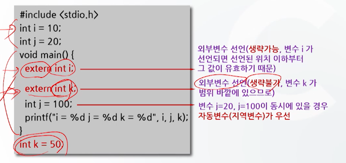

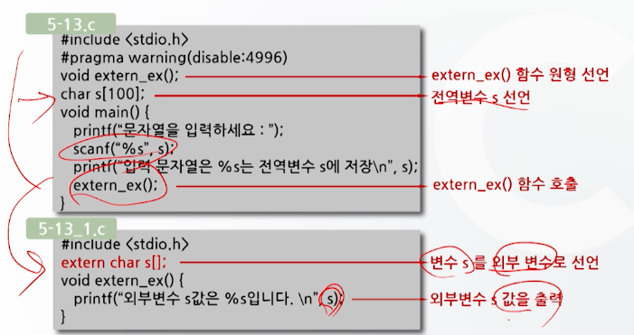

#### 레지스터 변수(register)

- CPU 내의 레지스터에 자료를 저장하고자 할 때
- 예약어 register 사용
- 자동 변수와 동일한 속성
- 프로그램의 실행속도 증가를 목적으로 사용
  - 주로 반복문에서 카운터 변수로 사용

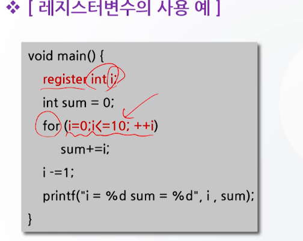
