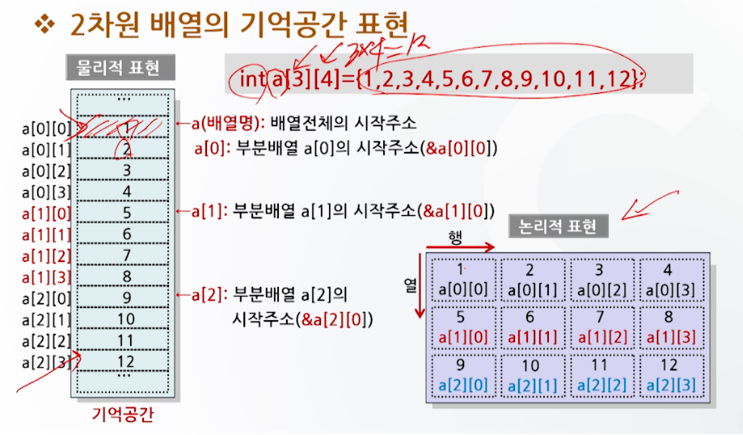

# 배열과 포인터 1

## 배열의 개념

- 배열은 동일한 자료형의 데이터를 연속적으로 저장하는 자료구조이다.
- 동일한 자료형을 갖는 자료들의 리스트
- 배열의 각 요소는 하나의 변수로 취급
- 배열은 배열명과 첨자로 구분

## 배열의 선언 형태

- 1차원 배열
- 2차원 배열
- 다차원 배열

### 1차원 배열

- 배열의 첨자가 하나만 있는 배열
- 첨자의 개수는 배열 전체의 구성요소의 개수를 의미
- 배열의 각 요소는 배열명과 첨자로 구분
  - 첨자는 0부터 시작
- 배열의 각 요소는 배열명과 첨자로 구분

```c
int a[5]; // 5개의 정수형 변수를 갖는 배열

// 배열명 : a
// 크기 : 10
// 타입 : 정수
```


### 1차원 배열의 초기화 

1. 배열선언 후 초기값 할당

```c
int a[4];
a[0] = 10;
a[1] = 20;
a[2] = 30;
a[3] = 40;
```

2. 배열선언과 동시에 초기값 할당

```c
// 가능
int a[4] = {10, 20, 30, 40};
int a[] = {10, 20, 30, 40};
int a[4] = {10, 20, 30, }; // a[3] = 0 으로 초기화

// 에러
int a[4] = {10, ,30, 40};
int a[4] = {10, 20, 30, 40, 50};
```

3. 외부로부터 자료를 입력 받아 초기화

```c
int x[10];

for (int i = 0; i < 10; i++) {
    scanf("%d", &x[i]);
}
```

### 예시

```c
// 
static int a[5] = {1, 2, 3, 4, 5};
int b[5] = {1, 2, 3, 4, 5};
```

## 다차원 배열

- 2차원 배열

```c
int a[3][4]; // 3행 4열의 2차원 배열

int a[3][4] = {
    {1, 2, 3, 4},
    {5, 6, 7, 8},
    {9, 10, 11, 12}
};

// 이것도 가능
int a[3][4] = {
    1, 2, 3, 4,
    5, 6, 7, 8,
    9, 10, 11, 12
};
```



- 3차원 배열

```c
int a[2][3][4]; // 2면 3행 4열의 3차원 배열

int a[2][3][4] = {
    {
        {1, 2, 3, 4},
        {5, 6, 7, 8},
        {9, 10, 11, 12}
    },
    {
        {13, 14, 15, 16},
        {17, 18, 19, 20},
        {21, 22, 23, 24}
    }
};
```


## char 배열과 문자열

```c
char 배열명[문자열 길이 + 1]
// 배열명이 str이고, 12문자 길이를 가진 char형 배열
char str[12]

char name[] = "HONG GIL DONG"; // 문자열 단위로 초기화, null 문자 자동 삽입
char address = {'S', 'E', 'O', 'U', 'L', '\0'}; // 문자 단위로 초기화, `\0` 문자 (null 문자)를 삽입해야함
```


## 함수와 배열

- 배열을 함수로 매개변수로 사용할 경우
  - 함수 호출 시 배열명만 명시하여 호출
  - 
  - 함수의 헤더에는
    - 1차원 배열의 경우 크기 생략 가능
    - 다차원 배열의 경우 가장 높은 차원의 크기 생략 가능

