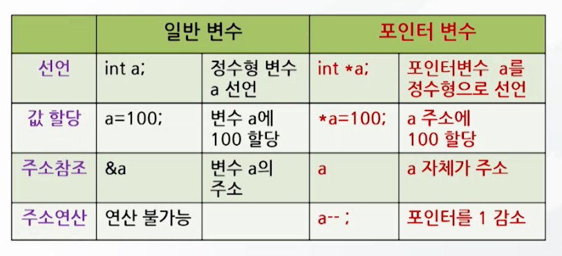
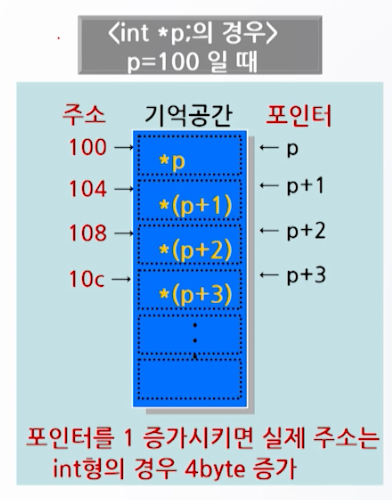
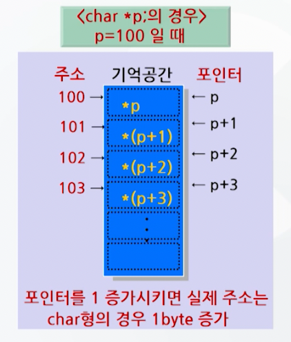
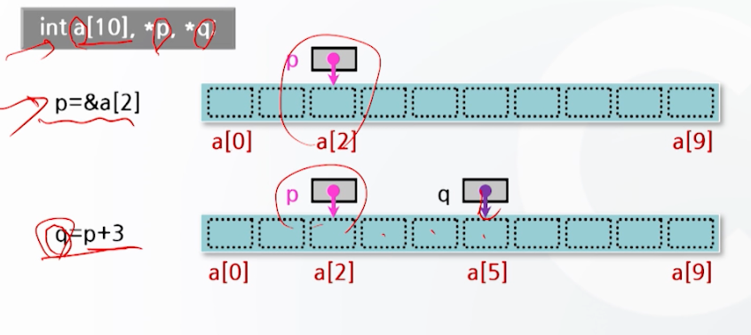
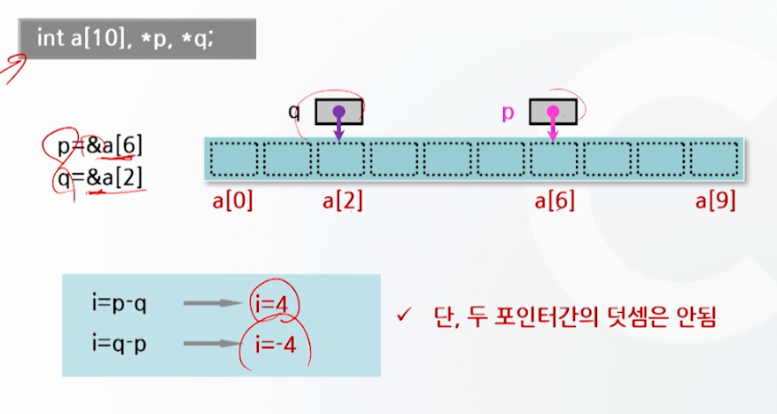

# 배열과 포인터 2

## 포인터의 개념

- 포인터 : 변수의 일종
  - 특정 데이터가 저장된 메모리의 주소 값을 가지고 있음
  - 주소를 이용하여 변수와 같은 동일한 작업 가능

```c
#include <stdio.h>

void main() {
    int days = 365;
    int month = 12;
    int Table[5] = {1, 2, 3, 4, 5};
    printf("days = %x\n", &days);
    printf("month = %x\n", &month);
    printf("Table = %x\n", Table); // 배열명은 주소를 나타낸다 & 필요없음
    printf("Table[0] = %x\n", &Table[0]);
    printf("Table[1] = %x\n", &Table[1]);
}
```

## 포인터 변수의 선언 방법

- 형식 : 자료형 *포인터변수명;
- 사용 예: int *p;
- 기능: 변수 p는 포인터 변수로서 정수형의 자료를 갖는 변수의 주소를 갖는다.

```c
int *p;

// p는 포인터 변수를 담고 있는 변수이고 메모리 주소를 나타낸다.
// *p는 p가 가리키는 주소에 있는 값을 나타낸다.
```

```c
int a, b;
int *p;
a = 5000;
p=&a; // p에 a의 주소를 저장
b=*p; // p의 주소를 deref 하여 b에 할당
```

## 포인터 변수의 참조 방법

### 올바른 참조 방법

```c
int *p;
int i = 4;
p = &i;
*p = 10;
```

### 올바르지 않은 참조 방법

```c
int *p;
int i = 4;
*p = i; // p에 할당된 주소가 없음 (쓰레기 값)
```

### 참조 예

```c
#include <stdio.h>

void main() {
    int *p, i=3, j;
    p = &i;
    j = *p;
    j++;
    printf("*p = %d\n", *p); // 3
    printf("p = %x\n", p); // p = fff4
    printf("j = %d\n", j); // j = 4
}
```

### void 형 포인터

- 형식: void *포인터명;
- 의미
  - 어떤 자료형의 주소도 저장할 수 있는 포인터
  - `저장하기 전에 명시적 형변환이 필요`

```c
#include <stdio.h>

void main() {
    int a = 100;
    char b = 'b';
    void *p = NULL;
    p = (int*)&a;
    printf("*p = %d\n", *(int*)p); // *p = 100
    p = (char*)&b;
    printf9"*p = %c\n", *(char*)p); // *p = b
} 
```



## 포인터 연산




- 포인터 변수에 +, -, ++, -- 연산자를 사용하는 연산



- 두 포인터 간의 연산, 단 두 포인터 간의 덧셈은 안됨

