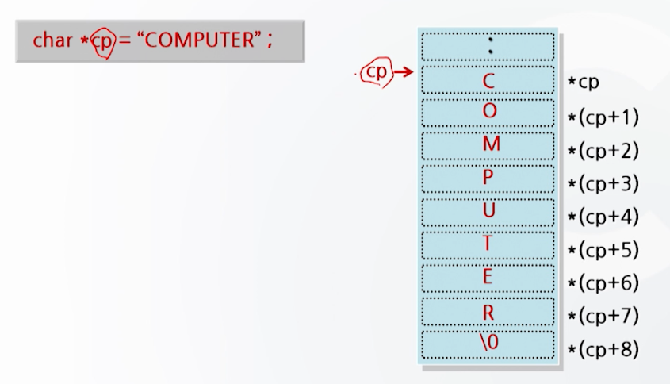
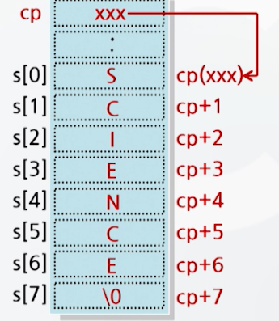
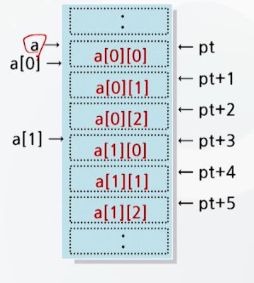
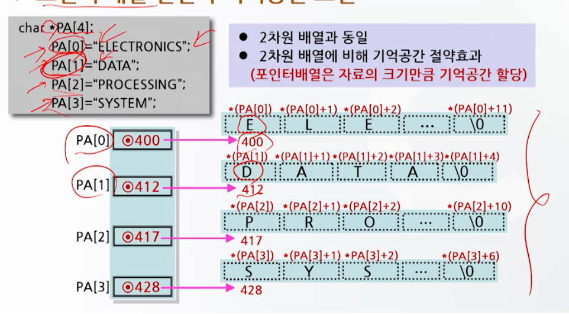
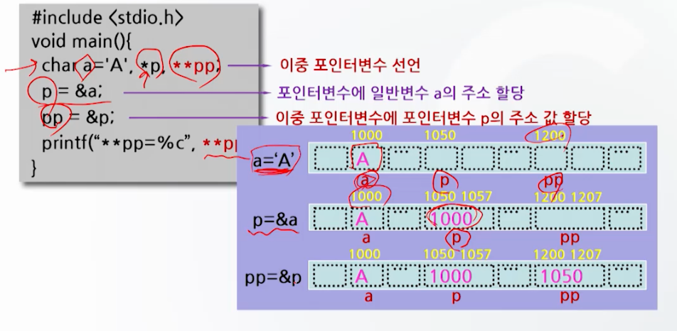

# 배열과 포인터 3

## char형 포인터

- 포인터는 문자열 처리에 효과적
- 문자열 처리에 char형 포인터 사용
  - `char *cp = "computer"`

### char 포인터의 기억공간 표현

- cp는 문자열의 시작주소를 갖는다.
- 따라서 값을 참조할 때와는 달리 포인터 변수 cp에 주소를 치환하지 않는다.


### char 포인터의 사용 예

```c
#include <stdio.h>
void main()
{
    char *cp = "computer";
    int i = 0;
    do
        printf("*(cp + %d) = %c\n", i, *(cp + i));
    while(*(cp + i++) != 0);
}

// *(cp + 0) = c
// *(cp + 1) = o
// *(cp + 2) = m
// *(cp + 3) = p
// *(cp + 4) = u
// *(cp + 5) = t
// *(cp + 6) = e
// *(cp + 7) = r
// *(cp + 8) =  
```

## 포인터와 배열의 관계

### 포인터를 이용한 1차원 배열의 참조

- 배열은 포인터의 일부분
- 모든 배열은 포인터로 표현 가능
  - `cp + 1 <-> &s[1]`
  - `*(cp + 1) <-> s[1]`

```c
char s[] = "SCIENCE";
char *cp;
cp = s; // 포인터 cp를 이용하여 배열 s의 내용을 참조
```



### 포인터를 이용한 2차원 배열의 참조

```c
int a[2][3];
int *pt;
pt = a;
```


```c
#include <stdio.h>
void main() {
    static a[3][3] = {{1,2,3}, {4,5,6}, {7,8,-9}};
    int *pt;
    pt = a[0]; // pt = a 또는 pt = &a[0][0] 과 동일
    while (*pt != -9) {
        printf("%d ", *pt);
        pt++;
    }
}
// 1 2 3 4 5 6 7 8 
```

### 포인터와 배열은 서로 호환적

```c
int a[] = {10 ,20, 30, 40, 50};
int *p, i;

// a + i == $a[i]
// a[i] == *(a + i)
// *(p+i) == p[i]
```

```c
#include <stdio.h>
void main() {
    char a[] = "ARRAY";
    char *p = "POINTER";
    int i;
    for (i = 0; i < 5; i++)
        printf("*(a+%d): %c\n", i, *(a+i));
    // *(a+0): A
    // *(a+1): R
    // *(a+2): R
    // *(a+3): A
    // *(a+4): Y
    for (i = 0; i < 7; i++)
        printf("p[%d]: %c\n", i, p[i]);
    // p[0]: P
    // p[1]: O
    // p[2]: I
    // p[3]: N
    // p[4]: T
    // p[5]: E
    // p[6]: R
}
```

### 포인터와 배열의 값 변경

- 배열 A[i]에서 A++, A--와 같이 값 변경 불가
- 포인터 *p에서 p++, p--와 같이 값 변경 가능

### 배열과 포인터의 기억공간 확보

- 배열
  - 메모리 중 자료영역을 고정적으로 확보
- 포인터
  - 기억공간 중 자료여역을 유동적으로 확보
    - 필요할 때만 자료용 메모리 공간을 확보
    - 자료의 개수가 가변적인 경우 효과적

> 포인터가 배열보다 활용의 폭이 넓다.

## 포인터 배열 

- 포인터 집합
  - 포인터가 여러 개 사용될 때 포인터 배열로 선언
  - 주로 문자열 배열 처리에 사용
  - `char *name1, *name2, *name3;` 대신 `char *name[3];`

```c
char *PA[4];
PA[0] = "ELECTRONICS";
PA[1] = "DATA";
PA[2] = "PROCESSING";
PA[3] = "SYSTEM";
```



```c
#include <stdio.h>
void main() {
    int a[] = {1, 2, 3, 4};
    int b[] = {5, 6, 7, 8};
    int *PA[2];
    PA[0] = a;
    PA[1] = b;
    
    printf("*(PA[0]) = %d\n", *(PA[0])); // 1
    printf("*(PA[0] + 1) = %d\n", *(PA[0] + 1)); // 2
    printf("*PA[1] = %d\n", *PA[1]); // 5
    printf("*PA[1] + 15 = %d\n", *PA[1] + 15); // 20
    
}
```

## 이중 포인터

- pointer to pointer
- 자료가 있는 곳을 이중으로 가리키는 포인터
  - 이중 포인터가 가리키는 주소로 가보면 자료가 아닌 주소 값이 들어 있고, 그 주소에 자료가 들어 있음

```c
int **p;
// p : 기억공간 주소
// *p : 주소 P에 수록되어 있는 값. 이 값이 주소로 사용됨
// **p : 주소가 *p인 곳에 수록되어 있는 값. 즉 int형 자료
```

```c
#include <stdio.h>
void main() {
    char a = 'A', *p, **pp;
    p = &a;
    pp = &p;
    printf("**pp = %c\n", **pp); // A
}
```

