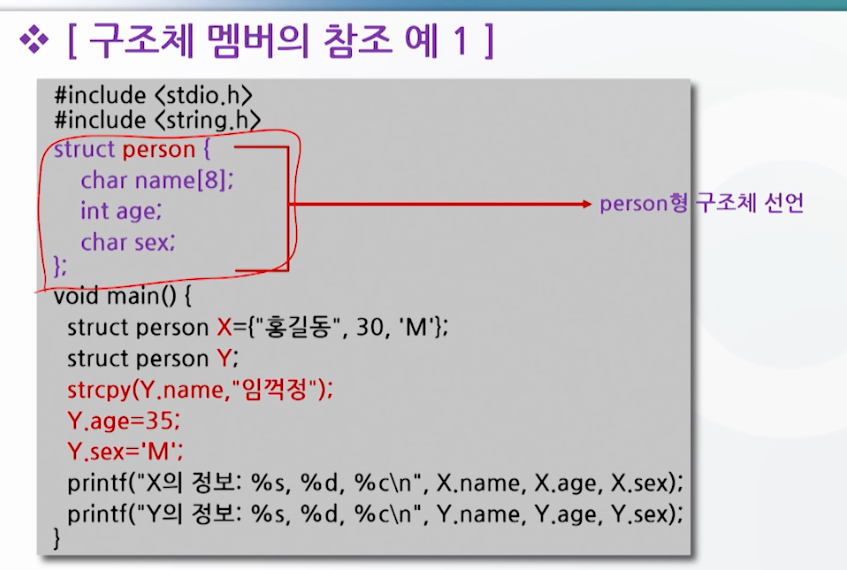
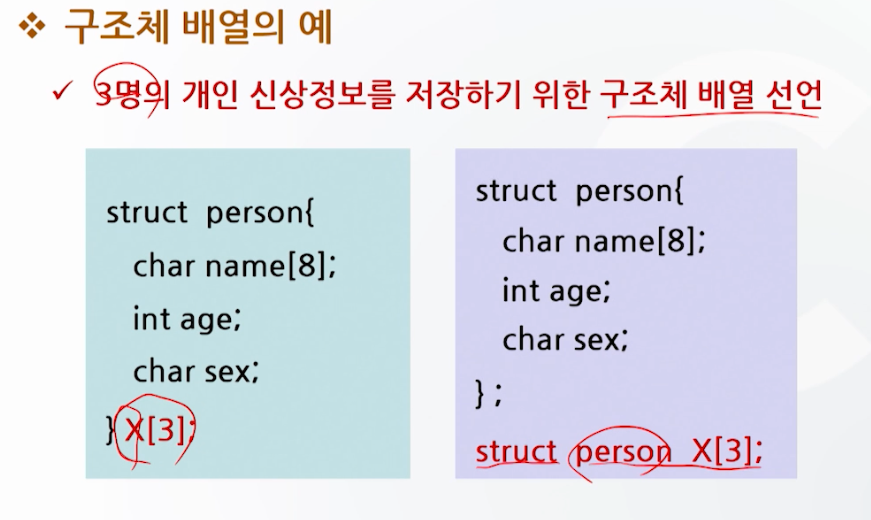
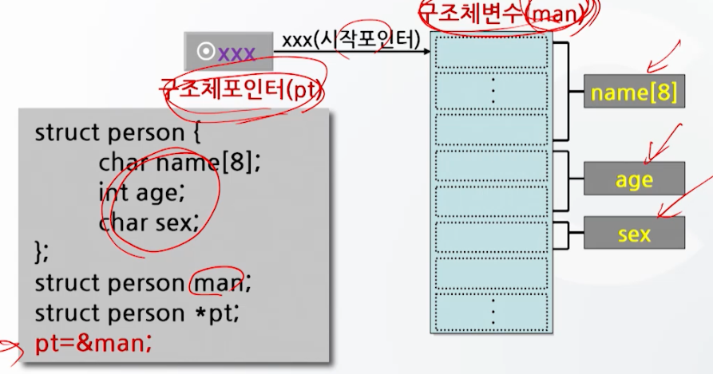

# 구조체와 공용체 1

## 구조체의 개념

- 서로 다른 자료형을 갖는 자료들의 모임을 하나의 자료형으로 정의하여 사용하는 자료형
- 사용자 정의 자료형
  - 다양한 타입의 자료를 간결한 형식으로 표현 가능

## 구조체의 정의와 변수 선언

## 구조체 변수의 초기화 및 참조

## 구조체 배열

- 동일한 구조를 갖는 구조체 변수가 여러 개 사용될 때 그 구조체 변수들을 대표하는 배열명을 설정하여 일반 배열과 같이 사용

## 구조체 포인터

- 구조체를 보다 쉽게 다룰 수 있다.
- 구조체 변수 선언시 *를 붙여 포인터로 선언
- 구조체 포인터는 포인터와 동일하게 주소값을 갖게 되며, 자료가 있는 곳을 가르킨다.

