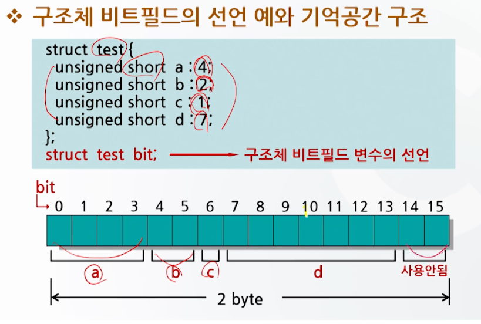

# 구조체와 공용체 2

## 함수와 구조체

### 구조체를 함수의 매개변수로 사용하는 경우

- 일반변수를 함수의 매개변수로 사용하는 것과 동일
- 매개변수가 구조체인 경우 함수의 타입매개변수를 구조체로 선언
- `해당 구조체 전체가 복사`
- 구조체 전체가 복사되기 때문에 시간과 메모리 소모가 크다.

```c
#include <stdio.h>

struct num calc(struct num);
struct num {
    int x;
    int y;
    int sum;
    int mul;
};

void main() {
    struct num number1; // 구조체변수 선언
    number1.x = 10;
    number1.y = 20;
    number1 = calc(number1);
}

struct num calc(struct num number2) {
    number2.sum = number2.x + number2.y;
    number2.mul = number2.x * number2.y;
    return number2;
}
```

### 구조체 포인터를 함수의 매개변수로 사용하는 경우

- 일반적으로 구조체 포인터를 함수의 매개변수로 사용
- 구조체를 복사하지 않기 때문에 실행속도 향상, 메모리 사용효율이 좋아짐

```c
#include <stdio.h>

struct num calc(struct num *);
struct num {
    int x;
    int y;
    int sum;
    int mul;
};

void main() {
    struct num number1; // 구조체변수 선언
    number1.x = 10;
    number1.y = 20;
    calc(&number1);
    printf("sum = %d, mul = %d\n", number1.sum, number1.mul);
}

struct num calc(struct num *number2) {
    number->sum = number2->x + number2->y;
    number->mul = number2->x * number2->y;
}
```

## typedef

- 이미 존재하는 자료형에 새로운 이름을 붙이기 위한 키워드
  - 간단하거나 의미있는 이름으로 바꾸기 위힘
  - 구조체형을 선언하는데 많이 사용

```c
typedef 기존 타입 새로운 타입
typedef int MYINT
```

```c
#include <stdio.h>

struct data {
     int x;
     int y;
};

typedef struct data DATA;

void main() {
    DATA d1 = {10, 20}; // struct data d 와 동일
```


## 구조체 비트필드

- 주기억장치의 기억공간을 byte 단위가 아닌 bit 단위로 사용
  - 프로그램 시 bit 단위의 연산이 필요한 경우 int형 변수를 사용
  - 이때 int형은 4 byte(32bit)이므로 1bit를 제외한 31bit의 기억공간이 낭비
- 구조체의 비트필드를 사용하면
  - 메모리를 절약하고 더욱 유연한 데이터 구조체를 만들 수 있다.

```c
struct 비트필드명 {
  자료형 비트필드변수 : 비트크기;
}

struct nibble {
    unsigned a : 1; // 1bit
    unsigned b : 2; // 2bit
    unsigned c : 1; // 1bit
}
```




## 공용체의 개념

- 동일한 기억장소에 여러 유형의 자료를 저장하기 위해서 프로그래머가 선언한 자료형
- 공용체 안에 포함된 자료들이 같은 기억장소를 공유하여 사용
- 사용될 자료의 자료형이 유동적이 경우 기억 공간을 효율적으로 사용할 수 있는 장점

### 예시

- 공용체의 멤버들이 완전히 다른 자료형을 가질 때 기억공간을 절약하기 위해 사용
- 급여관리 프로그램에서
  - 원화로 월급을 지급받는 사람 : 정수형으로 처리
  - 달러로 월급을 지급받는 사람 : 실수형으로 처리
    - 이러한 경우, 공용체를 사용하면 필요에 따라 메모리의 자료형을 선택해서 값을 저장 가능

```c
union 공용체명 {
    자료형 멤버1;
    자료형 멤버2;
    ...
};

union var {
    char a;
    int b;
    float c;
};
union var abc;
abc.a = 'A';
abc.b = 133;
abc.c = 1234.5678;
```

## 공용체의 사용

- 공용체가 사용되면
  - 공용체의 멤버 중에서 자료크기(byte 수)가 가장 큰 멤버에 대해서만 기억공간이 할당되고,
  - 기억 공간의 시작위치부터 각 부분을 다른 멤버가 공용으로 사용

```c
union hold {
    short int digit; // 2byte라고 가정
    double big; // 8byte라고 가정
    char letter; // 1byte라고 가정
}
```


