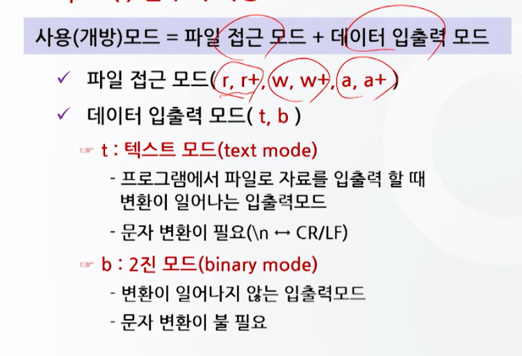

# 파일 처리 함수 1

## 파일 입 / 출력의 개념

- 보조 기억 장치의 파일을 이용한 자료의 입/출력
  - 파일처리 함수를 이용
- 파일이란?
  - 보조기억장치에 저장된 데이터들의 모임
  - 일련의 바이트(byte)들로 구성
  - C 프로그램은 운영체제를 통해서 파일을 읽거나 쓰게 된다.
- C언어에서는 컴퓨터와 연결된 장치들까지도 모두 파일의 범주에 넣어 처리
- 파일의 구분
  - 텍스트 파일
    - 화면에 출력되는 문자들로 구성된 파일
  - 2진 파일 (바이너리 파일)
    - 텍스트 파일을 포함한 모든 종류의 자료를 다루는 파일
    - 컴파일 되어 있어 기계어에 가까우므로 내용을 이해하거나 인쇄가 불가능
- 파일에 대한 자료의 입력과 출력
  - 파일 입력
    - 디스크 상의 특정 위치(파일)에 수록되어 있는 자료를 읽어들여 기억공간에 수록하는 절차
  - 파일 출력
    - 메모리에 있는 자료를 디스크 상의 특정 위치(파일)에 수록하는 절차
  - 파일포인터를 사용하여 파일 입출력 수행
- 파일 처리를 위해서는 파일 포인터를 사용
  - 파일 포인터
    - 파일이 어디에 있는지는 가리키는 포인터
    - 모든 파일 입출력 함수는 파일 포인터 사용
- 파일을 입출력 할 때 버퍼 사용
  - 버퍼
    - 메모리와 디스크 사이에 존재하는 임시 기억 공간
    - 파일 입출력 시 디스크에 저장된 자료를 기억 공간으로 읽어들이거나 기억 공간에서 처리된 자료를 디스크에 저장할 때 사용

## 파일포인터를 이용한 파일 입 / 출력

- 자료의 입출력의 개념
  - 프로그램과 입출력 장치(콘솔, 파일, 소켓 등)와의 사이에 이루어지는 자료의 입력과 출력
  - 자료의 입출력을 위한 논리적인 통로가 필요 : `스트림`
  - 
- 자료의 입출력을 위해서는 스트림이 필요
  - 표준 입출력장치를 이용한 입출력
    - 표준 입출력장치와의 스트림은 프로그램 실행 시 자동으로 생성되고, 프로그램 종료 시 자동으로 소멸
  - 파일을 이용한 자료 입출력
    - 파일 입출력을 위한 스트림은 프로그램을 통해 생성과 소멸을 시켜주어야 한다.
- 파일 입출력의 수행과정
  1. 파일을 연다 -> 파일과 자료를 주고 받을 수 있는 스트림을 생성 (fopen() 함수 사용)
  2. 입출력을 수행한다 
  3. 파일을 닫는다 -> 생성된 스트림을 소멸시키기 위한 과정 (fclose() 함수 사용)
  - 스트림의 생성
    - 파일과 프로그램과의 통로(논리적인 접속)를 구성
    - 통로 역할을 파일포인터가 수행
- 


```c
#include <stdio.h>
void main() {
    char ch;
    FILE *fp; // 파일 포인터 선언
    fp = fopen("test.txt", "w"); // 파일 오픈
    for (ch = 'A'; ch <= 'Z'; ch++)
        fputc(ch, fp); // 파일에 문자 출력
    fclose(fp); // 파일 닫기
}
```


### 파일 처리 함수와 기능


| 함수                         | 기능                |
|----------------------------|-------------------|
| fopen("파일명", "모드")         | 파일을 열어 파일 포인터를 반환 |
| fclose(파일포인터)              | 파일을 닫음            |
| fgetc(파일포인터), getc()       | 파일로부터 하나의 문자를 읽음  |
| fputc(문자, 파일포인터), putc()   | 파일에 하나의 문자를 씀     |
| fgets(문자열, 크기, 파일포인터)      | 파일로부터 문자열을 읽음     |
| fputs(문자열, 파일포인터)          | 파일에 문자열을 씀        |
| fscanf(파일포인터, 서식문자열, ...)  | 파일로부터 서식화된 자료를 읽음 |
| fprintf(파일포인터, 서식문자열, ...) | 파일에 서식화된 문자열을 씀  |
| fseek(파일포인터, 이동크기, 기준위치)   | 파일 내에서의 위치를 이동     |
|fread(데이터, 크기, 개수, 파일포인터)| 파일로부터 데이터를 읽음     |
|fwrite(데이터, 크기, 개수, 파일포인터)| 파일에 데이터를 씀        |
| feof(파일포인터)               | 파일의 끝에 도달하면 1을 반환   |
| ferror(파일포인터)             | 파일 입출력 에러가 발생하면 1을 반환 |

### 파일포인터 변수와 버퍼의 관계


### 파일포인터 선언과 파일 열기

- 파일 열기
  - 프로그램과 디스크 상의 파일 사이에 데이터가 입출력할 수 있도록 통로를 만들어주는 것


- fopen() 함수
  - 파일을 열어 파일 포인터를 반환
  - 파일이 열리지 않으면 NULL을 반환
  - 파일을 열 때 사용하는 모드
    - r : 읽기 모드
    - w : 쓰기 모드
    - a : 추가 모드
    - r+ : 읽기/쓰기 모드
    - w+ : 읽기/쓰기 모드
    - a+ : 읽기/쓰기 모드





- fclose() 함수
  - 개방된 통로와 버퍼를 원 상태로 환원
  - 쓰기의 경우 파일 끝에 EOF(End Of File)을 추가 (완전한 파일로 완성됨)

## 순차 파일 처리

- 정보의 집합 -> 파일
  - 파일은 레코드 단위로 구성
  - 레코드
    - 파일 입출력처리에 사용되는 논리적인 기본단위
    - 각 레코드들은 필드들로 구성
  - 파일처리 함수를 이용하여 파일을 편성하는 방법에 따라
    - 순차파일
    - 랜덤파일

### 파일의 종류

- 순차파일
  - 파일의 처음부터 자료를 차례를 읽고, 기록하는 파일
  - `레코드의 길이가 일정하지 않은 파일`
    - 레코드의 길이가 일정하지 않기 때문에 오히려 순차적으로 읽고 써야함
- 랜덤 파일
  - 파일의 임의의 위치에서 자료를 읽고, 기록하는 파일
  - `레코드의 길이가 일정한 파일`

### 순차파일에서의 레코드 구성

- 순차파일은 레코드의 길이가 일정하지 않기 때문에 레코드들의 구분이 필요
  - CR/LF를 사용하여 구분


### 순차파일 만들기

- 순차파일 출력함수
  - 만들어진 파일에 자료를 기록하는 함수 (파일에 자료를 기록하는게 파일을 출력하는 것이므로...)
  - putc(), fputc(), fputs(), fprintf()
- 순차파일 입력함수
  - 파일로부터 자료를 읽어오는 함수
  - getc(), fgetc(), fgets(), fscanf() 