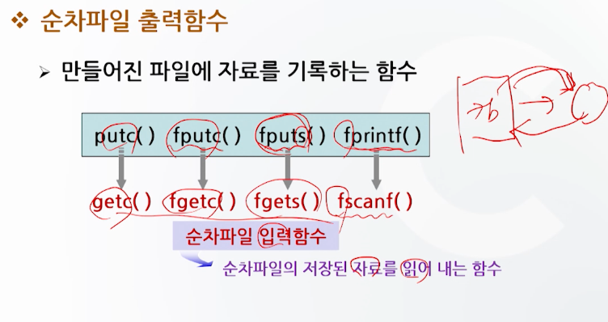
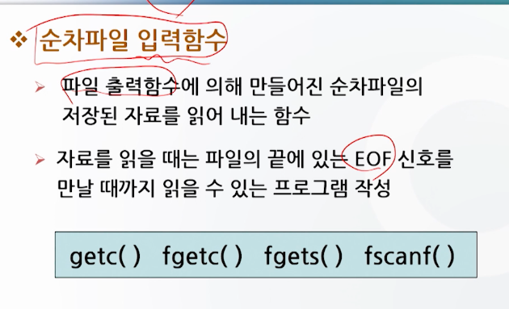
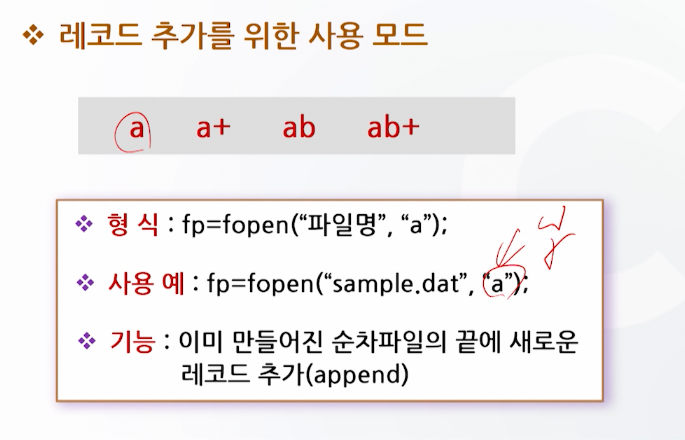
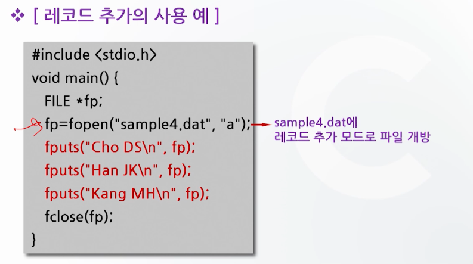
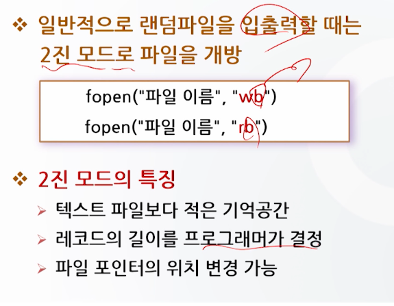
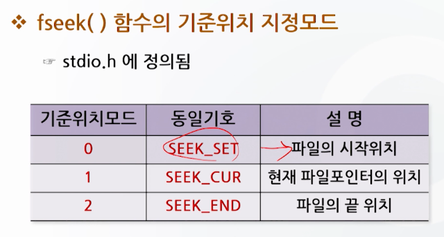
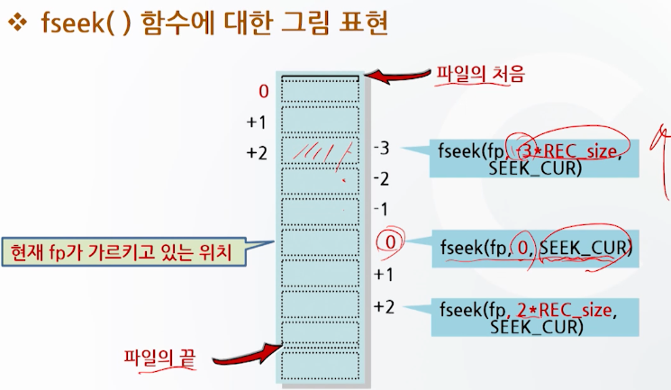

# 파일 처리 함수 2

## 순차파일 입출력 함수

### putc()

- 문자 단위의 파일 출력함수
- fputc() 함수와 유사
- 형식 : putc(문자변수, 파일포인터변수);
- 사용 예 : putc(c, fp);
- 기능: fp가 가리키는 파일에 변수 C에 있는 문자를 출력

### fputs()

- 문자열을 파일로 출력할 때 사용
- 형식 : fputs(문자열, 파일포인터변수);
- 사용 예 : fputs(str, fp);
- 기능 : fp가 가리키는 파일에 문자열 str을 출력

### fprintf()

- 지정된 형식을 가지고 파일에 자료를 출력
- 여러 항목의 복합적인 자료로 구성된 레코드를 저장할 때 유용
- 형식 : fprintf(파일포인터변수, 서식문자열, 출력할 자료);
- 사용 예 : fprintf(fp, "%d %f %s", a, b);
- 기능 : 지정된 형식대로 자료를 파인포인터변수가 가리키는 곳에 출력

### C 언어에서는 입출력 장치를 파일 개념으로 처리

- C 프로그램에서는 자동적으로 3개의 표준파일에 대한 포인터를 생성
- 이러한 표준파일에 대해서는 따로 파일포인터를 선언할 필요가 없다.

| 표준파일 | 파일 포인터 | 대응장치 |
|------|--------|------|
| 표준입력 | stdin  | 키보드  |
| 표준출력 | stdout | 모니터  |
| 표준에러 | stderr | 모니터  |

### getc()

- 문자 단위의 파일 입력 함수
- fgetc() 함수와 유사
- 형식 : getc(파일포인터변수);
- 사용 예 : c = getc(fp);
- 기능 : fp가 가리키는 파일로부터 문자를 입력

### fgets()

- 파일에 저장된 문자열 자료를 읽을 때 사용
- 읽어 낼 문자열의 길이를 반드시 명시
- 형식 : fgets(문자열, 문자열 길이 + 1, 파일포인터변수);
- 사용 예 : fgets(str, 80, fp);
- 기능 : 지정된 파일로부터 해당 문자열 길이 만큼의 문자를 읽어와 문자열 변수에 저장한다.

### fscanf()

- 숫자, 문자 등 복합적인 자료로 구성된 레코드를 읽을 때 사용
- 일반적으로 파일의 끝을 판별하는 feof() 함수와 같이 사용
- 형식 : fscanf(파일포인터변수, 서식문자열, 입력할 자료);
- 사용 예 : fscanf(fp, "%d %f %s", &a, &b);
- 기능: 파일 포인터가 가리키는 곳으로부터 지정된 형식대로 자료를 읽어온다

### 순차파일의 레코드 추가

## 랜덤 파일 처리

- 파일의 임의의 위치에서 자료를 읽거나 쓸 수 있다.
- 레코드의 길이가 일정
- 순차파일에 비해
  - 단점 : 메모리 낭비
  - 장점 : 레코드 검색이 빠르고 효과적

## 랜덤파일 입출력 함수

### fwrite()

- 형식 : fwrite(저장자료변수, 레코드길이, 레코드개수, 파일포인터변수);
- 사용 예 : fwrite(&name, 10, 1, fp);
- 레코드의 길이를 지정
- 자료저장 변수는 포인터형

### fread() 함수

- 형식 : fread(읽을자료변수, 레코드길이, 레코드개수, 파일포인터변수);
- 사용 예 : fread(&name, 10, 1, fp);
- 읽기에 성공하면 읽은 레코드 수를 리턴

## 랜덤파일의 위치 제어

### fseek()

- 파일 포인터를 임의의 위치로 이동시키는 함수
- 랜덤파일의 특정부분을 입출력할 수 있다.
- 형식 : fseek(파일포인터변수, 이동할 상대위치, 기준위치를 지정하는 모드);
- 사용 예 : fseek(fp, 2*REC_size, SEEK_SET);
- 기준 위치로부터 앞, 뒤로 이동하는 상대위치 개념 사용

