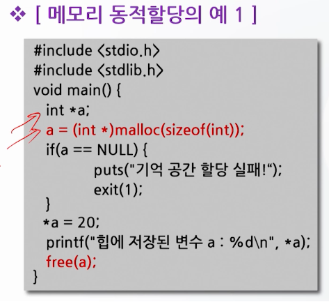

# 메모리 동적 할당

## 메모리 동적 할당의 개념

### C언어에서의 기억 공간

- 프로그램의 실행을 위해 기억공간 필요
- 기억공간은 운영체제에서 할당
- 할당되는 메모리의 영역
  - 데이터 영역
  - 힙
  - 스택

### 메모리 공간의 확보 방법

- 메모리 정적 할당 (static)
  - 기억공간의 데이터 영역과 스택 영역을 이용
  - 프로그램을 작성하는 단계에서 필요한 메모리의 크기를 결정
- 메모리 동적 할당 (dynamic)
  - 메모리의 힙 영역 이용
  - 프로그램 실행 중에 필요한 메모리의 크기를 결정

## 메모리 정적 할당

- 변수 선언이나 배열 선언과 같이 프로그램을 작성하는 단계에서 필요한 기억 공간의 크기를 결정
  - 변수 선언과 같이 할당시켜 줘야 할 기억 공간의 한계 크기를 명확히 알고 있을 경우 사용
  - 메모리 정적할당은 프로그램이 시작될 때 미리 기억공간의 크기를 고정하여 할당
- 장점
  - 프로그램에서 사용하게 될 변수의 기억 공간의 크기를 명확히 알고 있다면
    - 메모리 정적할당은 쉽게 메모리를 사용할 수 있고 에러의 발생확률을 줄일 수 있다.
- 단점
  - 사용하게 될 기억 공간의 크기를 정확히 알지 못하거나, 사용되는 자료의 크기가 각각 차이가 심하다면
    - 기억 공간의 낭비를 가져오게 되는 문제점

### 정적 할당의 문제점 예시

## 메모리 동적할당 함수

- 힙 영역을 이용하여 프로그램의 실행 중에 입력되는 자료의 크기에 맞게 기억 공간을 확보
- 많은 자료를 처리하는 배열의 크기를 실행 시간에 정의해야 하는 경우에 특히 유용
- 프로그램 실행 시 메모리의 크기를 지정할 수 있고 재조정이 가능
- 정적할당 대비 시간이 지체되는 단점이 있다.

### 동적할당 순서

1. 메모리를 동적으로 할당 받을 변수를 포인터를 이용하여 선언
2. malloc() 함수 등을 이용하여 기억 공간을 동적으로 할당
3. 기억공간의 사용이 끝나면 free() 함수를 이용하여 기억공간을 해제한다.

### 메모리 동적할당 함수

#### malloc()

- 인자로 할당 받고자 하는 기억 공간의 크기를 byte 단위로 전달
- 힙 영역에 그 크기만큼 기억 공간을 할당하고, 할당한 기억 공간의 첫 번째 주소를 반환
- void*로 명시하여 어떤 형으로든 형 변환이 가능
- 초기화 안됨(메모리의 초기화를 위해서는 memset() 함수를 사용

#### calloc()

- malloc() 함수와 동일하게 힙 영역에 기억공간 할당
- 다른 점은 사용하는 형태와 할당된 기억 공간을 0으로 초기화

#### realloc()

- 이미 할당 받은 기억 공간의 크기를 변경해야 할 필요가 있을 경우에 사용

#### free()

- 힙 영역에 할당된 공간은 프로그램이 종료될 때 까지 유지
- 할당된 기억 공간을 해제하지 않으면 기억 공간의 부족 현상이 발생
- 따라서 명시적 반납이 필요

## 메모리 관리함수

### memcmp()

- 메모리에 들어있는 자료를 주어지는 크기 만큼 비교하여, 같은지 여부를 알 수 있게 해주는 함수

### memcpy()

- 기억 공간의 내용을 복사하는 함수

### memset()

- 기억 공간의 자료를 지정한 문자로 채우는 함수
- 할당된 기억 공간의 초기화나 내용 삭제를 위해 주로 사용

