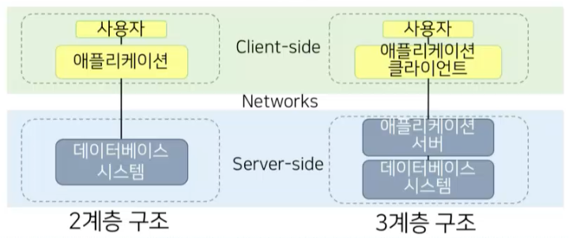

# 데이터베이스의 이해

## 1) 데이터베이스의 역할

- 데이터 관리의 필요
  - 대량의 데이터를 저장 및 관리하고 필요한 데이터를 신속히 검색할 수 있도록 보조하는 장치

### 1-2) 파일 처리 시스템

1. 데이터베이스가 개발되기 전에 데이터 관리에 사용
2. 업무 별 어플리케이션이 개별 데이터를 데이터 파일에 저장 / 관리하는 시스템
3. 발생 가능한 문제 
   1. 데이터 종속의 문제
   2. 데이터 중복의 문제
   3. 무결성 훼손의 문제
   4. 동시 접근의 문제

#### 1-2-1) 데이터 종속의 문제

- 저장된 데이터가 특정 하드웨어에서 또는 사용자 및 소프트웨어만 사용될 수 있도록 제한되는 문제
    - 물리적 데이터 종속
      - 물리적인 하드웨어가 분리되면 데이터도 함께 분리되는 문제
    - 논리적 데이터 종속
      - 데이터 저장방식이 달라질 경우 데이터를 사용하는 방식이 변경되어야 함

#### 1-2-2) 데이터 중복의 문제

- 동일한 사항에 대한 중복 데이터는 일관성, 보안성, 경제성 측면에서 문제 발생
  - 일관성: 한 사실에 대해 한 개의 데이터 값을 유지
  - 보안성: 같은 데이터에 같은 수준의 보안 유지
  - 경제성: 데이터에 대해 최소한의 공간만을 점유

#### 1-2-3) 무결성 훼손의 문제

- 실세계의 데이터는 데이터가 가질 수 있는 가능범위(제약조건)를 포함
  - 현상에 대한 값의 예: '홍길동'의 수강과목
  - 가능 범위의 예: 1학기 최대 수강과목 18학점
- 데이터 무결성
  - 데이터의 정확성 보장
  - 데이터의 값과 값에 대한 제약조건을 동시에 만족

#### 1-2-4) 동시 접근의 문제

- 동일 데이터에 다수 사용자의 접근 허용 시 일관성이 훼손

## 2) 데이터베이스의 특징

### 2-1) 데이터베이스 사용의 의미

- 데이터 사용과 데이터 관리의 영역을 분리

### 2-2) 데이터베이스의 특징

#### 2-2-1) 데이터베이스 시스템의 자기 기술성

- 데이터와 데이터의 정의 및 설명(메타데이터)을 포함

  

#### 2-2-2) 프로그램과 데이터의 격리 및 추상화

- 사용자에게 데이터에 대한 개념적인 표현을 제공하여 접근성을 향상

  

#### 2-2-3) 다중 뷰 제공

- 각 사용자가 관심을 갖는 데이터베이스의 일부만을 표현할 수 있는 기능 제공
  - 데이터베이스의 3단계 구조
    - 외부 단계
        - 사용자 관점에서 데이터베이스를 정의
    - 개념 단계
        - 데이터베이스의 전체적인 구조와 제약조건을 정의
    - 내부 단계
        - 어떠한 데이터가 물리적인 디스크에 저장되는지를 정의
  
    
    

#### 2-2-4) 데이터 공유와 다수 사용자 트랜잭션 처리

- 다수의 데이터 조작 요청을 동시성 제어 기능을 통해 데이터의 일관성을 보장하면서 동시에 작업을 수행
- 트랜잭션의 정의
  - 하나의 논리적인 작업을 처리하기 위한 일련의 데이터베이스 명령의 집합

### 2-3) 데이터베이스 관련 용어

- 데이터(data): 어떠한 사실에 대한 정량적, 정성적 특징을 나타낼 수 있는 값과 값에 대한 설명
- 데이터베이스(database): 특정 기관의 어플리케이션 시스템에서 사용되는 데이터의 집합
- 데이터베이스 관리 시스템(DBMS): 데이터베이스에 저장된 데이터의 구성, 저장, 관리, 사용을 위한 소프트웨어 패키지
- 데이터베이스 시스팀(database system): 정보를 데이터베이스에 저장/관리하여 사용자에게 요구된 형태의 정보로 제공하는 컴퓨터 기반 시스템(e.g. 웹 어플리케이션)

## 3) 데이터베이스의 구성요소

### 3-1) 데이터베이스 언어

- DBMS는 사용자가 데이터베이스를 쉽게 사용하고 다룰 수 있도록 언어 형태의 인터페이스를 제공
- 역할에 따라 종류의 언어로 구분
  - 데이터 정의 언어(DDL)
  - 데이터 조작 언어(DML)
- 현대 데이터베이스 언어는 자연어와 유사한 형태의 SQL로 표준화

#### 3-1-1) DDL(Data Definition Language)

- 데이터베이스 객체를 생성, 수정, 삭제하기 위한 언어
- DDL의 요구 기능
  - 데이터 모델에 따라 어플리케이션 프로그램이 요구하는 데이터의 논리적 구성이나 특징을 규정
  - 데이터가 기억장치에 저장되도록 데이터의 물리적 구성을 규정
  - 물리적 구성을 논리적 구성으로 변환이 가능하도록 데이터의 물리적 구성과 논리적 구성 간의 사상을 규정

#### 3-1-2) DML(Data Manipulation Language)

- 구조화된 데이터에 사용자가 접근 및 조작할 수 있도록 지원하는 언어(검색, 삽입, 삭제, 수정)
- DML의 요구 조건
  - 데이터 조작이 쉽고 간편
  - 데이터 조작 기능이 정확하고 완전
  - 사용자의 요청을 시스템 내부에서 효율적으로 처리 가능

### 3-2) 데이터베이스 시스템 아키텍처

- 중앙집중식 방식
  - 단일 서버가 다수의 클라이언트 장치를 대신하여 작동
  - 중앙 컴퓨터의 과부하로 전체적인 성능 저하
- 분산 시스템 방식
  - 클라이언트 장치의 성능 향상으로 자체적인 처리 능력 보우
  - 클라이언트-서버 데이터베이스 시스템
    - 어플리케이션 프로그램의 부하를 분산
    - 소프트웨어의 유지보수 비용을 절감 및 이식성 증가
  