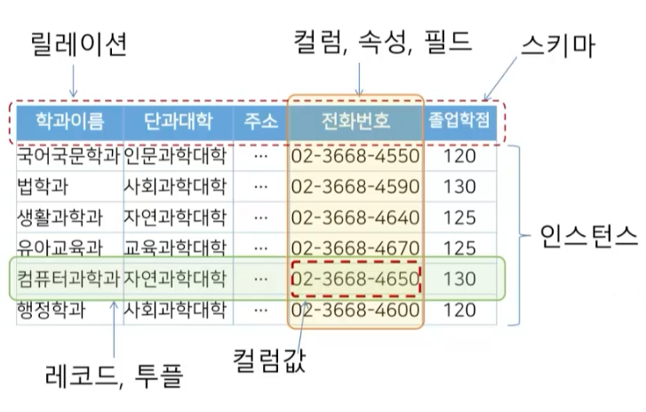

# 관계형 모델

## 1) 관계형 모델의 개념

### 릴레이션(테이블)의 구성

### 릴레이션의 특징

- 레코드의 유일성
  - 중복된 레코드의 존재가 불가능
- 레코드의 무순서성
  - 레코드의 순서는 의미가 없음
- 컬럼의 무순서성
  - 컬럼은 순서가 없고, 이름과 값의 쌍
- 컬럼값의 원자성
  - 모든 값들은 나눌 수 없는, 단 하나의 의미를 가짐

### 키(key)의 역할

- 릴레이션의 레코드를 유일하게 식별하는 값

### 키의 종류 및 속성

- 키의 속성
  - 유일성
  - 최소성: 더 이상 축소할 수 없는 값

- 키의 종류
  - 슈퍼키: 유일성 만족을 만족하는 속성 또는 속성들의 집합
  - 후보키: 유일성, 최소성 만족하는 속송 또는 속성들의 집합
  - 기본키: 레코드의 구분을 위해 선택된 후보키
  - 외래키: 참조된 다른 릴레이션의 기본키

### 관걔형 모델의 제약조건

- 영역 제약 조건
  - 컬럼에 정의된 영역에 속한 값으로만 컬럼값이 결정
- 키 제약조건
  - 키는 레코드를 고유하게 구별하는 값으로 구성
- 개체 무결성 제약조건
  - 어떠한 기본 키도 null이 될 수 없음
- 참조 무결성 제약조건
  - 반드시 존재하는 레코드의 기본키만 참조 가능

## 2) ERD의 변환

### 논리적 데이터 모델링

- DBMS의 구현 모델에 맞춰 데이터를 표현하는 과정
- 데이터 정의 언어로 기술된 개념 스키마 생성
- 논리적 데이터 모델링의 필요
  - RDBMS의 구현 모델에 맞춰 데이터의 구조와 관계를 표현
  - 작성된 ERD를 RDBMS가 수용 가능한 구조로 변환

## 3) 데이터 연산

### 관계 연산의 개념

- 관계형 모델을 기반으로 구성된 릴레이션을 사용하여 새로운 릴레이션을 생성하는 표현
- 사용자의 관점에서 필요한 데이터를 릴레이션에서 추출하는 방법을 제공하는 도구
- 관계 대수
  - 관계 연산을 정의하는 방법
  - 주어진 릴레이션에서 필요한 릴레이션을 만드는 연산자로 구성
  - 관계 대수 연산자는 새로운 임시 릴레이션을 생성
  - 연산자를 중첩하여 연산 처리 절차를 표현

### 셀렉트 연산(𝛔)

- 주어진 릴레이션에서 조건을 만족하는 레코드를 갖는 릴레이션을 생성
- 조건

| a, b | 속성 이름                  | v | 상수 값 |
|------|------------------------|---|------|
|    𝛉   | 비교자 {>, ≥, <, ≤, =, ≠} | R | 릴레이션 |

- 조건의 결합: ∧(and),∨(or),￢(not)

### 프로젝트 연산 (𝝅)

- 기술된 컬럼만 갖는 릴레이션으로 재구성
- <컬럼리스트>: 릴레이션에서 선택할 컬럼의 이름을 나열

### 관계 대수 연산식의 활용

- 서로 다른 연산을 중첩하여 사용 가능

### 집합 연산자

- 수학적 집합 이론에서의 이진 연산
  - 합집합: R ∪ S
  - 교집합: R ∩ S
  - 차집합: R - S
- 릴레이션은 집합, 레코드는 집합에 포함된 원소
- 집합 연산자 사용조건
  - 릴레이션 R, S의 차수(컬럼 수)가 동일
  - 모든 i에 대해 R의 i번째 컬럼의 도메인과 S의 i번째 컬럼의 도메인이 반드시 동일
    - R의 첫 번째 컬럼은 문자, S의 첫 번째 컬럼은 숫자 -> 집합 연산 불가

### 카티시언 프로덕트 연산

- 두 릴레이션에 포함된 레코드 간의 모든 조합을 생성하는 이항 연산자

### 조인 연산 (⋈)

- 두 릴레이션에서 조건을 만족하는 레코드를 결합한 레코드로 구성된 릴레이션을 생성

- 아래의 두 연산은 동일한 결과를 반환

### 집계 함수 연산

- 집계 함수를 값들의 집합 또는 레코드의 집합에 적용하는 연산
  - x(): AVG, SUM, COUNT, MAX, MIN 등의 집계 함수
  - A: 집계 연산을 적용할 컬럼

- 레코드 그룹화를 위해 집계 함수 연산자 앞에 그룹화 속성을 기술
  - B: 그룹의 기준이 되는 컬럼
  - x(): AVG, SUM, COUNT, MAX, MIN 등의 집계 함수
  - A: 집계 연산을 적용할 컬럼
  - R: 릴레이션

