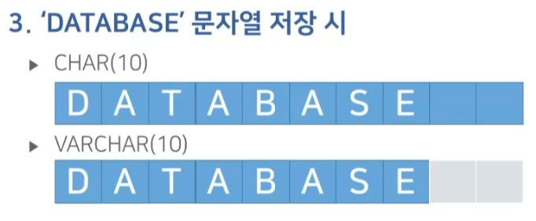
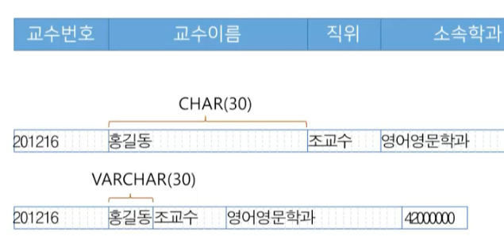

# SQL (1) - MySQL 기준

## 1) 데이터베이스 언어

### SQL의 개요

- SQL(Structured Query Language)은 관계대수에 기초하여 RDBMS의 데이터 관리를 위해 설계된 언어
- 1986년 ANSI, 1987년 ISO 표준으로 제정
  - 상용 DBMS의 특성에 맞게 국제표준을 확장한 독자적 버전이 존재
- 특징
  - 비절차적(선언형) 언어, 필요한 데이터만 기술
  - 인간의 언어와 매우 유사하고 간단, 명료

### SQL의 구성

- DDL(Data Definition Language): 데이터 정의 언어
  - 데이터베이스 내의 객체를 생성 및 삭제하고 그 구조를 조작하는 명령어의 집합
  - 데이터가 준수하야하는 제약조건을 기술
  - `CREATE`, `ALTER`, `DROP` 등
- DML(Data Manipulation Language): 데이터 조작 언어
  - 데이터베이스 내의 데이터를 검색, 삽입, 수정, 삭제하는 명령어의 집합
  - `SELECT`, `INSERT`, `UPDATE`, `DELETE` 등


## 2) 데이터 정의 언어

### 데이터 정의 언어의 개념

- 데이터베이스 객체를 생성, 삭제 또는 구조를 수정하는 명령어의 집합
- 데이터베이스 객체의 종류
  - 데이터 저장: 테이블, 인덱스, 뷰
  - 데이터 조작: 트리거, 프로시저, 함수 등
- 데이터 정의 명령어의 종류
  - `CREATE`: 객체 생성
  - `ALTER`: 객체 수정
  - `DROP`: 객체 삭제

### 스키마 정의

- 스키마 = 데이터베이스
- 한 조직의 데이터베이스 시스템의 운영에 필요한 테이블, 인덱스, 뷰 등의 데이터베이스 객체의 집합

### 스키마 관리 구문

- `CREATE SCHEMA 스키마 이름`
- `DROP SCHEMA 스키마 이름`

### 테이블 정의

```sql
CREATE TABLE 테이블이름(
    <컬럼1><데이터타입> [제약조건][
    <컬럼n><데이터타입n>[제약조건n]
    ]
    [PRIMARY KEY 컬럼명]
    [UNIQUE 컬렴명]
    [FOREIGN KEY 컬럼명 REFERENCES 참조테이블(참조컬럼)]
)
```

### 데이터 타입의 개념

- 컬럼이 가질 수 있는 값의 범위, 즉 도메인을 결정
- MySQL의 데이터 타입
  - `CHAR(n)`: 고정 길이 문자열
  - `VARCHAR(n)`: 가변 길이 문자열
  - `TEXT`: 긴 문자열
  - `INT`: 정수형
  - `FLOAT`: 실수형
  - `DOUBLE`: 더블형,
  - `DECIMAL (m, n)`: 고정 소수점
  - `DATE`: 날짜형
  - `TIME`: 시간형
  - `DATETIME`: 날짜와 시간형
  - `TIMESTAMP`: 날짜와 시간형

#### 정수 데이터 타입

- `TINYINT`: 1바이트, -128 ~ 127
- `SMALLINT`: 2바이트, -32,768 ~ 32,767
- `INT`: 4바이트, 약 -20억 ~ 20억
- `BIGINT`: 8바이트, 약 -900경 ~ 900경

#### 실수 데이터 타입

- 고정 소수형
  - `DECIMAL(m, n)`: m은 전체 자리수, n은 소수점 이하 자리수
    - 예) `DECIMAL(5, 2)`: 123.45, -999.99 ~ 999.99
    - NUMERIC과 동일
- 부동 소수형
  - `FLOAT`: 4바이트, 
  - `FLOAT(P)`: 소수점 이하 P개 자리의 부동 소수
  - `DOUBLE`: 8바이트,

#### 날짜 및 시간 데이터 타입

- 날짜 데이터 타입
  - `DATE`: 'YYYY-MM-DD'
  - `YEAR`: 'YYYY'
- 시간 데이터 타입
  - `TIME`: 'HH:MM:SS'
- 날짜 및 시간 데이터 타입
  - `DATETIME`: 'YYYY-MM-DD HH:MM:SS'
  - `TIMESTAMP`: 'YYYY-MM-DD HH:MM:SS'

#### 문자 데이터 타입

- `CHAR(n)`: 고정 길이 문자열
- `VARCHAR(n)`: 가변 길이 문자열
- `TEXT`: 긴 문자열



#### CHAR와 VARCHAR

- `CHAR(n)`: 고정 길이 문자열
  - n은 최대 길이
  - 입력한 문자열이 n보다 작을 경우 공백으로 채워짐
- `VARCHAR(n)`: 가변 길이 문자열
  - n은 최대 길이
  - 입력한 문자열이 n보다 작을 경우 실제 입력한 길이만큼만 저장
- `TEXT`, `CLOB`: 긴 문자열
  - 최대 길이 2 ~ 4GB인 가변 문자열
- `ENUM`: 문자열 중 하나를 선택하는 데이터 타입
  - ENUM('남', '여')

- CHAR는 성능적으로 빠르지만 저장공간을 낭비할 수 있음
- VARCHAR는 저장공간을 절약할 수 있지만 성능적으로 CHAR 대비 느릴 수 있음



### 테이블 수정

- 생성된 테이블에 컬럼을 추가, 수정(이름, 데이터타입, 제약조건) 또는 삭제하는 명령
- 컬럼 삭제 또는 컬럼의 데이터 타입 수정 시 데이터에 대한 소실이 발생하므로 각별한 주의 필요

### 테이블 수정 구문 형식

- 새로운 컬럼을 추가, 삭제 및 수정하는 등의 테이블의 구조를 변경

```sql
ALTER TABLE 테이블 이름
    [ADD COLUMN 컬럼명 데이터타입 [제약조건]]
    [DROP COLUMN 컬럼명]
    [CHANGE COLUMN 기존컬럼명 새컬럼명 데이터타입]
    [MODIFY COLUMN 컬럼명 데이터타입 [제약조건]]
```

### 테이블 삭제

- 존재하는 테이블을 스키마에서 삭제
- 삭제할 테이블의 모든 데이터가 소실, 복구가 불가능한 연산이므로 각별한 주의가 요구

```sql
DROP TABLE 테이블 이름
```

### 제약조건

- 테이블과 테이블에 존재하는 데이터를 보다 무결하게 관리하기 위한 목적
- DBMS는 테이블 조작 시 테이블에 정의된 제약조건을 만족시키는지 지속적으로 검사
- DBMS는 적용하려는 제약의 유형에 따라 다양한 제약 조건을 지원

- PRIMARY KEY: 기본키 지정, UNIQUE + NOT NULL
- FOREIGN KEY: 외래키 지정, 참조 무결성 제약조건
- NOT NULL: NULL 값을 허용하지 않음
- UNIQUE: 중복된 값을 허용하지 않음
- AUTO_INCREMENT: 레코드가 추가될 때 자동으로 증가하는 값을 지정
- CHECK: 컬럼값이 특정 조건 준수 여부 지정