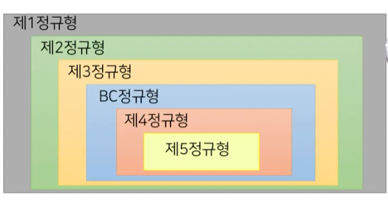

# 정규화

## 잘못된 데이터베이스 모델링

1. 데이터의 중복
   - 일관성 유지의 어려움
   - 저장 공간 낭비
2. 갱신 이상
   - 삽입 이상 : 레코드 추가 시 불필요한 컬럼의 값이 없이는 추가하지 못하는 경우 
   - 삭제 이상 : 삭제 시 의도하지 않았던 다른 데이터가 삭제되는 경우
   - 수정 이상 : 중복 저장된 레코드를 수정 시 모두 반영이 안되어 데이터베이스의 일관성이 깨지는 경우

### 갱신 이상 - 삽입 이상

- 새로운 등급과 할인율을 설정하기 위해서는 알 수 없는 고객 정보를 추가해야함 

### 갱신 이상 - 삭제 이상

- 특정 등급을 삭제하려면 필요한 고객 정보를 삭제해야함

### 갱신 이상 - 수정 이상

- 특정 등급의 할인율을 수정하려면 모든 레코드를 수정해야함, 이 과정에서 알 수 없는 오류로 일관성이 깨질 수 있음

## 좋은 릴레이션의 개념

1. 컴퓨터 프로그래머적 관점에서의 모델링 (어떻게 데이터를 저장해야 하는가?)
2. 릴레이션의 스키마사 얼마나 효율적으로 실세계를 반영하고 있는지 평가
3. 고려사항
   - 한 릴레이션 내의 컬럼 간의 관계 분석
   - 원하지 않는 데이터의 종속과 중복 제거
   - 새로운 컬럼들이 데이터베이스에 추가될 때, 기존 컬럼과의 관계 수정을 최소화

## 함수적 종속성의 정의

1. 릴레이션 인스턴스를 분석하여 속성들 간의 연관관계를 표현한 것
   - 릴레이션 인스턴스 : 특정 시점의 릴레이션에 저장된 튜플들의 집합
2. 릴레이션의 효율성을 향상시켜 좋은 릴레이션으로 변환하는데 이용되는 중요한 개념 

> 임의의 릴레이션 스키마 R의 인스턴스 r(R)에 포함되는 서로 다른 두 레코드 r1, r2와 컬럼 집합 X와 Y에 대해, r1[X] = r2[X]일 때, r1[y] = r2[y]이면 함수적 종속성 X -> Y가 성립한다.

### 함수적 종속성의 판별

- 예를 들어 등급이 같은 고객의 할인율은 같다면 등급은 할인율을 종속한다.
- 하지만 등급은 전화번호를 종속하지 않는다. 등급에 따라서 전화번호가 결정되지 않기 때문에

- 고객번호에 따라 등급이 결정되기 때문에 고객번호 -> 등급
- 고객명에 따라 등급이 달라진다. 헷갈리지 말아야할 점은 고객명이 다르면 등급이 달라야하는 것은 아니다.
  - 결정자가 같을 때 종속자가 같은지를 보는 것이 중요하다

### 함수적 종속성의 확장

1. 함수적 종속성은 릴레이션의 효율성 여부에 중요한 판단기준
2. 그러나 릴레이션의 인스턴스만으로 내재된 모든 함수적 종속성을 찾아내기 어려움
3. 판별되지 않은 모든 함수적 종속성을 찾기 위해 추론 규칙을 사용하여 함수적 종속성을 확장
4. 클로저
   - 판별된 함수적 종속성 집합으로부터 유도되는 함수적 종속성 집합 - `F+`

### 함수적 종속성 추론 규칙

1. 암스트롱 공리

- 재귀성 규칙 : Y가 X의 부분집합이면, X는 Y를 종속한다
  - `X ⊃ Y이면 X -> Y`
  - {등급, 할인율} -> {할인율}
- 부가성 규칙 : X가 Y를 종속하면, X나 Y에 새로운 컬럼을 추가해도 종속된다.
  - `X -> Y이면 XZ -> YZ`
- 이행성 규칙 : X가 Y를 종속하고, Y가 Z를 종속하면, X는 Z를 종속한다.
  - `X -> Y, Y -> Z이면 X -> Z`

2. 암스트롱 공리 확장

- 분해 규칙 : X가 YZ를 종속하면 X는 Y를 종속한다.
  - `X -> YZ이면 X -> Y`
- 합집합 규칙 : X가 Y를 종속하고 X가 Z를 종속하면, X는 YZ를 종속한다.
  - `X -> Y, X -> Z이면 X -> YZ`
- 의사 이행성 규칙 : X가 Y를 종속하고, WY가 Z를 종속하면, WX는 Z를 종속한다.
  - `X -> Y, WY -> Z이면 WX -> Z`

### 카노니컬 커버

1. 함수적 종속성 추론 규칙으로 확장된 클로저에는 `자명한 종속성`과 `중복된 종속성`을 포함
   - 자명한 종속성 : A -> A
   - 중복된 종속성 : X -> AB, X -> B
2. 불필요한 함수적 종속성을 제거한 표준형으로 벼노한 후 정규화를 수행
3. 표준형 조건
   - F의 모든 함수적 종속성의 오른편 속성은 반드시 1개
   - F에서 X -> A를 X의 진부분집합 Y에 대하여 Y -> A로 교체했을 때, 그 집합이 F와 동등한 집합이 불가능
   - F에서 어떤 함수적 종속성을 제거했을 때, 그 집합이 F와 동등한 집합이 불가능

## 정규화

### 정규형

1. 이상 현상을 최소화 하도록 특정 조건을 갖춘 릴레이션의 형식
2. 정규형의 분류
   - 현엽에서는 4, 5 정규형은 잘 사용하지 않는다.

### 정규화의 목적

> 정의 : 특정 정규형의 조건을 만족하도록 릴레이션과 속성을 재구성하는 과정

1. 정규화의 기능
 - 데이터베이스 내에 모든 릴레이션을 효과적으로 표현
 - 보다 간단하게 관계 연산에 기초하여 검색 알고리즘을 효과적으로 작성할 수 있도록 지원
 - 바람직하지 않은 삽입, 수정, 삭제 등의 이상 발생 방지
 - 새로운 형태의 데이터가 삽입될 때 릴레이션 재구성의 필요성을 축소

### 제 1 정규형

- 가장 조건이 단순한 정규형
- 관계형 모델에 조건에 따라 자동 적용되는 정규형

> 릴레이션 스키마에서 정의된 모든 속성의 도메인이 원자값을 갖는 상태

#### 함수적 종속성 다이어그램

### 제 2 정규형

- 릴레이션이 제 1 정규형을 만족하고 기본키의 부분집합이 특정 속성을 종속하고 있지 않은 상태

> 주어진 릴레이션의 인스턴스가 기본키가 아닌 속성들이 기본키에 완전히 종속되어 있는 상태

#### 릴레이션의 무손실 분해

> 스키마 R에 함수적 종속성 X -> Y가 존재하고 X ∩ Y = Ø이면, R을 R-Y와, XY로 분해

- 도크관리 릴레이션 무손실 분해
  - {도크번호} -> {도크관리자} : 도크 번호는 도크 관리자를 종속한다.
  - {도크번호} ∩ {도크관리자} != Ø : 도크번호와 도크관리자 사이에는 공유된 컬럼이 없다.

도크관리 - {도크관리자},{도크번호, 도크관리자}

### 제 3규형의 정의

> 릴레이션이 제 2정규형을 만족하고, 기본키가 아닌 속성들이 어떤 키에도 이행적으로 종속되지 않은 상태

- 이행적 종속성
- X -> Y이고 Y -> Z이면 X -> Z

## BC 정규형의 정의

> 릴레이션이 제 3 정규형을 만족하고 릴레이션에 성립하는 X->Y 형태의 모든 함수적 종속성에 대하여 X가 수퍼키인 상태

- 수퍼키만 종속성의 결정자가 될 수 있음
- 입출항관리 릴레이션의 함수적 종속성
  - {도크번호, 입항시간} -> {목적}
  - {도크번호, 입항시간} -> {출항시간}
  - {목적} -> {도크번호}

### 정규화 결과

## 역정규화

- 정규화의 반대 과정
- 정규화를 통해 분리되었던 릴레이션을 통합하는 재조정을 수행하고 정보의 부분적 중복을 허용하는 기법
- 데이터 접근 성능을 개선 목적

