# 데이터 저장과 파일

## 물리적 저장장치

- 물리적 저장장치는 데이터 접근 속도, 용량을 기준으로 다양한 장치로 구성
  - 휘발성 (volatile)
    - 캐시 : 고비용 저장장치로 빠른 접근 속도를 보장
    - 메인 메모리 : 실제 프로그램과 데이터 적재 공간
  - 비휘발성
    - 플래시 메모리 : 메인 메모리와 유사하나 비휘발성
    - 자기 디스크 : 데이터베이스 전체를 안정적으로 저장
    - 고아학 디스크 드라이브 : CD, DVD, 블루 레이 등
    - 테이브 장치 : 용량이 크고 저렴하나 순차 접근 방식으로 접근 속도가 매우 느림

## 데이터베이스 구성

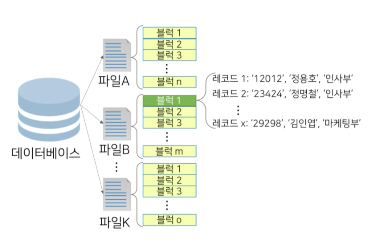

## 데이터베이스 구성 요소

1. 파일
    - 데이터를 영구적으로 저장하기 위해 사용되는 가장 기초적인 논리적 구조
2. 블럭
   - 파일을 고정적인 길이로 분할하여 생기는 균등한 크기의 데이터 묶음
   - 일반적으로 메모리와 디스크간 데이터 전송 단위로 결정
3. 레코드
   - 블럭을 구성하는 요소
   - 더 이상 분리될 수 없는 최소 데이터 저장 단위

## 고정 길이 레코드

1. 고정적인 바이트 수를 갖는 레코드를 저장하는 기법

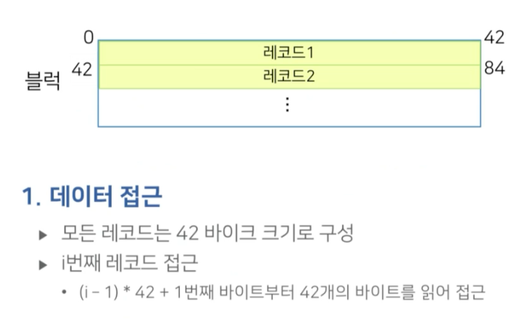

### 잔여 고정 길이 레코드 할당

- 블럭의 길이가 레코드 길이로 정확히 나눠지지 않아 잔여 공간을 비워두는 방법
   - 블럭 내의 남은 공간 낭비

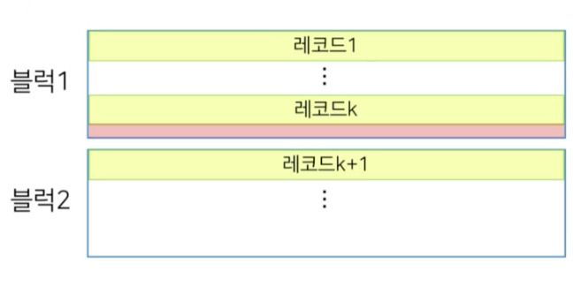

### 고정 길이 레코드 할당

- 블럭의 길이가 레코드 길이로 정확히 나눠지지 않아 한 레코드를 두 블럭에 나누어 저장하는 방법
  - 레코드 접근 시 두 블럭을 접근

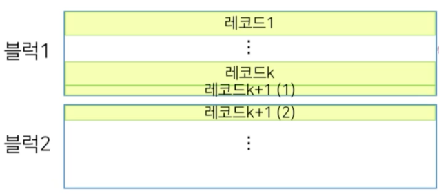

### 고정 길이 레코드 할당의 문제

1. 레코드 삭제 시
   - 해당 레코드가 저장된 위치에 빈공간이 생성
   - 장시간 레코드의 삽입 및 삭제 발생 시, 저장 공간에 많은 낭비가 발생
2. 레코드 삭제 시 대처 방안
   - 마지막 레코드로 공백 대체
   - 삭제 레코드 이후의 레코드를 이동
   - 가용 리스트 관리

#### 마지막 레코드로 공백 대체

- 삽입된 순서대로 레코드가 유지되지 않음

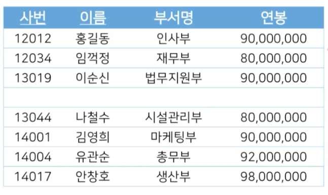
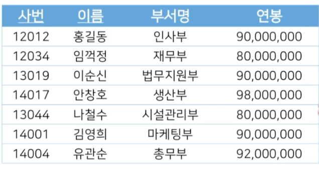

#### 삭제 레코드 이후의 레코드를 이동

- 레코드 순서 유지
- 레코드 이동에 따른 오버헤드가 발생할 수 있다.

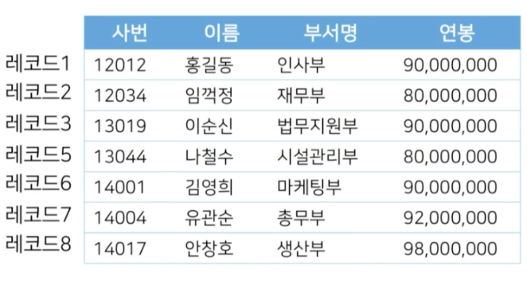

#### 가용 리스트 관리

- 레코드 순서 유지 불가
- 상용 DB에서도 가장 많이 사용

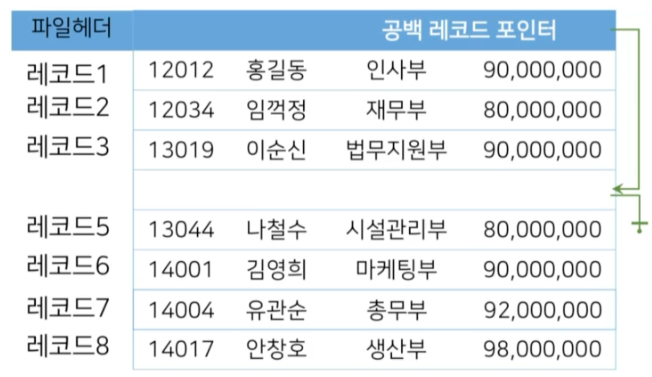
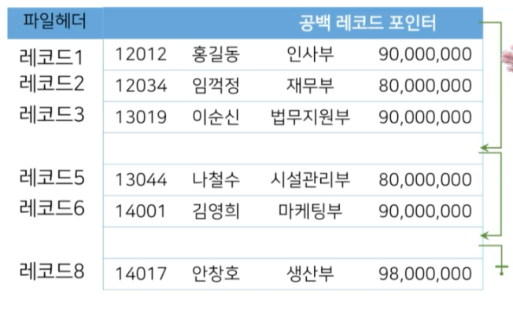

## 가변 길이 레코드

1. 블럭에 저장되는 레코드의 길이가 서로 다른 (가변적) 레코드를 할당하는 방법
2. 가변 길이 레코드가 사용되는 상황
   - 한 블럭 내에 저장되는 레코드 유형이 둘 이상
   - 길이가 고정되지 않은 컬럼의 개수가 하나 이상
   - 레코드가 멀티셋을 허용한 컬럼을 가질 때

> 멀티셋 : 레코드의 컬럼값이 여러 개인 컬럼

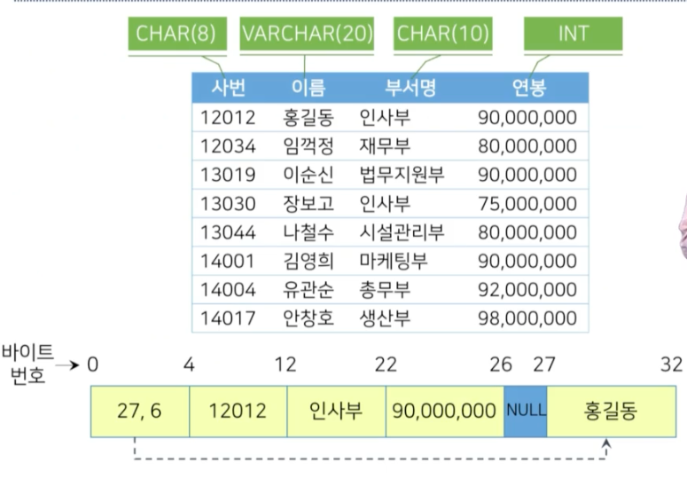

### 슬롯페이지 구조

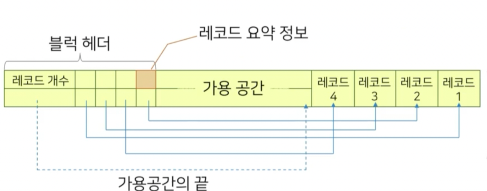

## 파일 구조화 방법

- 파일 구조화
   - 파일 수준에서 레코드를  관리(순서 등)하는 기법

## 파일구조화 방법의 종류

1. 힙 파일 구조 : 저장순서 고려없이 파일 내 임으의 위치에 배치
2. 순차 파일 구조 : 레코드들이 탐색키 기준으로 정렬되어 저장
3. 해시 파일 구조: 해시 함수를 사용하여 블럭 주소를 계산

### 순차 파일구조

1. 레코드가 검색키 순서대로 정렬
2. 레코드가 파일에 삽입되는 시점에서 키 값이 부여
3. 장점
   - 검색키에 대한 정렬 연산이 불필요, 키 값들의 순서로 레코드를 판독하는 연산에 효율적
   - 현재 레코드에서 정렬된 키 순서로 다음 레코드를 찾을 때 부가적인 블럭 접근이 불필요
   - 이진 탐색을 사용하면 더 빠르게 레코드를 검색
4. 단점
   - 레코드 삽입, 삭제에 많은 비용 소요

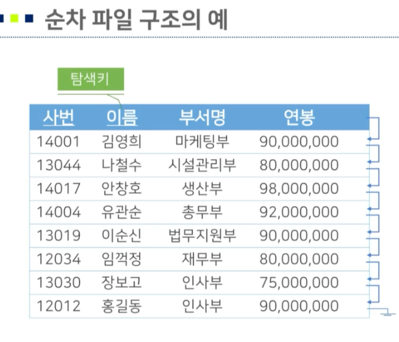

### 오버플로우 블럭

1. 순차 파일 구조에서 레코드의 정렬된 상태 유지를 위해 삽입된 신규 블럭

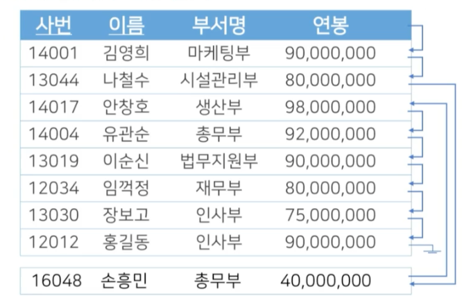

## 저장 장치 접근

1. 파일은 논리적 관점에서의 저장 객체
2. 실제 저장될 때에는 여러 개의 물리적 단위인 블럭으로 저장
   - 블럭은 메모리와 디스크 간 데이터의 전송 단위
   - 일반적으로 2KB ~ 32KB 사용
   - 블럭 전송을 최소화 할 수록 입출력 소요 시간이 단축
     - 사용 중인 블럭을 지속적으로 메모리에 적재
     - 한정적 공간으로 인하여 필요에 따라 특정 블럭 할당을 해지
     - 메모리 내부에 버퍼라는 공간에 블럭을 저장하고, 이를 관리하는 버퍼 관리자를 사용

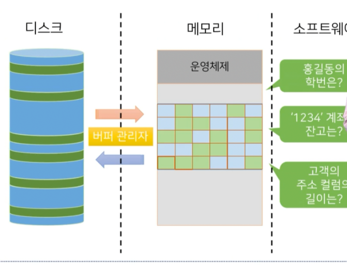

### 버퍼 관리자

1. DBMS 사으이 소프트웨어는 필요한 블럭이 있을 때 버퍼 관리자에게 해당 블럭을 요청
  - 요청된 블럭이 버퍼에 있다면, 버퍼 관리자는 블럭이 위치한 메모리 주소를 프로그램에 전달
  - 요청된 블럭이 없는 경우, 버퍼 관리자는 버퍼내의 새로운 공간을 할당하고 해당 블럭을 적재
  - 더 이상 적재할 공간이 없다면, 버퍼에 있는 기존 블럭을 선택하여 할당을 해지하고 해당 블럭을 적재

#### 버퍼 교체 전략

- 가용 공간을 확보 하기 위해 기존에 적재된 블럭의 할당을 특정 기준에 의하여 해지
- 미래에 가장 적게 사용될 블럭을 선택하여 디스크로 내보내는 것이 버퍼 교체 전략
  - LRU(Least Recently Used) : 최근에 가장 적게 참조된 블럭을 선택
  - MFU(Most Frequently Used) : 특정 기간 동안 가장 여러번 사용된 블럭을 선택하여 블럭을 교체

### 고정 블럭과 블러 강제 출력

- 고정 블럭
  - 장애로 인하여 메모리의 데이터가 손실되어 작업이 중단될 경우, 중단된 작업의 결과물이 디스크에 기록되는 것을 방지
  - 디스크 블럭이 교체되는 것을 제한
- 블럭 강제 출력
  - 시스템 로그와 같이 중요한 데이터는 디스크에 영구적으로 기록되어야 함
  - 버퍼 공간이 필요 업성도 강제로 디스크에 기록