# 인덱싱

## 인덱스의 이해

### 인덱스의 개념

1. 데이터 검색에서 발생하는 비효율적인 데이터 입출력 문제를 해결하기 위한 목적으로 시작
   - 인덱스: DBMS에서 요청된 레코드에 빠르게 접근할 수 있도록 지원하는 데이터와 관련된 부자거인 구조
   - 인덱싱: 인덱스를 구성하고 생성하는 작업
2. 인덱스의 탐색키를 이용하여 해당 레코드가 저장된 블럭을 디스크 저장장치 또는 메모리에서 파악하여 해당 블럭을 빠르게 적재

> 탐색키 : 파일에서 레코드를 찾는데 사용되는 컬럼이나 컬럼의 집합

### 인덱스 기반의 검색 과정

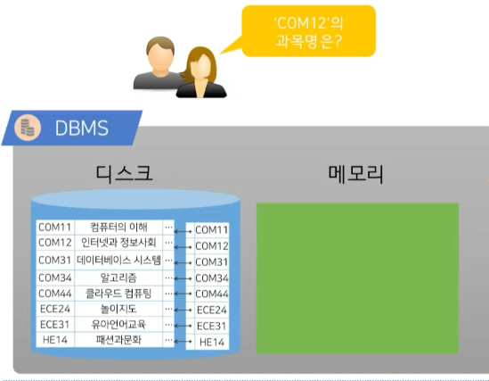

- 인덱스 블럭을 먼저 메모리에 적재
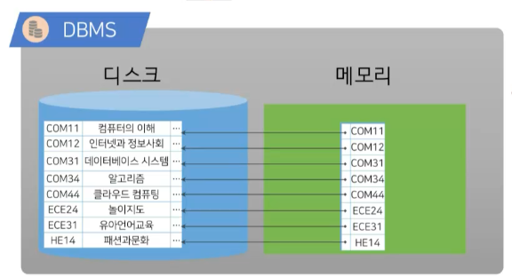

### 인덱스 종류

- 순서 인덱스 : 특정 값에 대해 정렬된 순서 구조
- 해시 인덱스 : 버킷의 범위 안에서 값의 균일한 부포에 기초한 구조로 해시 함수가 어떤 값이 어느 버킷에 할당되는지 결정

#### 인덱스의 평가 기준

- 접근 시간 : 데이터를 찾는데 걸리는 시간
- 유지 비용 : 새로운 데이터 삽입 및 기존 데이터 삭제 연산으로 인한 인덱스 구조 갱신 비용
- 공간 비용 : 인덱스 구조에 의해 사용되는 부가적인 공간 비용

## 순서 인덱스

### 특징

- 탐색키로 정렬된 순차 파일에 대하여 레코드에 대한 빠른 접근이 가능하도록 구성한 인덱스
  - 탐색키를 정렬하여 해당 탐색키와 탐색키에 대한 레코드와의 연계를 통하여 인덱스 생성
  - 순서 인덱스의 종류
    - 밀집 인덱스
    - 희소 읜덱스
    - 다단계 인덱스

### 인덱스 엔트리의 구조

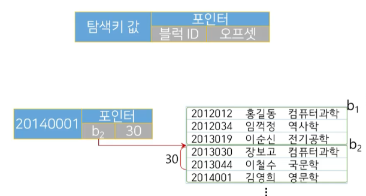

### 밀집 인덱스

- 모든 레코드에 대해 탐색키 값|포인터 쌍을 유지

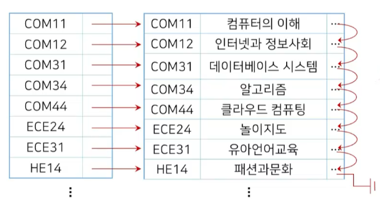

### 희소 인덱스

- 인덱스의 엔트리가 일부의 탐색키 값만을 유지
- 밀집 인덱스 대비 인덱스 관리 비용이 낮음
- 밀집 인덱스보다 검색 성능이 떨어짐 

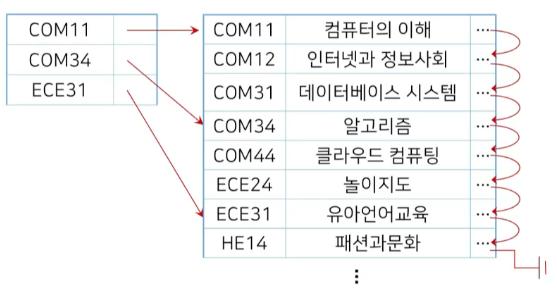

### 다단계 인덱스

#### 다단계 인덱스가 필요한 이유

- 4KB 크기의 한 블럭에 100개의 엔트리가 삽입될 때, 100,000,000 개의 레코드에 대한 순서 인덱스
  - 1,000,000 개의 블럭 = 4GB의 공간이 필요
  - 인덱스 만으로도 이미 많은 공간을 차지하게 됨
- 인덱스 크기에 따른 검색 성능
  - 인덱스 크기 < 메모리 크기
    - 디스크 I/O이 줄어 탐식 시간이 축소
  - 인덱스 크기 > 메모리 크기
    - 저장된 블럭을 여러번 나누어 읽어야 하기 때문에 디스크 I/O 비용이 증가하여 탐색 시간이 증가

> 그래서 다단계 인덱스를 구성!

- 내부 인덱스와 외부 인덱스로 구성
  - 외부 인덱스를 내부 인덱스보다 희소한 인덱스로 구성하여 엔트리 포인터가 내부 인덱스 블럭을 지칭
  - 포인터가 가리키는 블럭을 스캔하여 원하는 레코드보다 작거나 같은 탐색키 값 중에 가장 큰 값을 가지는 레코드를 탐색
- 내부 인덱스는 1,000,000 개의 블럭을 가지는 반면, 외부 인덱스는 100 개의 블럭믄 사용하여 작은 크기의 외부 인덱스로 메모리에 적재 가능

#### 다단계 인덱스의 구조

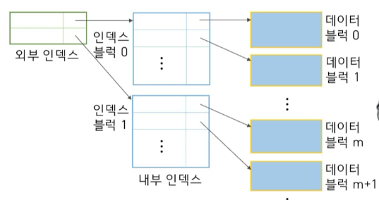

## B+ - 트리

- 루트 노드로부터 모든 단말 노드에 이르는 경로의 길이가 같은 높이 균형 트리
  - 순서 인덱스는 파일이 커질수록 데이터 탐색에 있어서 접근 비용이 커지는 문제점을 해결하기 위한 제안
  - 사용 DBMS에서도 널리 사용되는 대표적인 순서 인덱스
- B+ 트리의 노드 구조
  - 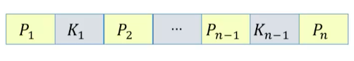

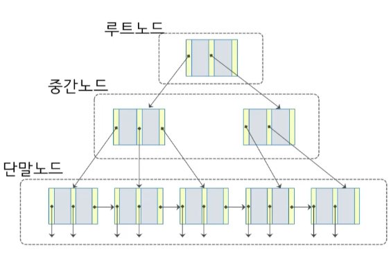

### B+ - 트리 구성 요소

- 인덱스 세트 : 루트노드와 중간노드로 구성
  - 단말 노드에 있는 탐색키 값을 신속하게 찾아갈 수 있도록 경로를 제공하는 목적으로 사용
  - [n/2] ~ n 사이의 개수를 자식으로 소유
  - 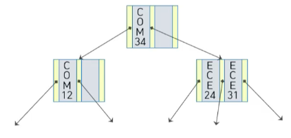
- 순차 세트: 단말노드로 구성
  - 모든 노드가 순차적으로 서로 연결
  - 단말 노드는 적어도 (n -1)/2 개의 탐색키를 포함
  - 탐색키에 대한 실제 레코드를 지칭하는 포인터를 제공
  - 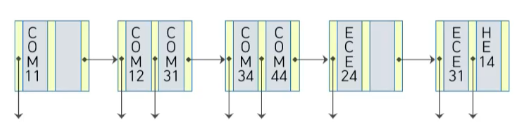

### 단말노드의 구성

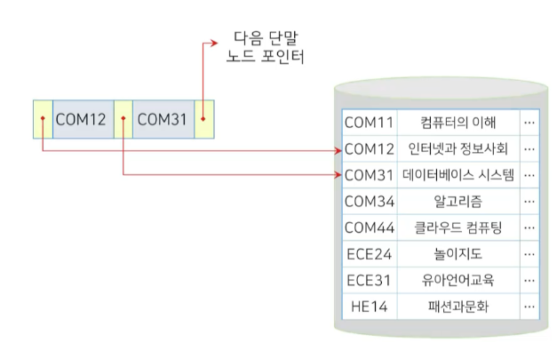

### B+ 트리의 예

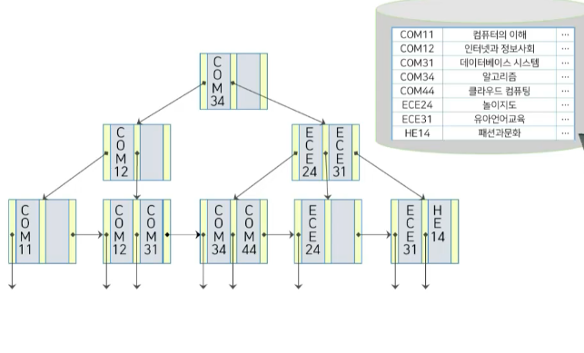

### B+-트리 상에서의 삽입, 삭제

- 레코드 삽입, 삭제 시 B+-트리 수정
  - 레코드 삽입
    - 노드에서 유지해야 할 탐색키와 포인터 수 증가로 인해 노드를 분할해야 하는 경우가 발생
  - 레코드 삭제
    - 노드에서 유지해야 할 탐색키 값과 포인터 수 감소로 형제 노드와 키를 재분배 또는 병합해야 하는 경우가 발생
  - 높이 균형 유지
    - 노드가 분할되거나 병합되면서 높이의 균형이 맞지않는 경유가 발생

#### 삽입과 삭제

- 삽입 : 검색과 같은 방법을 사용하여 삽입되는 레코드의 탐색키 값이 속할 단말 노드를 탐색
  - 해당 단말 노드에 <탐색키, 포인터> 쌍을 삽입
  - 삽입 시 탐색키가 순서를 유지
- 삭제 : 삭제될 레코드의 탐색키를 통해 삭제될 탐색키와 포인터를 포함한 단말 노드를 선택
  - 같은 탐색키 값을 가지는 다중 엔트리가 존재할 경우, 삭제될 레코드를 가리키는 엔트리를 찾을 때까지 탐색 후 단말 노드에서 제거
  - 단말 노드에서 제거된 엔트리의 오른쪽에 있는 엔트리들은 빈 공간이 없도록 왼쪽으로 이동

#### 삽입

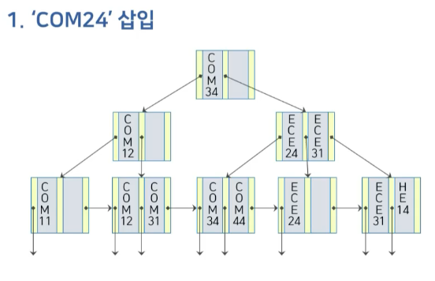  

- COM24 노드가 없으므로 기존 노드를 분할하고 재조정이 필요
  - COM12와 COM31 사이가 COM24의 자리

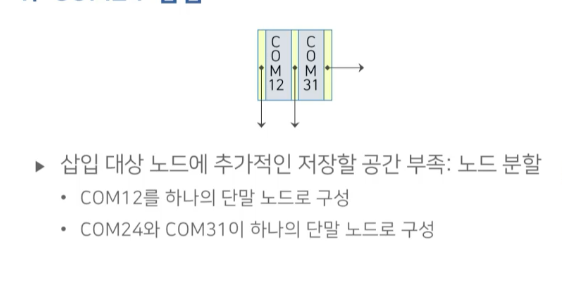
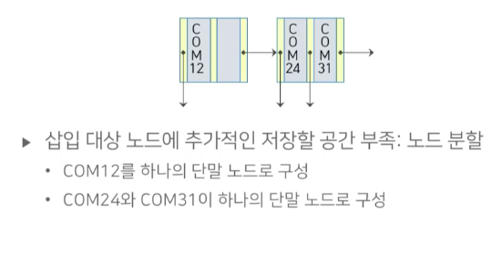

- 부모 노드쪽도 재조정이 필요

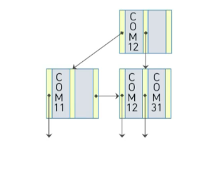
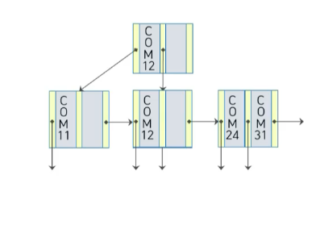
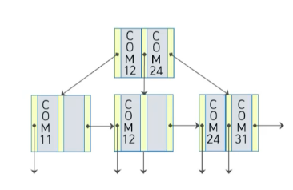

#### 삭제

- 재조정이 필요 없는 삭제

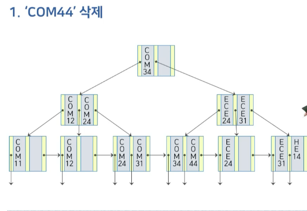
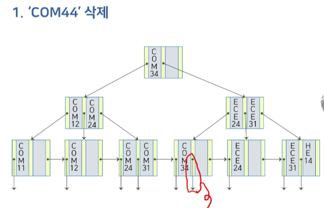

- 재조정이 필요한 삭제

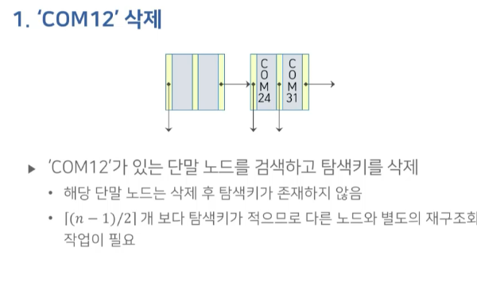
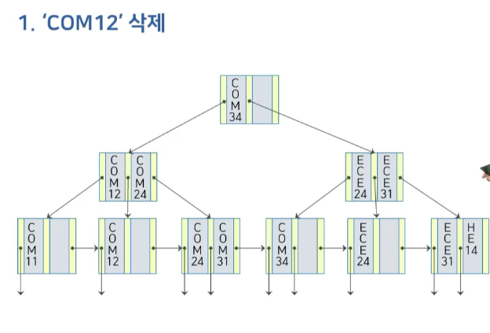
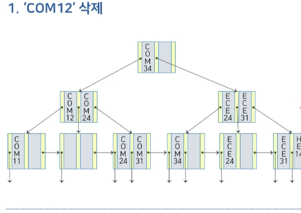
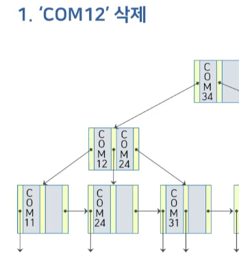
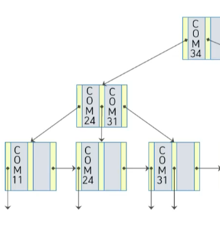