# 해싱과 특수 인덱스

## 해싱

- 해시
  - 탐색키에 산술적인 연산을 통해 버킷의 주소를 계산하는 해시 함수를 사용하여 데이터 배분 및 접근하는 기법
  - 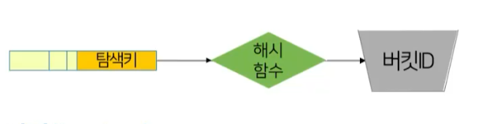
- 버킷
  - 한 개 이상의 레코드를 저장할 수 있는 저장공간의 단위
  - 크기는 일반적으로 디스크 블록의 크기와 일치

### 해시의 구조

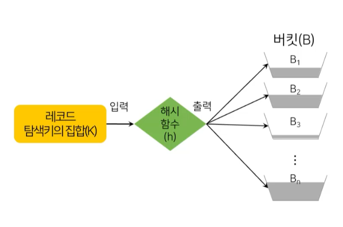

### 해시의 사용

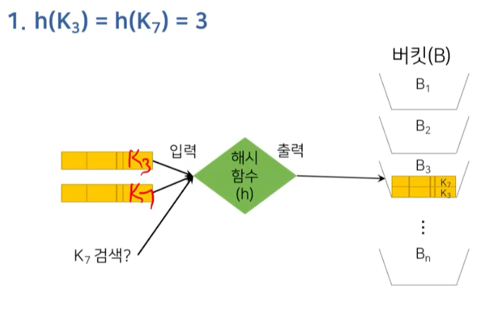

### 해시 함수의 역할

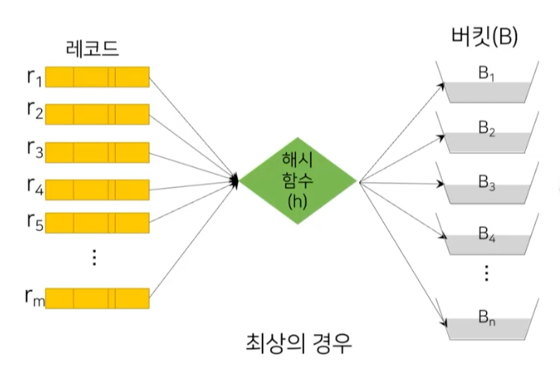

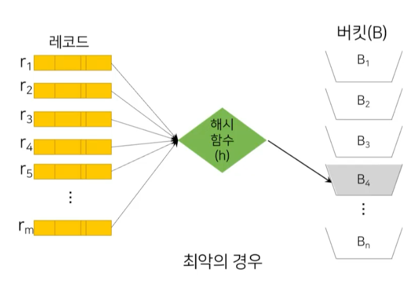

### 해시 파일 구조

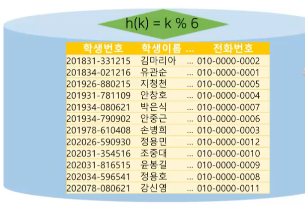

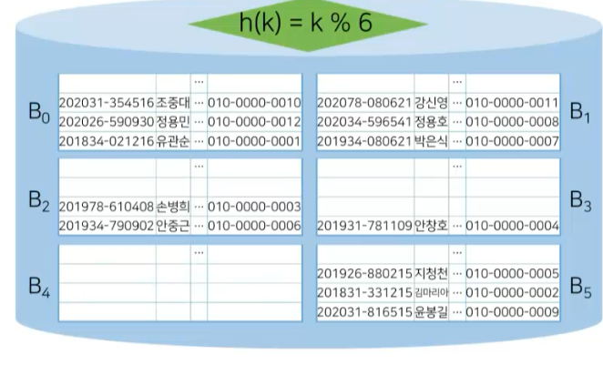

## 정적 해싱

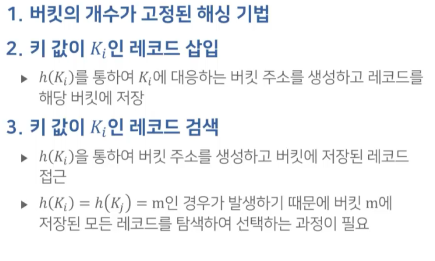

### 충돌과 동거자

- 충돌 : 서로 다른 두 레코드가 동일한 버킷에 대응
- 동거자 : 충돌에 의해 같은 버킷 주소를 갖는 레코드

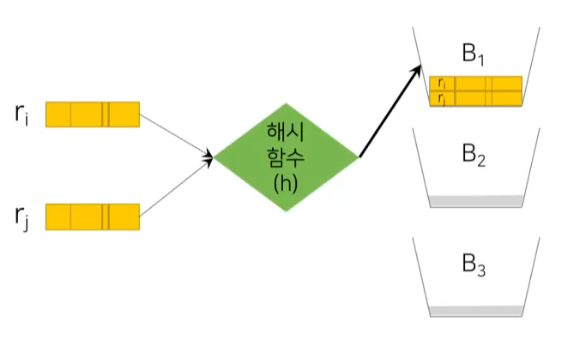

### 오버플로우

- 버킷에 레코드를 저장할 수 있는 여유 공간이 없는 상황에 발생
- 추가적인 버킷을 할당 또는 다음 버킷에 할당하여 처리
- 오버플로우가 발생할수록 접근시간이 길어지고 해시 성능이 저하

### 해시 인덱스

- 해시 파일 구조와 동작 방식을 레코드가 아닌 인덱스 엔트리에 적용한 인덱스

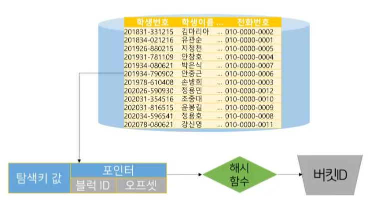
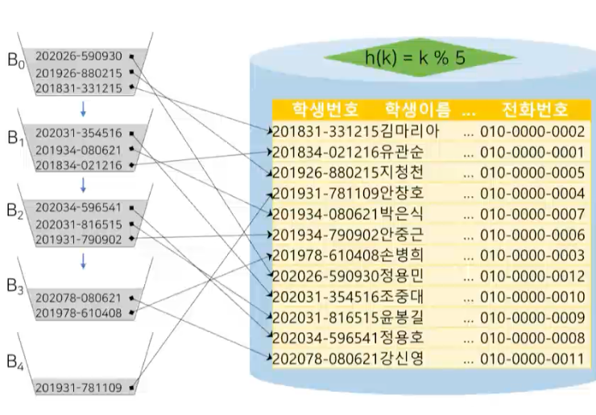

- 버킷이 꽉 차면 다음 빈 버킷에 인덱스 엔트리 포인트 추가
- 해싱에 해당하는 버킷에 데이터가 없을 경우 다른 버킷을 찾아다니면서 검색해야함
  - 다른 버킷을 찾아다니는건 디스크 IO가 발생하므로 오버헤드 발생

### 문제점

- 데이터베이스 크기가 커짐에 따른 성능 감소
- 미리 큰 공간을 잡을 경우 초기에 상댱한 양의 공간이 낭비
- 재구성 시 새롭게 선택된 해시 함수를 사용하여 모든 레코드에 대하여 다시 계산하고 버킷에 할당하는 대량의 비용이 발생

> 해시 구조의 크기가 동적으로 결정되는 동적 해싱 방법 제안

## 동적 해싱

- 동적 해싱의 정의
  - 버킷의 개수를 가변적으로 조절할 수 있는 해싱 기법
  - 데이터베이스의 크기에 따라 버킷의 크기가 비례
- 데이터베이스의 증대 혹은 축소에 따른 인덱스의 구조를 조절하기 위해 해시 함수를 동적 변경하는 기술
- 확장성 해싱
  - 동적 해싱의 일종으로 디렉터리와 버킷의 2단계 구조
  - 디렉터리는 디스크에 저장되는 버킷 주소 테이블
  - 디렉터리 깊이를 의미하는 정수값 d를 포함하는 헤더와 데이터가 저장된 버킷에 대한 2^d개의 포인터로 구성

### 확장성 해싱

- 모조키 (pseudo key)
  - 레코드의 탐색키 값이 해시 함수에 의해 일정 길이의 비트 스트링으로 변환된 키
  - 모조키의 첫 d 비트를 사용하여 디렉터리에 접근
- 버킷 헤더
  - 정수값 i(<= d)가 저장되어 있음을 표시
  - i는 버킷에 저장되어 있는 레코드의 모조키들이 처음부터 i 비트까지 일치함을 표시

### 확장성 해싱의 구조

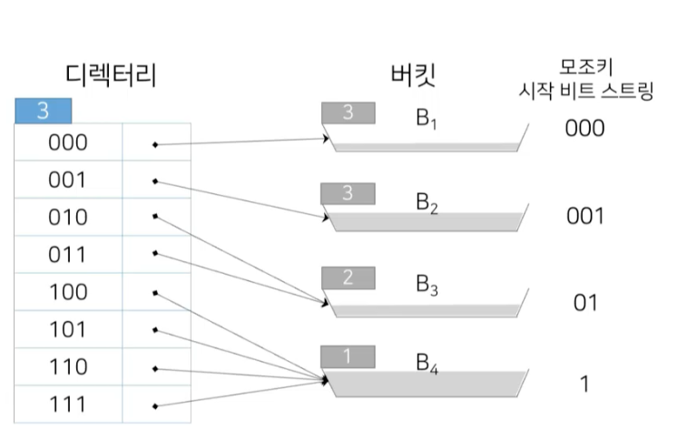
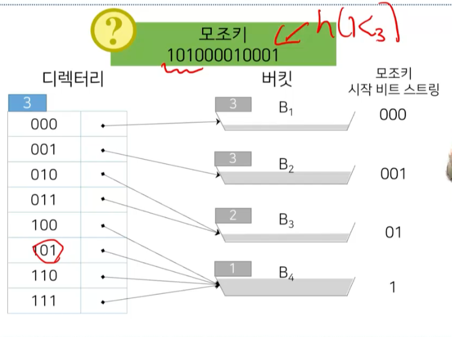

### 확장성 해싱의 분할

- 레코드 삽입에 의해 분할된 확장성 해싱 파일

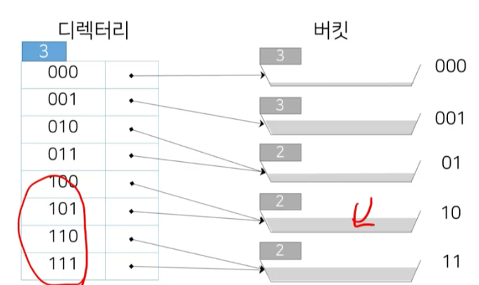

## 비트맵 인덱스

### 개념

- 탐색키의 중복 비율이 높은 컬럼을 대상으로 하는 질의를 효율적으로 처리하기 위해 고안된 특수한 형태의 인덱스
- 비트맵
  - 간단한 비트의 배열
  - 릴레이션 r의 속성 A에 대한 비트맵 인덱스는 A가 가질 수 있는 값에 대해 비트맵을 구성
  - 각 비트맵은 릴레이션에 있는 레코드의 수 n개 만큼 n개의 비트로 표현

### 비트맵 인덱스 구성

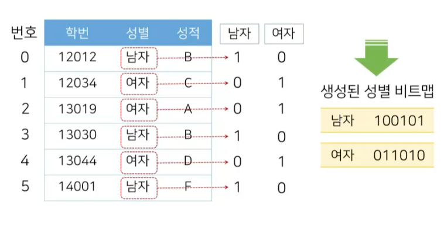
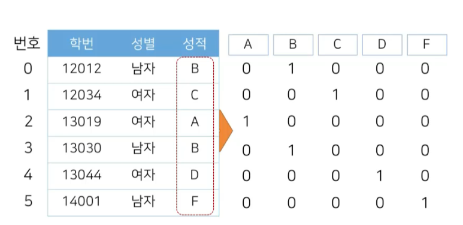
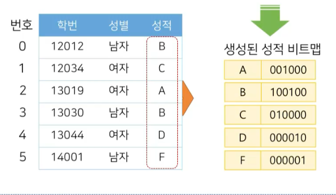

### 비트맵 인덱스의 사용

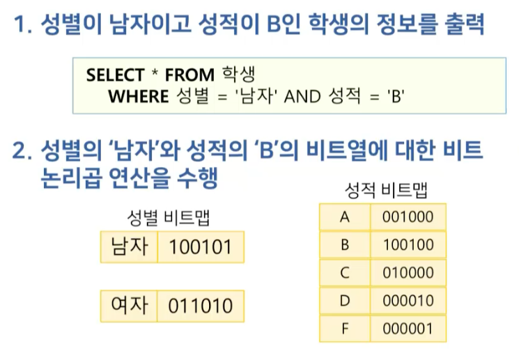
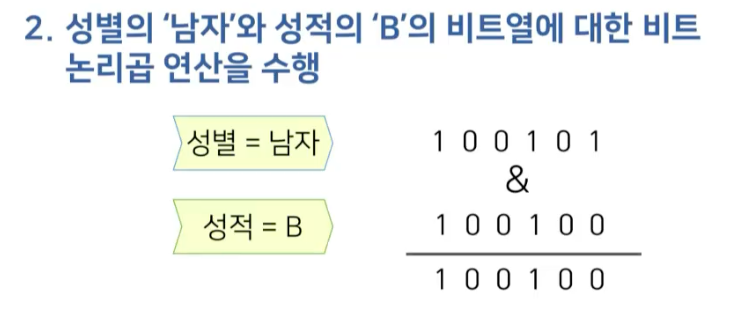
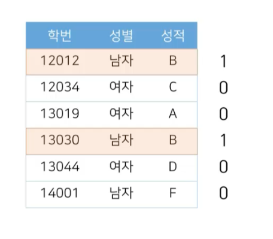

### 비트맵 인덱스의 특징

- 활용
  - 컬럼에 대한 값의 범위가 유한하고 비교적 개수가 적은 규모일 때 용이
  - 적용: 직책, 학과, 혈액형 등
- 크기
  - 레코드의 크기가 수백 바이트 이상이 되어도 비트맵 인덱스에서는 하나의 비트로 표시
  - 실제 릴레이션 크기에 비해 매우 작은 것이 장점