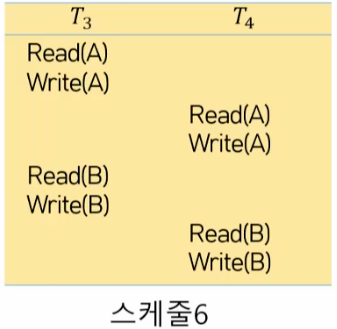
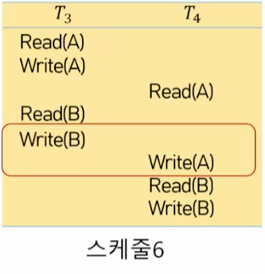

# 트랜잭션

## 트랜잭션의 이해

### 데이터 동시 접근의 문제

### 개념

- 데이터베이스를 조작하기 위한 하나의 논리적 단위를 이루는 일련의 연산의 집합
  - 예) 예금 인출
    - 작업 단위: 예금 1000원 인출
    - 일련의 연산: Read(A), A=A-1000, Write(A)
- 데이터베이스를 사용하여 처리하는 작업을 하나의 묶음으로 인식하여 묶음 단위로 실행되도록 정의한 개념

### 특징

- 다수의 연산으로 구성된 트랜잭션이 사용자에게 단일작업처럼 다뤄지도록 ACID 특징을 준수

#### ACID 특성

- 원자성(atomicity) : 하나의 트랜잭션에 포함된 모든 연산은 완전히 수행되거나 전혀 수행되지 않음
- 일관성(consistency) : 특정 트랜잭션이 수행되기 전과 후에 데이터베이스가 일관된 상태를 유지
- 고립성(isolation) : 특정 트랜잭션이 데이터베이스를 갱신하는 동안 다른 트랜잭션에 의해 방해받지 않음
- 지속성(durability) : 완료된 트랜잭션의 결과는 어떠한 시스템의 장애에도 데이터베이스에 반영되어야 함

### 트랜잭션 읽기와 쓰기

- 트랜잭션의 두 연산
  - Read(X): 데이터베이스에서 데이터 X를 읽고, 트랜잭션이 실행되는 메모리의 변수 X에 값을 저장하는 연산
  - Write(X): 트랜잭션이 실행되는 메모리에 있는 변수 X의 값을 데이터베이스에 저장하는 연산
- 트랜잭션 실행의 연산
  - Commit: 트랜잭션 연산에 의해 갱신된 데이터 항목의 값을 데이터베이스에 반영시키고 지속성을 확보하는 연산
  - Rollback: 트랜잭션이 중단되기 이전까지 수행한 연산에 의해 갱신된 모든 데이터 항목의 값을 무효화하여 일관성을 확보하는 연산

## 트랜잭션의 동시성

- DBMS는 다수의 사용자가 데이터베이스를 공용으로 사용하기 위한 목적으로 도입
- 트랜잭션 동시 실행의 이점
  - 트랜잭션 처리율과 자원 이용률을 향상
  - 트랜잭션의 대기 시간을 감소
- 다중 사용자 환경에서 트랜잭션의 동시 실행으로 데이터 갱신 시, 일관성 훼손 문제가 발생
- 동시성 제어
  - 다수의 트랜잭션이 성공적으로 동시에 실행되어도 일관성을 유지할 수 있도록 지원하는 기법

### 적용 트랜잭션

#### 직렬 스케줄

- 각 트랜잭션에 속한 모든 연산이 순차적으로 실행되는 스케줄
- 이 때 각 트랜잭션의 순서는 변동가능성이 있고 그에 따른 최종 결과도 다를 순 있다.
- 그러나 각 트랜잭션이 다른 트랜잭션에 영향을 주는 것은 아님

#### 병렬 스케줄

- 두 개 이상의 트랜잭션이 비순차적 실행되는 스케줄

#### 직렬 가능 스케줄

- 트랜잭션 간 연산 순서를 교환하여 트랜잭션을 직렬 스케줄과 동등하게 변환이 가능한 스케줄
- 사용된 read와 write 연산 교환 시 상황에 따라 실행 결과에 일관성이 훼손되는 현상(충돌)이 발생
- 연산의 순서의 교환
  - 
  - 첫 번째 케이스만 연산 순서 교환 가능(둘 다 read 이므로)

#### 충돌 동등

특정 스케줄 S에서 충돌이 일어나지 않는 연산의 순서를 바꿔 스케줄 S'으로 변환이 가능한 상태

- 서로 다른 데이터에 대해 Read, Write이기 때문에 교환 가능

#### 충돌 직렬성

- 순서 교환이 가능한 연산을 교환하여 직렬 스케줄의 연산과 동등하게 변환이 가능한 스케줄

## 트랜잭션의 회복

### 회복의 개념

- 원자성을 보장하기 위해 트랜잭션 실패 시 실행된 모든 연산을 실행 이전 상태로 복원하는 기법
- 회복 불가능한 스케줄
  - 

### 회복 가능한 스케줄

### 비연쇄적 스케줄

