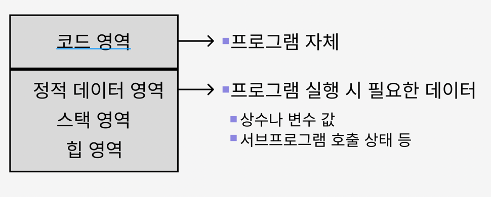
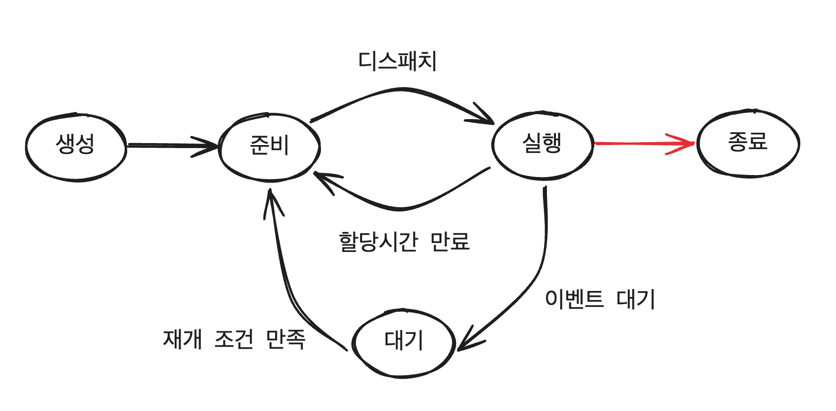
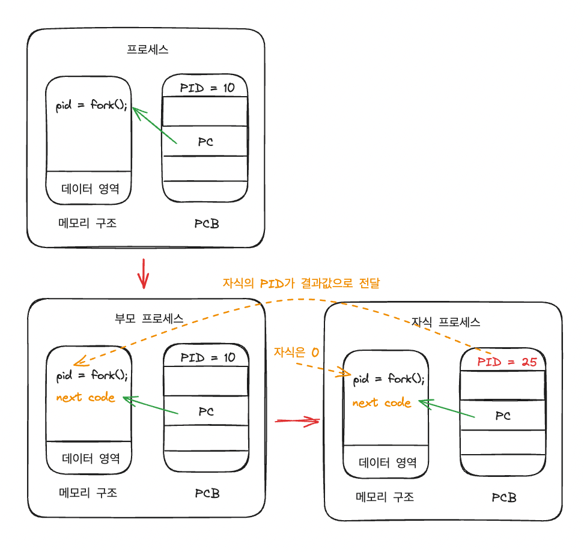
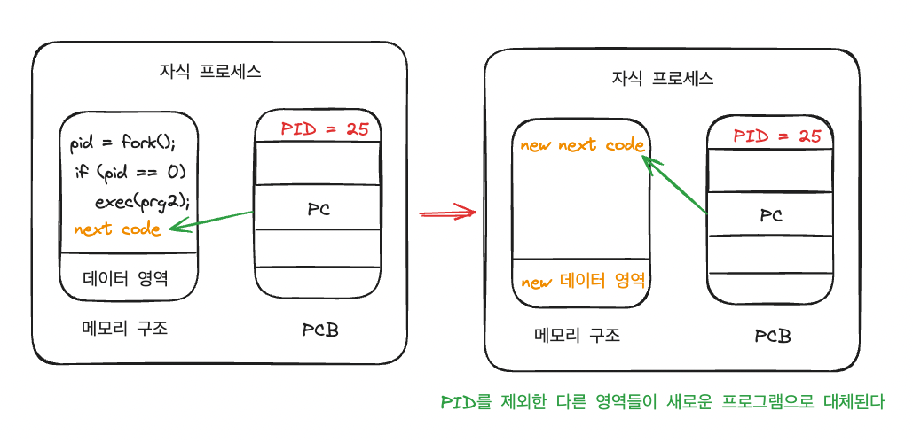
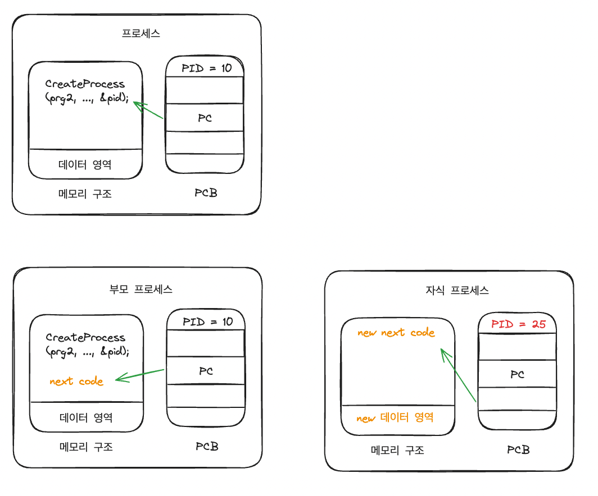
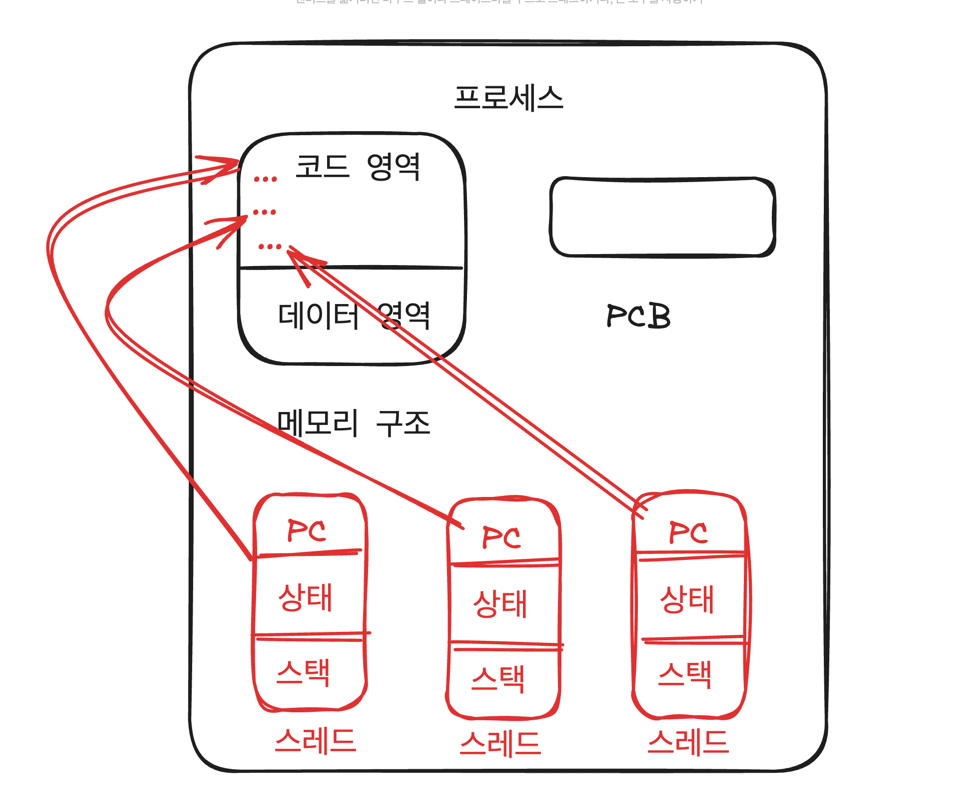

# 프로세스와 스레드

## 1) 프로세스

### 1-1) 프로세스의 개요

- 프로세스: 실행 중인 프로그램
  - 프로그램: 실행 파일
  - 프로세스: 실행 파일이 메모리에 적재되어 실행 중인 상태

#### 1-1-1) 운영체제로부터 자원을 할당 받아 동작

- 자원: CPU, 메모리, 입출력 장치, 파일 등
- 동작: CPU가 프로세스의 명령을 실행

#### 1-1-2) 운영체제(프로세스 관리자)가 처리하는 작업

- 프로세스를 생성 및 종료
- 프로세스를 실행시키기 위한 스케줄링 작업
- 프로세스의 상태 관리

### 1-2) 프로세스의 구성

- 메모리 구조
  - 프로그램 실행에 직접적으로 필요한 코드와 데이터
    

- 프로세스 제어 블록 (PCB)
  - 운영체제가 프로세스를 관리하기 위해 필요한 정보
  - 각 프로세스마다 존재
  - 여러 프로세스가 번갈아 실행되는 경우 PCB에 저장된 정보 활용

#### 1-2-1) PCB의 구성

- 프로세스 식별자 (PID)
- 프로세스 상태
- 프로그램 카운터 (PC)
- 레지스터
- 메모리 관리 정보
- 프로세스 우선 수위
- 회계 정보
- etc.

### 1-3) 프로세스의 상태

- 프로세스 상태: 프로세스가 운영체제에 의해 관리되는 상태
  - 생성, 준비, 실행, 대기, 종료
- 생성: 프로세스가 생성되어 메모리에 적재되는 상태, 처음 작업이 시스템이 주어진 상태
- 준비: 프로세스가 CPU를 할당받기를 기다리는 상태
- 실행: 프로세스가 CPU를 할당받아 명령을 실행하는 상태
- 대기: 프로세스가 I/O 작업이 끝날 때까지 또는 특정 자원을 할당받을 때까지 보류되는 상태
- 종료: 프로세스가 실행을 마치고 메모리에서 제거되는 상태

### 1-4) 부모 프로세스와 자식 프로세스

- 프로세스 생성 방법
  - 사용자가 프로그램을 직접 실행
  - 프로세스가 시스템 호출 이용해 또 다른 프로세스를 생성
    - 부모 프로세스: 시스템 호출을 하는 프로세스
    - 자식 프로세스: 시스템 호출을 통해 새로 생성된 프로세스

### 1-5) 프로세스 생성 시스템 호출

- UNIX, Linux: fork() 시스템 호출
  - 자식 프로세스는 부모 프로세스의 복제본

- UNIX, Linux: exec() 시스템 호출
  - 자식 프로세스는 부모 프로세스와는 다른 프로그램 실행

- Windows: CreateProcess() 시스템 호출
  - 자식 프로세스는 새로운 프로그램으로 생성

### 1-6) 프로세스 종료

- 프로세스 종료 방법
  - 프로세스가 모든 처리를 완료 (정상적 종료)
  - 부모 프로세스에 의해 자식 프로세스가 강제 종료
    - 프로세스 종료 시스템 호출 이용
    - 자식 프로세스 생성 시 얻은 자식 PID를 이용해 자식 프로세스 종료
  - 부모 프로세스가 종료되는 경우 운영체제가 자식 프로세스 종료

## 2) 스레드

### 2-1) 전통적인 프로세스와의 차이

- 전통적인 프로세스
  - 하나의 프로그램을 실행하기 위한 기본적인 단위
  - 자원 소유의 단위
    - 하나의 제어 흐름
  - 디스패칭의 단위
    - 하나의 제어흐름
  - 프로세스 내에서 다중처리 불가능

- 스레드 (스레드의 등장 이후 전통적인 프로세스의 개념이 달라짐)
  - 프로세스 내에서 다중처리를 위해 제안된 개념
  - 하나의 프로그램을 실행하기 위한 기본적인 단위
  - 디스패칭의 단위
    - 자원 소유의 단위는 여전히 프로세스
      - 메모리는 여전히 프로세스 단위로 할당 받으므로
  - 하나의 프로세스 내에는 하나 이상의 쓰레드 존재
  - 쓰레드는 실행에 필요한 최소한의 정보만 가짐
    - PC를 포함한 레지스터 값
    - 상태정보
    - 스택 영역
  - 나머지 정보는 프로세스에 두고 다른 쓰레드와 공유

### 2-2) 스레드의 장점

- 멀티 CPU 또는 멀티 코어 컴퓨터 시스템
  - 다중 스레드를 병렬로 처리 가능
- 처리속도 별로 스레드가 나누어진 경우
  - 효율적인 처리 가능

