# 병행 프로세스 2

## 생산자-소비자 문제 정의

- 두 협력 프로세스 사이에 버퍼를 두고 생산자와 소비자의 상황을 다루는 문제
  - 생산자: 데이터를 넣는 프로세스
  - 소비자: 데이터를 빼는 프로세스

### 생산자-소비자 문제 조건

- 버퍼에 여러 프로세스가 동시에 접근할 수 없음
  - 버퍼에 데이터를 넣는 동안에는 데이터를 꺼낼 수 없음
  - 버퍼에서 데이터를 꺼내는 동안에는 데이터를 넣을 수 없음

> 상호배제 필요

- 버퍼의 크기가 유한 (유한 버퍼 문제)
  - 버퍼가 가득 찬 경우 생산자는 대기해야 함
  - 버퍼가 빈 경우 소비자는 대기해야 함

> 동기화 필요

### 세마포어를 이용한 생산자-소비자 문제 해결

- 상호배제: 세마포어 mutex (초깃값 1)

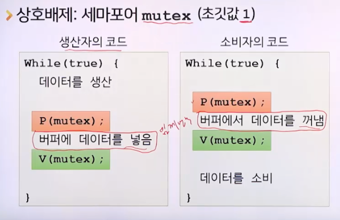

- 버파가 가득 찬 경우 동기화: 세마포어 empty (초깃값 n: 버퍼 크기)

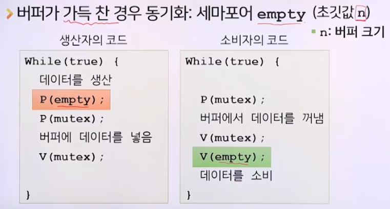

- 버퍼가 빈 경우 동기화: 세마포어 full (초깃값 0)

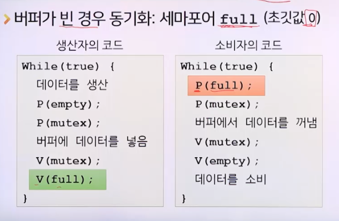

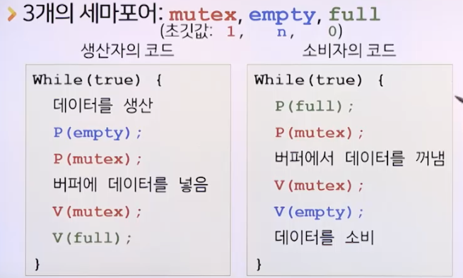

## 판독기-기록기 문제 정의

- 여러 협력 프로세스 사이에 공유자원을 두고 판독기와 기록기의 상황을 다루는 문제
  - 판독기: 데이터를 읽는 프로세스
  - 기록기: 데이터를 쓰는 프로세스

> 판독기-기록기 문제는 생산자-소비자 문제와 유사하지만, 판독기-기록기 문제는 데이터를 읽는 동안에 데이터를 쓸 수 있음.
> 
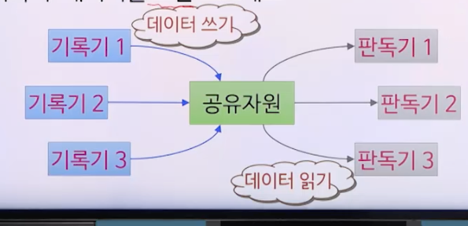

### 판독기-기록기 문제 조건

- 하나의 기록기가 공유자원에 데이터를 쓰는 중에는 다른 기록기나 판독기는 공유자원에 접근할 수 없음
  - 공유자원에 데이터를 쓰는 동안에는 누구도 접근할 수 없음
  - 공유자원에서 데이터를 읽는 동안에는 데이터를 쓸 수 없음

> 상호배제 필요

- 여러 판독기는 동시에 공유자원에서 데이터를 읽을 수 있음
  - 판독기가 읽는 중 새로운 판독기 읽기 시도 -> 가능
  - 판독기 읽는 중 기록기 대기하는 상황
    - 새로운 판독기 읽기 시도 시 가능/불가능 ?

### 제1판독기-기록기 문제

- 판독기가 공유자원에 접근 중이라면 기록기보다 `판독기에 우선순위를 줌`
- 즉, 새로운 판독기는 즉기 공유자원에 접근 가능
- 문제점
  - 기록기의 기아상태 유발 가능

### 세마포어를 이용한 제1판독기-기록기 문제 해결

- 상호배제: 세마포어 wrt (초깃값 1)

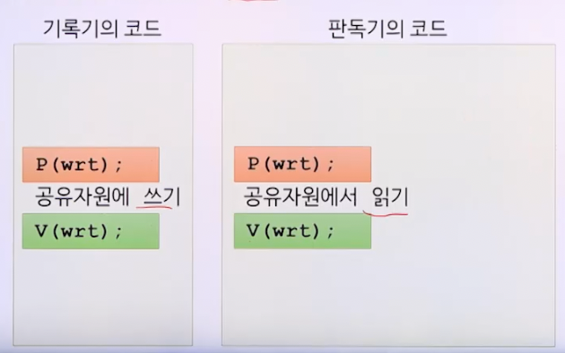

- 판독기 우선: 일반변수 rcount (초깃값 0), 세마포어 mutex(초깃값 1)

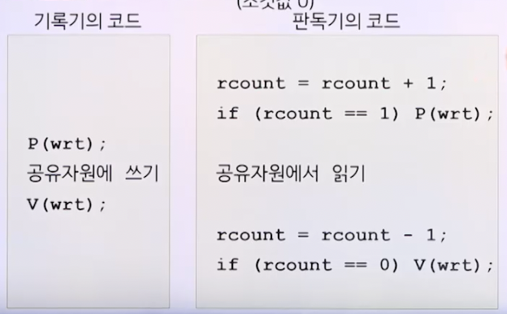

> 그러나 `rcount = rcount + 1`코드와 `if (rcount == 1) P(wrt)`코드 사이에 상호배제 문제가 발생함.

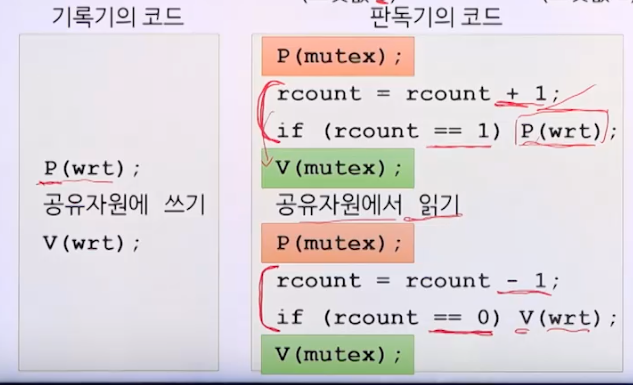

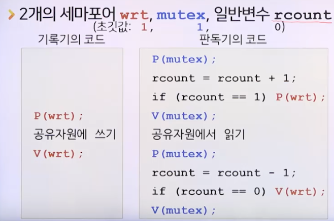

### 제2판독기-기록기 문제

- 판독기가 공유자원에 접근 중이라면 판독기보다 기록기에 우선순위를 줌
- 즉, 대기중인 기록기가 있다면 새로운 판독기는 공유자원에 접근 불가능
- 문제점
  - 판독기의 병행성이 떨어짐
  - 판독기의 기아상태 유발 가능

### 세마포어를 이용한 제2판독기-기록기 문제 해결

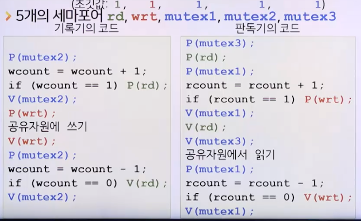

## 프로세스 간 통신

- 프로세스 간 통신(IPC, Inter-Process Communication)
- 병행 프로세스가 데이터를 서로 공유하는 방법
  - 공유 메모리 방법
  - 메시지 전달 방법
- 하나의 운영체제에서 두 방법 함께 사용 가능

### 공유 메모리 방법

- 협력 프로세스가 동일한 변수를 사용
  - 동일한 변수: 공유자원인 메모리 공간 사용
- 예
  - 생산자-소비자 문제의 유한 버퍼
  - 판독기-기록기 문제의 공유자원
- 대량 데이터 교환: 고속 통신 가능
- 통신상 발생 가능 문제 해결을 프로그래머가 처리해야함

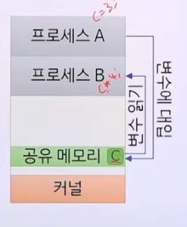

### 메시지 전달 방법

- 협력 프로세스가 메세지를 주고받음
  - 시스템 호출 send(), receive() 사용
- 소량 데이터 교환에 적합
- 통신상 발생 가능 문제 해결
  - 운영체제가 처리

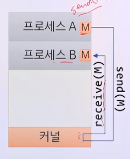

#### 메세지 전달방법의 논리적 구조

- 통신 링크: 메세지가 지나다니는 통로

- 통신 링크의 구현 형태
  - 연결 대상: 두 프로세스, 셋 이상의 프로세스
  - 두 프로세스 사이 링크 개수: 하나, 둘 이상
  - 방향성: 단방향, 양방향
  - 용량: 무한, 유한, 0

#### 통신 링크의 용량

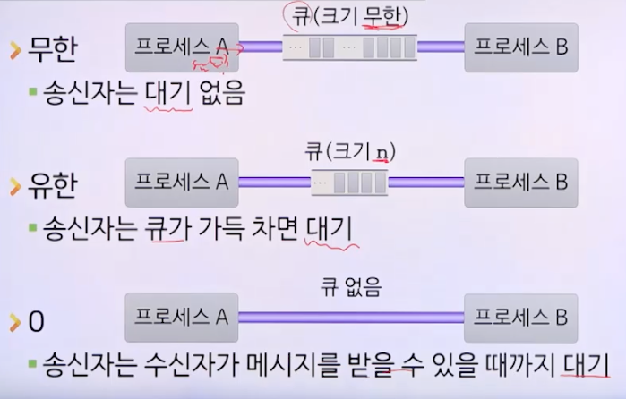

#### 직접통신

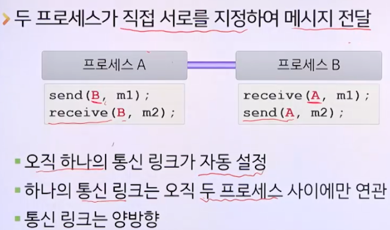

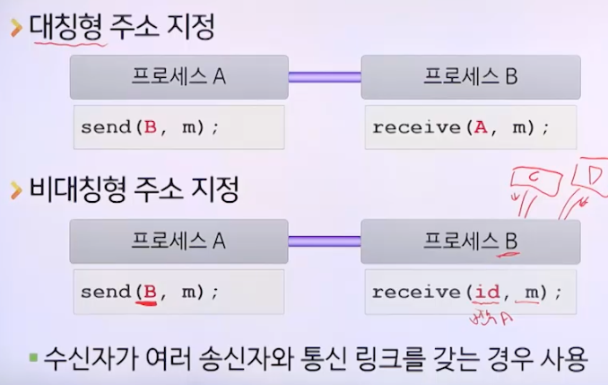

#### 간접통신

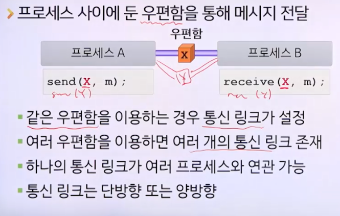

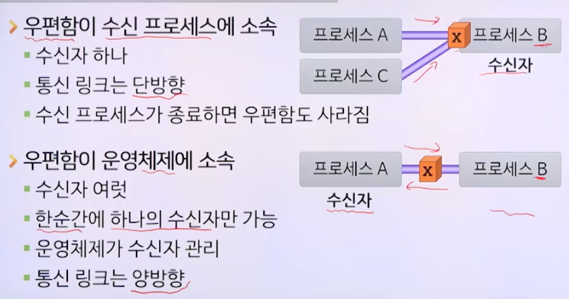