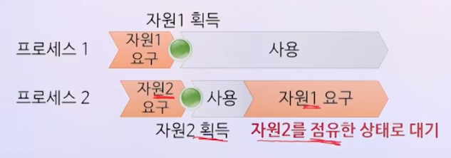

# 교착상태 1

## 교착상태(Deadlock)

- 여러 개의 프로세스가 서로 상대방의 작업이 끝나기만 기다리고 있어 어느 쪽도 영원히 진행하지 못하는 상태

## 교착상태의 특성

### 교착상태의 필요조건

- 상호배제
- 점유대기
- 비선점
- 환형대기

> 네 가지 조건이 동시에 만족될 때 교착상태 발생 가능

#### 상호배제 조건

- 프로세스가 자원에 대한 배타적인 통제권을 요구
- 적어도 하나 이상의 자원은 여러 프로세스에 의해 동시에 사용될 수 없음
- 다른 프로세스가 점유한 자원이 필요하면 반드시 대기

#### 점유대기 조건

- 프로세스가 이미 한 자원을 할당받아 점유하고 있는 상황에서 다른 프로세스가 점유하고 있는 또 다른 자원을 요구하여 해제되기를 기다리는 상황

#### 비선점 조건

- 프로세스에 할당된 자원은 그 프로세스가 사용을 마치고 스스로 반환하기 전에는 해제되지 않음
- 할당된 자원은 타의에 의해서는 해제되지 않음

#### 환형대기 조건

- 프로세스의 자원 점유 및 점유된 자원의 요구 관계가 호나형을 이루며 대기하는 상황

### 자원할당 그래프 G = (V, E)

- V : 정점의 집합 V = P ∪ R
  - P : n개의 프로세스 집합
  - R : m개의 자원 집합
- E : 방향이 있는 간선의 집합 E = Q U S
  - Q : 프로세스 P가 자원 R을 요구
    - 요구 간선 : P -> R
  - S : 자원 R이 프로세스 P에 할당
    - 할당 간선 : R -> P

#### 자원할당 그래프 예시

#### 교창상태의 필요조건 표현

- 상호배제 : 하나의 할당간선
- 점유대기 : 한 프로세스에 할당간선과 요구간선 연결
- 비선점 : 요구간선
- 환형대기 : 사이클

- 사이클 없음 -> 교착상태 없음
- 사이클 있음 -> 교착상태 발생 가능 (발생했을 수도 있고 안했을 수도 있다.)

- 교착상태가 발생한 예

- 사이클이 있지만 교착상태가 아닌 예

p4가 할당을 해제하면 사이클이 해제될 수 있음

### 교착상태의 처리기법

- 교착상태 예방
  - 교착상태의 네 가지 필요조건이 동시에 만족되는 것을 피하여 교착상태가 발생하지 않도록 하는 방법
- 교착상태 회피
  - 프로세스에 필요한 자원의 최대량에 대한 정보를 이용하여 교착상태가 발생하지 않도록 하는 방법
- 교착상태 탐지 및 복구
  - 교착상태의 발생 여부를 조사하여 발생한 경우에는 적절한 조치를 취해 정상상태로 복구하는 방법

#### 교착상태 예방

- 상호배제 조건 제거
    - 공유할 수 있는 자원: 상호배제 필요 없음
      - 예: 읽기 전용 파일
    - 공유할 수 없는 자원: 반드시 상호배제 필요
      - 예: 프린터

> 상호배제 조건 제거로 교착상태 예방은 불가능

- 점유대기 조건 제거
  - 자원을 점유했을 때 대기하지 않아아 함
    - 프로세스가 앞으로 필요한 모든 자원을 처음에 한꺼번에 요구하여 할당받으면 대기하지 않을 수 있음
      - 다른 프로세스의 자원이용률 낮아짐
      - 기아상태 가능, 처음에 다른 프로세스가 이미 사용중인 자원이라면 대기해야함
  - 대기할 때 자원을 점유하고 있지 않아야함
    - 새로운 자원을 요구할 때 할당받았던 자원을 모두 해제
      - 점유 도중 해제할 수 없는 자원에는 적용이 불가 (ex: 프린터)

- 비선점 조건 제거
  - 선점이 가능하도록 해야함
    - 자원의 특성에 따라 불가능한 경우 존재 (ex: 프린터)
  - 다른 프로세스가 대기할 가능성 줄이기
    - 점유대기 상황이 발생하면 할당받았던 자원을 모두 해제
      - 프린터 같은 자원에는 적용 불가

- 환형대기 조건 제거
  - 모든 자원에 일련번호를 지정
    - 함수 f(R) -> N (R: 자원, N: 자연수 집합)
      - 이 함수는 서로 다른 자원이라면 서로 다른 N (일렵번호)를 리턴한다.
  - 방법1
    - 프로세스는 자원을 요구할 때 일련번호 기준으로 항상 오름차순이 되도록 요구
    - 가장 최근에 할당받은 자원이 r이라면 r보다 큰 번호의 자원만 요구
  - 방법2
    - 프로세스가 자원을 요구할 때 그보다 일련번호가 작은 자원만 점유하도록 함
    - 자원 r을 요구할 때 r보다 큰 번호의 자원들은 모두 해제
  - 점유대기 중인 프로세스는 점유 중인 자원의 일련번호보다 대기 중인 자원의 일련번호가 큼
  - 프로세스마다 요구순서가 다를 수 있어 자원의 일련번호 설정 어려움 (방법1)
  - 요구순서가 일련번호 오름차순을 못 지키면 점유자원 해제 필요하나 적용 불가한 자원 존재 (방법2)

> 예방이 어렵다...