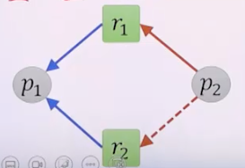
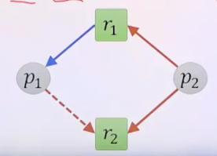

# 교착상태 2

## 교착상태 회피

- 프로세스의 자원 사용에 대한 사전 정보를 활용하여 교착상태가 발생하지 않는 상태에 머물도록 하는 방법
- 사전 정보
  - 현재 할당된 자원
  - 가용상태의 자원
  - 프로세스들의 최대 요구량
- 교착상태는 불안정상태에서만 발생 가능
- 항상 안전상태를 유지해야함
- 프로세스가 가용상태의 자원을 요구하더라도 프로세스는 대기상태가 될 수 있음
  - 자원이용율은 다소 낮아질 수 있음

### 안전상태와 안전순서열

- 안전상태
  - 교착상태를 회피하면서 각 프로세스에 그들의 최대 요구량까지 빠짐없이 자원을 할당할 수 있는 상태
  - 안전 순서열이 존재하는 경우
- 불안전상태
  - 안전순서열이 존재하지 않는 경우

### 안전순서열

- 순서가 있는 프로세스의 집합 <p1, p2, ..., pn>
- 각 pi에 대해 pi가 추가로 요구할 수 있는 자원의 양이 현재 가용상태의 자원으로 충당되거나 혹은 여기에 pj(단, j < i)에 할당된 자원까지 포함하여 충당 가능한 경우

### 교착상태 회피 알고리즘

- 각 자원의 단위자원이 하나밖에 없는 경우
  - 변형된 자원할당 그래프 이용
- 각 자원의 단위자원이 여러 개일 수 있는 경우
  - 은행원 알고리즘 이용

#### 각 자원의 단위자원이 하나밖에 없는 경우

- 변형된 자원 할당 그래프 이용
  - 자원 정점에 표시하던 단위자원의 개수 제거
  - 선언간선(pi, rj)
    - 앞으로 프로세스 pi가 자원 rj를 요구하게 될 것임을 의미
    - 요구간선과 구분을 위해 점섬으로 표시
    - 
  - 자원을 요구받으면 해당 선언간선을 요구간선으로 변경
  - 그 요구간선을 할당간선으로 변환해도 사이클이 생기지 않는 경우에만 자원을 할당하고 할당간선으로 변환
  - 
  - 
  - 
  - 
  - 
  - 
  - 

#### 각 자원의 단위자원이 여러 개일 수 있는 경우

- 은행원 알고리즘
  - 자원을 요구받으면 그 자원을 할당해 주고 난 후의 상태를 계산해서 그것이 안전상태인지 확인
  - 안전상태가 보장되는 경우에만 자원을 할당
  - 
  - 
  - 

- 은행원 알고리즘 안전상태 확인 시뮬레이션
  - 
  - 
  - 
  - 
  - 
  - 
  - 

- 은행원 알고리즘 자원 요구 사항 요청 시 시뮬레이션
  - 
  - 
  - 
  - 

## 교착상태 탐지 및 복구

- 사후에 처리하는 방법
- 교착상태 탐지
  - 시스템의 교착상태 여부를 조사하기 위해 주기적으로 상태 조사 알고리즘 수행
- 교착상태 복구
  - 교착상태가 탐지된 경우 적절한 조치를 취해 정상상태로 복구

### 교착상태 탐지

- Shoshani와 Coffman 알고리즘
  - 안전 알고리즘과 비슷하지만 안전상태를 찾는 대신 교착상태를 찾음
  - 
  - 
  - 
  - 시간 복잡도 O(mn)^2
  - 알고리즘 수행 시점
    - 즉시 받아들일 수 없는 자원 요구가 있을 때
    - 정해진 시간간격
    - CPU 효율이 일정 수준 이하로 떨어질 때

### 교착상태 복구

- 교착상태가 탐지되면 복구조치
- 복구의 주체
  - 오퍼레이터: 수작업으로 복구
  - 운영체제: 자동으로 복구
- 복구 방법
  - 교착상태 프로세스를 종료
    - 모든 교착상태 프로세스를 종료
      - 단점: 진행했던 내용에 대한 복원비용이 큼
    - 사이클에 제거될 때까지 교착상태 프로세르를 하나씩 종료
      - 단점: 종료 대상을 선택하기 위한 비용, 매 프로세스 종료 후 교착상태 재확인을 위한 비용
  - 교착상태 프로세스가 할당받은 자원을 해제
    - 사이클이 제거될 때까지 할당된 자원을 단계적으로 선점하여 다른 프로세스들에 할당
    - 프로세스와 자원 선택 기준
      - 프로세스 진척도, 사용 중인 자원의 수 등
    - 프로세스의 복귀 시점도 제반 오소를 고려하여 결정
    - 기아상태에 빠지지 않도록 프로세스 선택 시 복구 횟수 고려