# 가상 메모리

## 가상 메모리의 개념

### 연속 메모리 할당

- 메모리 크기보다 더 큰 메모리 공간이 필요한 프로세스는 실행불가

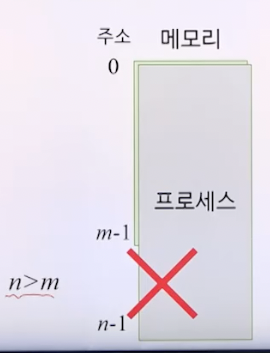

### 가상 메모리

- 메모리 크기보다 더 큰 기억공간이 필요한 프로세스도 실행할 수 있게 하는 방법

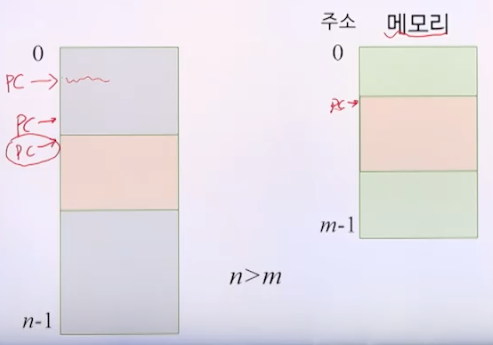

- 실핼 중인 프로세스에 의해 참조되는 주소를 메모리에서 사용하는 주소와 분리
- 현재 필요한 일부만 메모리에 적재

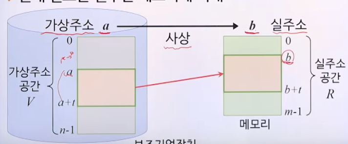

### 사상 (mapping)

- 프로세스 실행을 위해 가상주소를 실주소로 변환하는 과정
- 동적 주소변환(DAT): 프로세스가 실행되는 동안 매핑
- 인위적 연속성
  - 가상주소 공간에서 연속적인 주소가 실주소 공간에서도 연속적일 필요는 없음

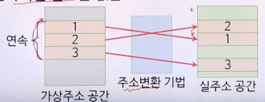

## 블록 단위 주소변환

### 주소 변환

- 주소 변환 사상표 (매핑 테이블)
  - 동적 주소변환을 위한 정보를 가진 표
- 주소 변환이 바이트나 워드 안위로 이루어지면 변환에 필요한 정보량이 너무 많아 비효율적임

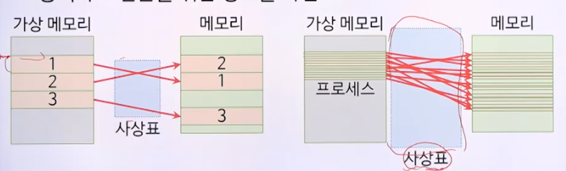

### 블록 매핑 시스템

- 블록 단위로 주소 변환
- 가상 메모리의 각 블록이 메모리의 어디에 위치하는지 관리
- 가상주소 v = (b, d)
  - b: 블록 번호
  - d: 블록의 시작점으로부터의 변위 (얼마나 떨어져 있는지 나타냄)
  - 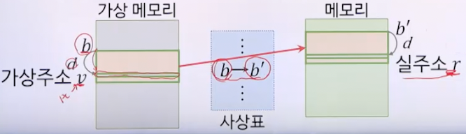
- 블록의 크기는 적절히 정해야함
  - 크키가 커질수록
    - 매핑테이블 크기 감소
    - 블록 전송시간 증가, 동시에 적재할 프로세스 수 감소
  - 크기가 작아질수록
    - 블록 전송시간 감소, 동시에 적재할 프로세스 수 증가
    - 매핑테이블 크기 증가

### 블록 구성방식

#### 페이징 기법

- 블록의 크기가 동일
- 가상 메모리를 페이지 단위로 나누어 관리하는 기법
- 메모리 영역도 페이지와 동일한 크기의 페이지 프레임으로 나눔
  - 페이지 프레임: 페이지를 담을 수 있는 틀
- 페이지 매핑표 (사상표)
  - 가상주소를 실주소로 동적 변환할 수 있게 함
  - 페이지 번호에 대한 페이지 프레임 번호 저장

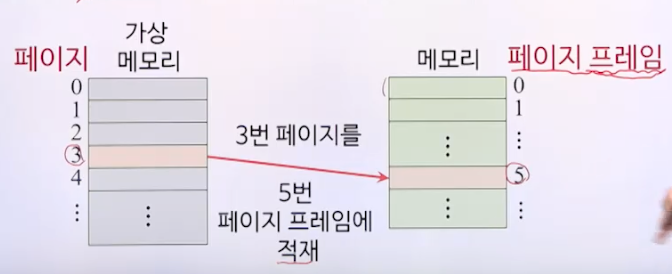
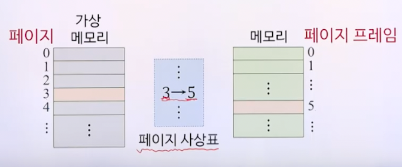
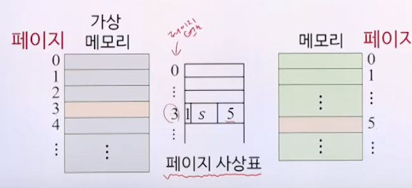
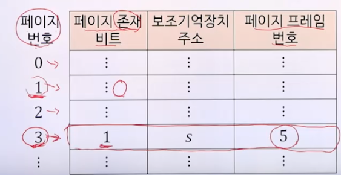
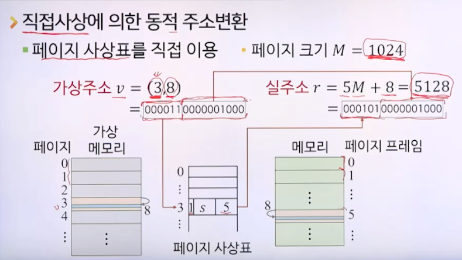

- 연관사상에 의한 동적 주소변환
  - 페이지 변환 정보를 연관 메모리에 저장한 연관사상표를 이용

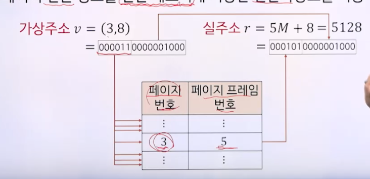

- 연관/직접 사상에 의한 동적 주소 변환
  - 연관사상표에는 가장 최근에 참조된 페이지만 보관
  - 연관사상표에 없을 때만 직접 사상 이용 

- 특징
  - 논리적 의미와 무관한 동일 크기의 페이지로 나눔
  - 메모리 보호는 페이지 단위로 이루어짐
  - 외부 단편화가 발생하지 않음
  - 내부 단편화는 발생 가능

#### 세그멘테이션 기법

- 블록의 크기가 다를 수 있음
- 가상 메모리를 세그먼트 안위로 나누어 관리하는 기법
  - 세그먼트 : 논리적 의미에 부합하는 다양한 크기의 블록
- 세그먼트 사상표를 이용하여 동적 주소 변환

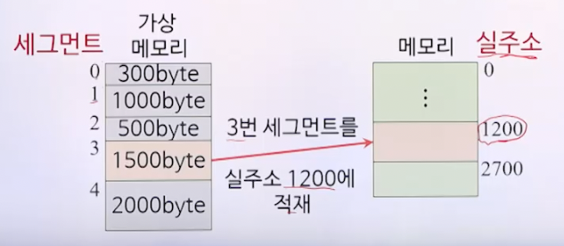

- 세그먼트 사상표
  - 세그먼트 번호에 대한 실주소에서의 시작 위치 저장
  - 세그먼트 길이는 오버플로 확인용

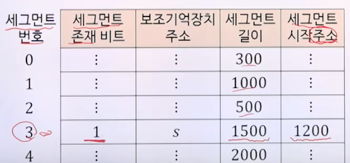

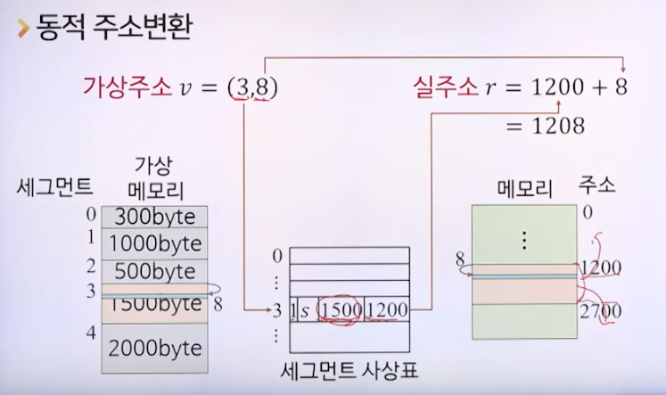

#### 페이징/세그먼테이션 혼용기법

- 세그먼테이션 기법의 논리적 장점 + 피이징 기법의 메모리 관리 측면의 장점
- 가상 메모리를 세그먼트 단위로 분할 후 각 세그먼트를 다시 페이지로 분할
- 메모리는 페이지 프레임으로 분할
- 가상주소 v = (s, p, d)
  - s: 세그먼트 번호
  - p: 페이지 번호
  - d: 페이지 내의 변위

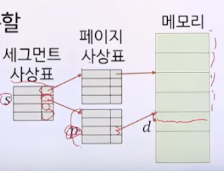

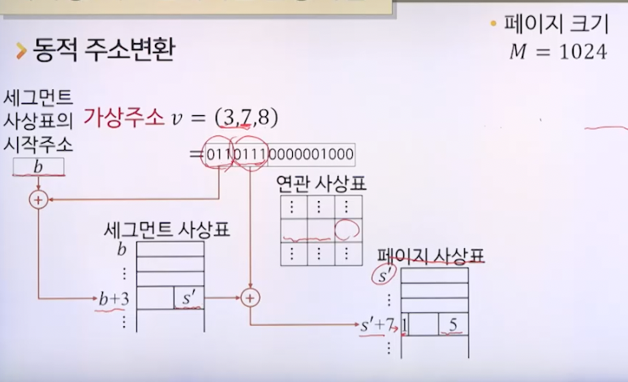

## 메모리 호출 기법

- 어느 시점에 페이지 또는 세그먼트를 메모리에 적재할 것인가를 결정하는 기법
- 페이징 기법에서의 호출기법 종류
  - 요구 페이지 호출기법
  - 예상 페이지 호출기법

### 요구 페이지 호출 기법

- 프로세스의 페이지 요구가 있을 때 요구된 페이지를 메모리에 적재하는 방법

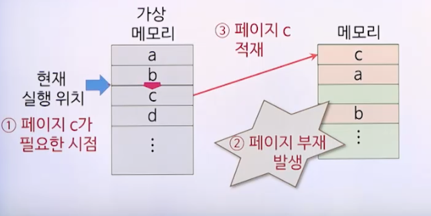

### 예상 페이지 호출 기법

- 곧 사용될 것으로 예상되는 페이지를 미리 메모리에 적재하는 방법

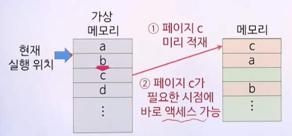

### 비교

- 요구 페이지 호출 기법
  - 옮길 페이지 결정에 대한 오버헤드 최소화
  - 적재된 페이지는 실제로 참조됨
  - 프로세스 시작 시점에는 연속적으로 페이지 부재 발생
- 예상 페이지 호출 기법
  - 예상이 잘못된 경우 시간과 메모리 공간 장비
  - 프로세스 시작 시점에 적용하면 성능이 개선됨