# 페이지 교체 알고리즘

- 모든 페이지 프레임이 사용되고 있을 때 새로 적재되어야 할 페이지를 위해 적절한 교체 대상을 결정

## 교체 대상 선택

- 최적화의 원칙
  - 앞으로 가장 오랫동안 사용되지 않을 페이지를 교체 대상으로 선택
  - 이론적으로 최적이나 미래를 예측할 수없어 실현 불가능
- 선택을 위한 기본 정책
  - 대체로 좋은 결론은 내리면서 선택을 위한 시간 및 공간 오버헤드가 적은 방법
- 교체 제외 페이지
  - 페이징을 위한 커널 코드 영역
  - 보조기억장치 드라이버 영역
  - 시간을 맞춰 동작해야 하는 코드 영역
  - 입출력장치를 위한 데이터 버퍼 영역 등

## FIFO 페이지 교체

- 메모리 내에 가장 오래 있었던 페이지를 선택하여 교체
- 구현: FIFO 큐 이용
- 단점 
  - 가장 많이 쓰이는 페이지를 교체시킬 가능성이 있음
  - Belady의 이상현상
    - 프로세스에 더 많은 수의 페이지 프레임을 할당하면 오히려 페이지 부재가 더 많이 발생할 수 있는 현상

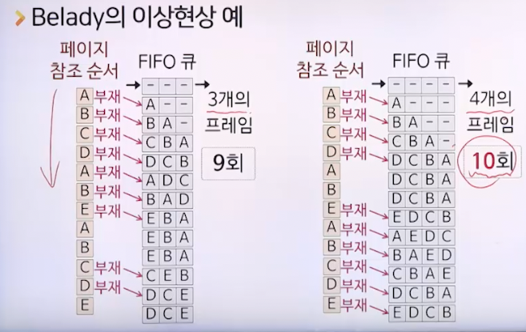

## LRU 페이지 교체

- 메모리 내에서 가장 오랫동안 사용되지 않은 페이지를 선택하여 교체
- 국부성 휴리스틱에 기반
  - 최근의 상황이 가까운 미래에 대한 좋은 척도
  - 시간 국부성, 공간 국부성
- 구현: 참조시각 또는 리스트 이용
- 참조시각을 이용한 구현
  - 각 페이지가 참조될 때마다 그때의 시각을 테이블에 기록
  - 교체가 필요한 경우 참조시각이 가장 오래된 페이지를 선택하여 교체
  - 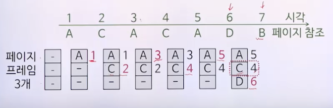
- 리스트를 이용한 구현
  - 각 페이지가 참조될 때마다 리스트의 선두로 옮김
  - 교체가 필요한 경우 리스트의 끝에 있는 페이지를 선택하여 교체
  - 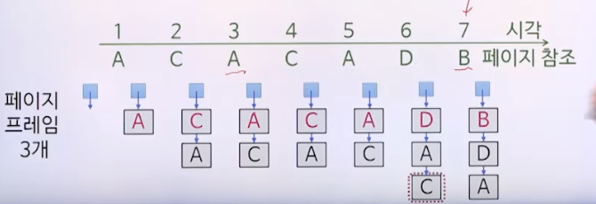
- 장점
  - Belady의 이상현상이 발생하지 않음
  - 많은 경우 최적화 원칙에 근사한 선택 가능
- 단점
  - 국부성이 맞지 않는 상황도 존재
  - 막대한 오버헤드 (참조시간 업데이트, 페이지 탐색, 리스트 조작 등)

## LFU 페이지 교체

- 메모리 내에서 참조된 횟수가 가장 적은 페이지를 선택하여 교체
- 구현 : 참조횟수 이용
  - 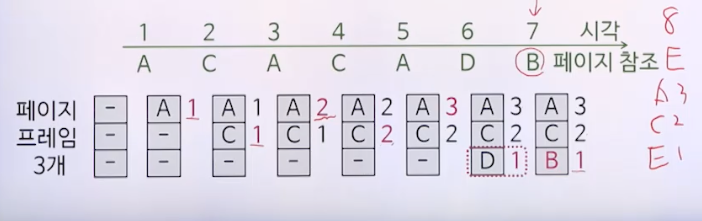
- 단점
  - 가장 최근에 메모리로 옮겨진 페이지가 교체될 가능성이 크다.
  - 초기에 매우 많이 사용된 후 더 이상 사용되지 않는 페이지가 계속 남아있을 수 있음
  - 막대한 오버헤드

## 2차 기회 페이지 교체

- 참조 비트가 0이면서 메모리 내에 가장 오래 있었던 페이지를 선택하여 교체
- 구현: FIFO 큐와 참조 비트 이용
  - 각 페이지가 메모리에 적재될 때는 참조 비트 0
  - 적재된 상태에서 추가로 참조되면 참조 비트 1
  - 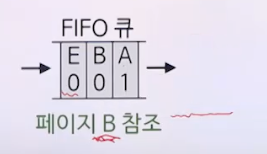
  - 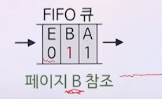
- 참조할 페이지가 메모리에 없는 경우
  - 빈 페이지 프레임이 있으면
    - 페이지 적재, 큐에 추가, 참조 비트는 0으로 설정
  - 빈 페이지 프레임이 없으면
    1. 큐의 선두 항목을 꺼내 참조 비트 조사
    2. 1이면 0으로 바꿔 큐의 뒤에 추가 후 1 단계로 이동
    3. 0이면 교체 새앙으로 선택하여 교체
- 참조할 페이지가 메모리에 있는 경우
  - 큐 위치 변화 없이 참조 비트만 1로 설정
- 변형된 원형 큐를 이용한 구현 (클럭 페이지 교체 알고리즘)
  - 포인터는 마지막 에 추가된 페이지의 다음 위치를 가리킴
    - 빈 페이지 프레임이 있는 경우 : 포인터가 빈칸을 가리킴
      - 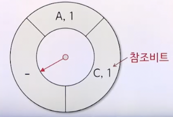
    - 페이지 프레임이 꽉 찬 경우 : 포인터가 큐의 선두를 가리킴
      - 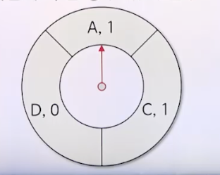

### 큐를 이용한 예

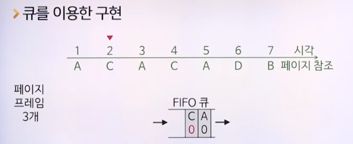
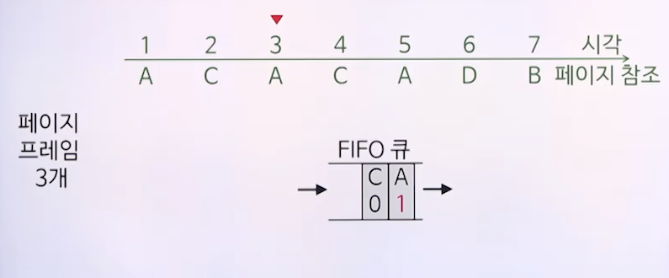
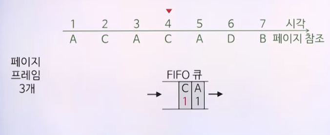
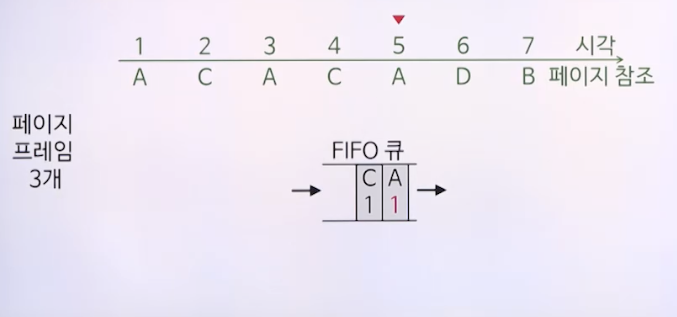
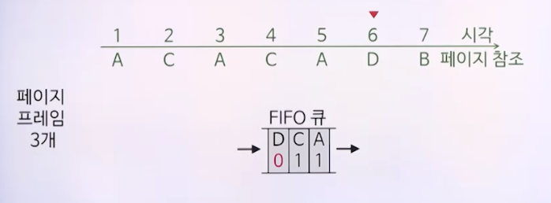
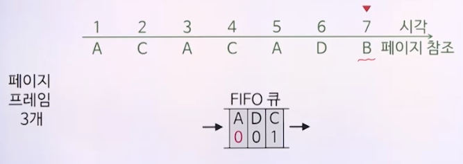
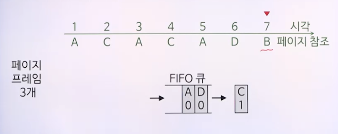
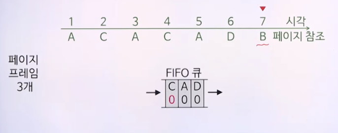
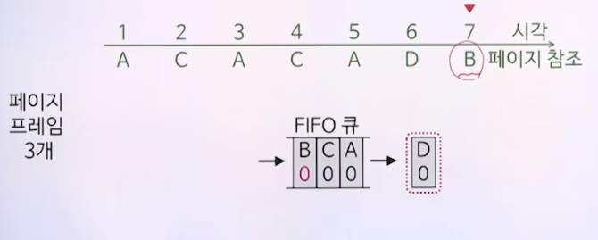

### 원형 큐를 이용한 예

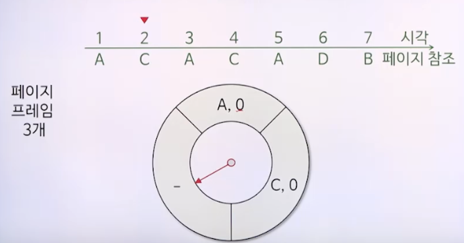
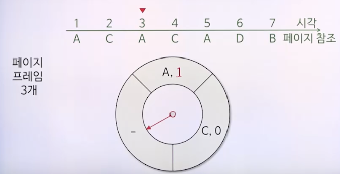
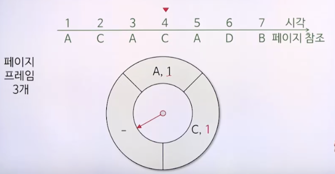
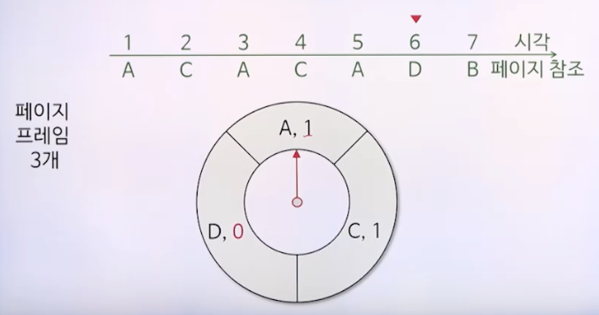
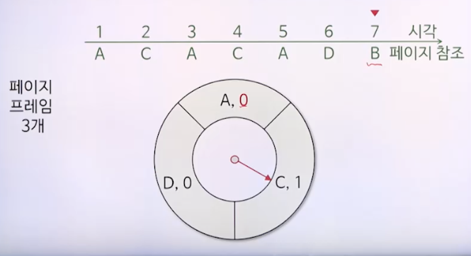
- 포인터가 가리키는 페이지가 가장 오래된 페이지이므로 참조 비트를 0으로 바꿔주고 다음 페이지로 포인터 변경
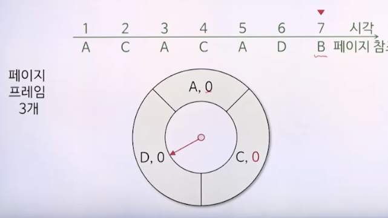
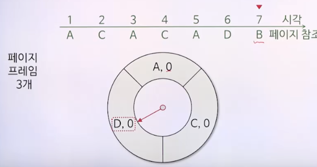
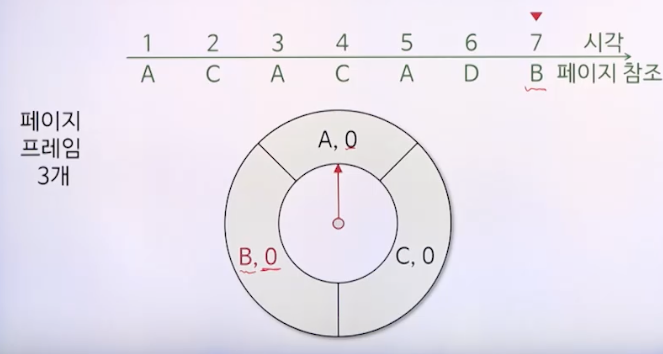

## 프로세스별 페이지 집합관리

- 프로세스 페이지 집합
  - 프로세스마다 사용할 수 있는 페이지 프레임의 개수만큼 메모리에 유지되는 페이지 집합
  - 프로세스 별 메모리에 올라가 있는 페이지의 모음
- 집합의 크기가 작을 수록 시스템 처리량 증대 (더 많은 프로세스를 운용 가능)
  - 각 프로세스별 페이지 부재는 자주 발생하여 성능 저하
- 집합의 크기가 클수록 프로세스별 페이지 부재는 감소
  - 메모리에 적재될 수 있는 프로세스 수는 줄어듦
- 각 프로세스가 사용할 수 있는 페이지 프레임 개수 관리
  - 워킹 세트 알고리즘, PFF 알고리즘

### 워킹 세트 알고리즘

- 워킹 세트 모델
  - 페이지 부재비율을 감소시키기 위해 Denning이 제안한 모델
- 프로세스의 워킹 세트 W(t:현재시간, delta:현재 시간으로부터 특정 과거까지의 시간)
  - 시각 t에 t를 포함한 직전 delta 시간 동안 참조한 페이지의 집합

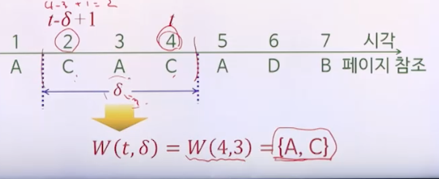

- 프로세스가 수행됨에 따라 그 프로세스의 워킹 세트는 변할 수 있으며 워킹 세트의 크기도 달라질 수 있음
- 워킹 세트 알고리즘의 원칙
  - 프로세스의 워킹 세트를 메모리에 유지시키는 것
- 워킹 세트를 메모리에 유지하지 않으면 쓰래싱 유발 가능
  - 쓰래싱 (thrashing) : 페이지 부재가 비정상적으로 많이 발생하여 프로세스 처리보다 페이지 교체어리에 너무 많은 시간을 소비하여 시스템의 처리량이 급감하는 현상
- 프로세스마다 워킹 세트 크기에 맞게 페이지 프레임 개수 조절
- 충분한 여분의 페이지 프레임이 존재
  - 실행 프로세스 수 늘림
- 실행 중인 프로세스들의 워킹 세트 크기의 합이 총페이지 프로임 수를 넘어섬
  - 우선순위가 낮은 프로세스를 일시 중지
- 문제점
  - 과거를 통해 미래를 예측하는 것이 정확하지 않음
  - 워킹 세트를 정확히 알아내고 계속 업데이트하는 것이 현실적으로 어려움
  - 워킹 세트 윈도 크기 delta의 최적값을 알기 어려우며 이 역시 변화할 수 있음

### PFF 알고리즘

- 페이지 부재 빈도(PFF)를 이용하여 프로세스별 페이지 집합의 크기를 변화시키는 기법
- PFF(Page Fault Frequency) : 페이지 부재 빈도
  - 얼마나 자주 페이지 교체가 발생하는지를 나타내는 척도
  - 페이지 부재가 발생하면 직전 페이지 부재 이후로 경과된 시간의 역수
- PFF의 상한과 하한을 정해 둠
- PFF가 상한보다 높으면
  - 페이지 프레임 개수를 1 증가
- PFF가 하한보다 낮으면
  - 그 사이에 참조되지 않았던 페이지를 모두 제거
- 장점
  - 프로세스별 페이지 집합이 워킹 세트 알고리즘처럼 자주 바뀌지 않음