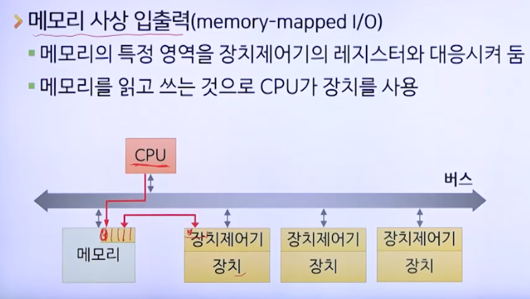

# 장치 관리

## 장치의 개념

### 컴퓨터 시스템의 구성

- 다양한 장치들
  - CPU, 메모리 : 프로세스 실행에 필수
  - 나머지 장치들 : 프로세스 실행 시 데이터 입력이나 출력에 사용되는 입출력 장치
    - 디스크 드라이브, 키보드, 마우스, 모니터, 프린터 등
- 입출력 장치의 구분
  - 장치의 기능적 특징과 장치관리자의 관리방법에 따라 구분
  - 전용 장치, 공용장치, 가상장치

### 전용 장치

- 한 번에 단지 하나의 프로세스에만 할당
- ex: 테이프 드라이브, 프린터, 플로터 등
- 단점: 대기시간이 길어질 수 있음

### 공용 장치

- 여러 프로세스에 동시에 할당
- 예: 디스크 같은 직접접근 저장장치
- 스케줄링 기법 필요

### 가상 장치

- 전용장치를 공용장치처럼 보이게 함
- 디스크 같은 공용장치를 이용
- 예: 스풀링을 적용한 플로터 등

## 장치의 구성

### 논리적 구성

- 장치 제어기
  - 장치를 직접적으로 다루는 전자장치
  - 장치에서 발생하는 각종 데이터를 전자신호로 변환하여 운영체제로 보냄
  - 운영체제가 요청하는 명령을 받아 장치를 구동
  - 운영체제가 보내는 출력을 장치에 맞게 변환
- 장치 드라이버
  - 응용 프로그램의 입출력 요청을 해당 장치에 맞도록 변환
  - 장치의 종류나 제조사에 따라 장치제어기가 이해하는 명령이나 명령의 종류가 다를 수 있기 때문
  - 보통 장치 제조사에서 해당 장치의 드라이버도 같이 제공

### 물리적 구성

## 입출력 처리 유형

- 프로세스가 진행하며 입출력이 발생하는 경우
- 세 가지 유형
  - 프로그램 방법
  - 인터럽트 방법
  - DMA 방법

### 프로그램 방법

- CPU만 이용하는 폴링을 이용하여 입출력을 처리
  - CPU가 입출력장치의 상태를 지속적으로 확인하며 CPU가 원하는 상태가 될 때 까지 기다림
  - 
  - CPU 낭비가 심해 비효율적

### 인터럽트 방법

- 인터럽트를 이용하여 입출력을 처리
  - 인터럽트 : 어떤 장치가 다른 장치의 작업을 중단시키고 자신의 상태를 알리는 기능
- 프로세스를 대기 상태로 보내고 인터럽트가 발생할 때까지 CPU는 다른 프로세스를 처리할 수 있음

### DMA(Direct Memory Access) 방법

- DMA 제어기를 이용하여 CPU를 통하지 않고 메모리에 직접 접근하여 데이터를 전송하는 방법
- 인터럽트 발생 횟수를 단 한 번으로 줄여 CPU 효율 증대

## 입출력 관리

- 입출력 장치와는 독립적인 입출력 관리방법
- 두 가지 방법
  - 버퍼링
  - 스풀링

### 버퍼링

- CPU의 데이터 처리 속도와 I/O 장치의 데이터 전송속도의 차이로 인한 문제를 버퍼를 통해 해결
- 메모리를 일시적인 데이터 저장장소인 버퍼로 이용
- 단일 버퍼링
  - 저장과 처리를 동시에 할 수 없어 비효츌적
  - 
- 이중 버퍼링
  - 
- 순환 버퍼링
  - 

### 스풀링

- 입출력 프로세스와 저속 입출력장치 사이의 데이터 전송을 자기 디스크와 같은 고속장치를 통하도록 하는 것
- 프로세스 입장에서는 입출력작업이 빨리 끝남
- 전용장치를 가상장치로 변화시킴

